Motherboard X9DBU-3F/X9DBU-iF

Руководство по X9DBU-iF rev. 1.10

### Структура руководства

В главе 1 описываются функции, технические характеристики и производительность материнской платы. Также представлена подробная информация о чипсете Intel C602/C606.

В главе 2 приведены инструкции по установке оборудования. Ознакомьтесь с этой главой при установке процессора, модулей памяти и других аппаратных компонентов в систему. 

В главе 3 описаны процедуры устранения неполадок, связанных с видеокартой, памятью и настройками системы, хранящимися в CMOS.

В главе 4 представлено введение в BIOS и подробная информация о запуске утилиты настройки CMOS.

В приложении A приведены звуковые сигналы ошибок BIOS.
В приложении B приведены инструкции по установке программного обеспечения.

### Chapter 1: Overview

---

**Поздравляем с покупкой материнской платы от признанного лидера отрасли.**  

Материнские платы Supermicro разработаны с максимальным вниманием к деталям, чтобы обеспечить высочайшие стандарты качества и производительности.  

Пожалуйста, проверьте, что все перечисленные ниже компоненты присутствуют в комплекте поставки. Если какие-либо из указанных элементов повреждены или отсутствуют, обратитесь к вашему продавцу.  

**В розничную упаковку входят следующие компоненты:**  
- Одна (1) материнская плата Supermicro  
- Два (2) кабеля Serial ATA (CBL-0044Lx2)  
- Два (2) кабеля I-Pass to 4 Serial ATA (50 см) (CBL-097L-03x2) (X9DBU-3F)  
- Один (1) кабель I-Pass to 4 Serial ATA (50 см) (CBL-097L-03) (X9DBU-iF)  
- Одна заглушка для панели ввода-вывода (MCP-260-00027-0N)  
- Одно (1) краткое руководство пользователя (MNL-1294-QRG)  

**Примечание:** Для корректной работы системы перейдите по ссылкам ниже, чтобы загрузить все необходимые драйверы, утилиты и руководство пользователя для вашей материнской платы.  

- **Руководства по продуктам SMCI:** [http://www.supermicro.com/support/manuals/](http://www.supermicro.com/support/manuals/)  
- **Драйверы и утилиты:** [ftp://ftp.supermicro.com/](ftp://ftp.supermicro.com/)  

Если у вас возникнут вопросы, пожалуйста, свяжитесь с нашей службой поддержки по адресу **support@supermicro.com**.  

---

### Motherboard X9DBU-3F/X9DBU-iF


)

   Note: All graphics shown in this manual were based upon the latest PCB
   revision available at the time of publishing of the manual. The motherboard
   you've received may or may not look exactly the same as the graphics
   shown in this manual.


### Chapter 1: Overview

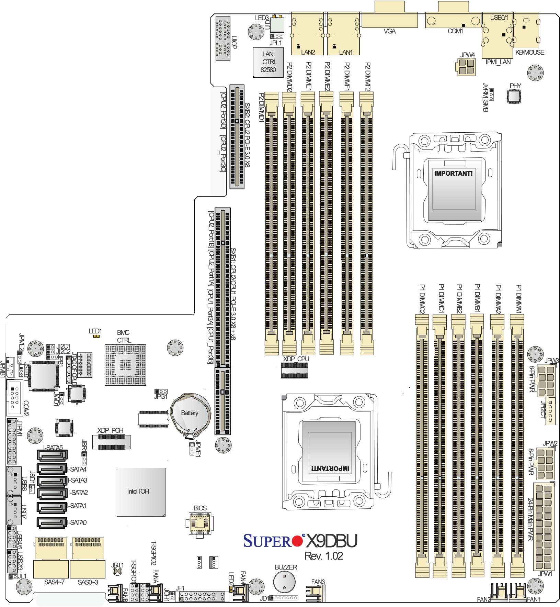

​                                                                                                                                                                                                                                                                                                                                                                       Note : For the latest CPU/Memory updates, please refer to our website at  http://www.supermicro.com/products/motherboard/ for details.

### Motherboard User’s Manual Quick Reference

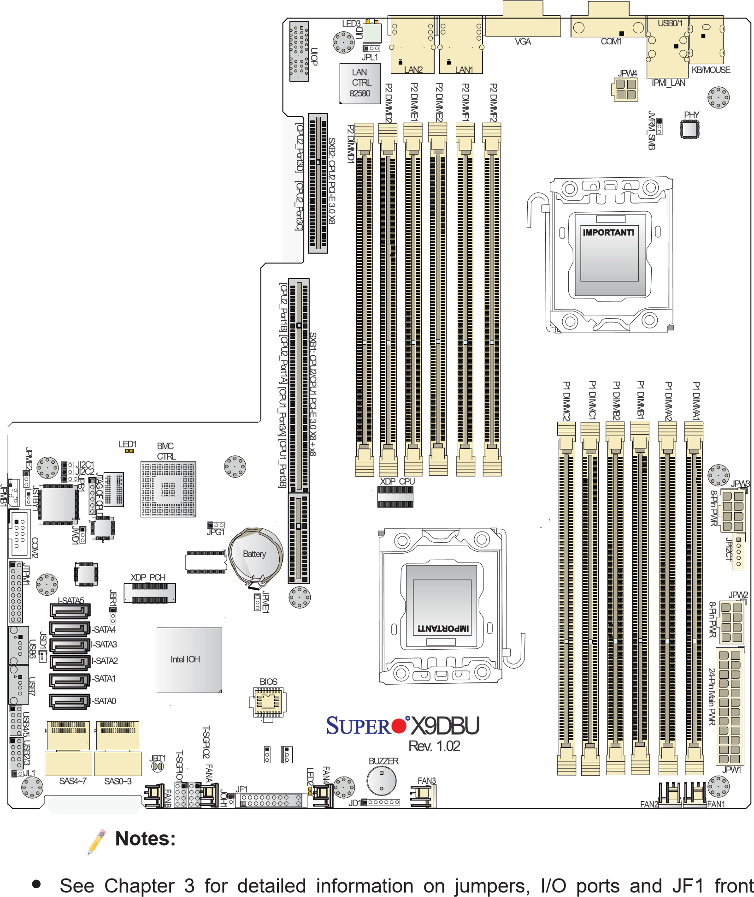

 Примечания:

**Подробная информация** о перемычках, портах ввода-вывода и подключениях передней панели JF1 приведена в главе 3.

**Обозначение « »** указывает на расположение контакта «Pin 1» (первый контакт).

**Компоненты без маркировки** или документации (перемычки, светодиодные индикаторы, разъёмы, колодцы) предназначены только для тестирования.

**Используйте только тот тип** встроенной батареи CMOS, который указан производителем. Не  устанавливайте встроенную батарею вверх ногами во избежание возможного  короткого замыкания.

### Перемычки (Jumpers) 

| **Перемычка**   | **Описание**                                    | **Заводская настройка** |
| --------------- | ----------------------------------------------- | ----------------------- |
| **JBT1**        | Сброс CMOS                                      | См. Главу 3             |
| **JI2C1/JI2C2** | SMB к слотам PCI-E                              | Открыто (Normal)        |
| **JPB1**        | Включение BMC (Baseboard Management Controller) | Контакты 1-2 (Enabled)  |
| **JPG1**        | Включение VGA                                   | Контакты 1-2 (Enabled)  |
| **JPL1**        | Включение LAN1/LAN2                             | Контакты 1-2 (Enabled)  |
| **JPME1**       | Режим восстановления Management Engine (ME)     | Контакты 1-2 (Normal)   |
| **JPME2**       | Режим производства Management Engine (ME)       | Контакты 1-2 (Normal)   |
| **JWD1**        | Watch Dog (Контроль сбоев)                      | Контакты 1-2 (Reset)    |

---

### Разъемы (Connectors) 

| **Разъем**         | **Описание**                                                 |
| ------------------ | ------------------------------------------------------------ |
| **Buzzer**         | Встроенный динамик (пищалка)                                 |
| **COM1/COM2**      | Разъемы COM-порта (на задней панели / дополнительный фронтальный) |
| **FAN1~4, FANA/B** | Разъемы вентиляторов (CPU/системные)                         |
| **IPMB1**          | 4-контактный разъем для внешнего IPMI-модуля (I2C)           |
| **I-SATA 0~5**     | Разъемы SATA (Intel PCH): 0/1 — SATA 3.0, 2~5 — SATA 2.0     |
| **JBAT1**          | Разъем батарейки CMOS (см. Главу 4 по утилизации)            |
| **JD1**            | Индикатор питания (PWR LED, контакты 1-3) / динамик (контакты 4-7) |
| **JF1**            | Разъем подключения передней панели                           |
| **JL1**            | Датчик вскрытия корпуса                                      |
| **JOH1**           | Индикатор перегрева/остановки вентилятора                    |
| **JPI2C1**         | Разъем SMBus для мониторинга блока питания                   |
| **JPW1**           | 24-контактный разъем питания ATX (см. предупреждение на стр. 1-6) |
| **JPW2~JPW3**      | 8-контактные разъемы питания +12V (см. предупреждение на стр. 1-6) |
| **JPW4**           | 4-контактный разъем питания                                  |
| **JSTBY1**         | Дежурное питание (Standby)                                   |
| **JTAG of CPLD**   | Разъем JTAG для программирования CPLD (Complex Programmable Logic Device) |
| **JTPM1**          | Разъем TPM (Trusted Platform Module) / Port 80 (диагностика POST) |
| **JSD1**           | Разъем питания SATA DOM (Device On Module)                   |
| **KB/Mouse**       | Разъемы клавиатуры/мыши (PS/2)                               |
| **LAN1/2**         | Гигабитные Ethernet-порты 1 и 2                              |
| **(IPMI) LAN**     | Выделенный порт IPMI                                         |
| **SAS 0~3, 4~7**   | Разъемы Serial-Link SATA/SAS (0-3 — SATA/SAS, 4-7 — SAS)     |

| **Разъем**                        | **Описание**                                                 |
| --------------------------------- | ------------------------------------------------------------ |
| **SXB1**                          | Слоты PCI-E 3.0 x8 + x8 (для CPU1/CPU2)                      |
| **SXB2 (CPU2)** / **SXB3 (CPU1)** | Слоты PCI-E 3.0 x8 (SXB2 — CPU2, SXB3 — CPU1)                |
| **T-SGPIO 1/2**                   | Serial-Link General Purpose I/O (универсальные программируемые линии ввода-вывода) |
| **UIOP**                          | Проприетарный универсальный слот ввода-вывода (SMC)          |
| **USB 0/1**                       | USB-порты на задней панели (0 и 1)                           |
| **USB 2/3, 4/5**                  | USB-разъемы для подключения к передней панели (2/3 и 4/5)    |
| **USB 6, USB7**                   | USB-порт типа A на передней панели (порт 6)                  |
| **UID Switch**                    | Кнопка UID (Unit Identifier — индикатор идентификации сервера) |
| **VGA1**                          | VGA-порт на задней панели (1) / дополнительный разъем для фронтальной панели (2) |

---

### Светодиодные индикаторы (LED Indicators)

| **Индикатор** | **Описание**                   | **Состояние**             | **Статус**                |
| ------------- | ------------------------------ | ------------------------- | ------------------------- |
| **LED1**      | BMC Heartbeat (пульс BMC)      | Зеленый: мигает           | BMC работает нормально    |
| **LED2**      | Standby PWR (дежурное питание) | Зеленый: горит            | Дежурное питание включено |
|               |                                | Синий: горит (Windows OS) | Работа в ОС Windows       |
|               |                                | Синий: мигает (Linux)     | Работа в ОС Linux         |
| **LED3**      | UID LED (идентификация)        | Горит / мигает            | Сервер идентифицирован    |

---

### **Предупреждение по электропитанию**  
**Внимание!** Во избежание повреждения материнской платы и компонентов используйте блок питания с поддержкой следующих разъемов:  
- **24-контактный**  
- **Два 8-контактных**  
- **Один 4-контактный**  

Обязательно подключите:  
- **24-контактный** и **8-контактные** разъемы — для стабильного питания системы.  
- **4-контактный** разъем — опциональный, но Supermicro рекомендует его подключение для оптимального энергоснабжения.  

Если индикаторы ведут себя некорректно (например, не горят или мигают с ошибками), проверьте подключение питания и состояние BMC/IPMI.


### Основные характеристики материнской платы

---

#### **Процессор (CPU)**  
- Поддержка **двух процессоров Intel® E5-2400** (сокет B2)  
- Каждый процессор оснащен **двумя QPI-линками** с пропускной способностью до **8.0 GT/s** (максимальная скорость передачи данных — **16 ГБ/с** на порт).  

---

#### **Память (Memory)**  
- **Встроенный контроллер памяти** поддерживает до **384 ГБ** DDR3:  
  - Типы модулей: **RDIMM, LRDIMM, UDIMM ECC/Non-ECC**  
  - Частоты: **800/1066/1333/1600 МГц** (12 слотов)  
  - Поддерживаемые объемы: **1 ГБ, 2 ГБ, 4 ГБ, 8 ГБ, 16 ГБ, 32 ГБ** (1.35V/1.5V)  
- **Виртуализация**: VT-x, VT-d, VT-c  
- *Примечание*: Актуальную информацию о совместимости CPU/памяти см. на [supermicro.com](http://www.supermicro.com/products/motherboard).  

---

#### **Чипсет (Chipset)**  
- **Intel® C602** (X9DBU-iF) / **C606** (X9DBU-3F)  

---

#### **Графика (Graphics)**  
- **Видеоконтроллер Matrox G200eW**  

---

#### **Сетевые интерфейсы (Network)**  
- **Контроллер Intel I350** для гигабитных портов LAN1/LAN2  

---

#### **Накопители и RAID (Storage)**  
- **SATA**:  
  - **2× SATA 3.0** (порты 0/1)  
  - **4× SATA 2.0** (порты 2–5)  
  - **1× mini-iPass SATA 2.0** (только X9DBU-iF)  
  - Поддержка **RAID 0, 1, 5, 10**  
- **SAS/SATA**:  
  - **4× S-SATA/SAS 0–3**  
  - **4× SAS 4–7**  
  - **2× mini-iPass SATA 2.0** (только X9DBU-3F)  
  - Поддержка **RAID 0, 1, 10**  

---

#### **Дополнительные контроллеры**  
- **Супер-ввод/вывод (Super I/O)**: Nuvoton W83527  
- **BMC (IPMI)**: Nuvoton WPCM450R-F с поддержкой **IPMI 2.0**  

---

#### **Интерфейсы**  
- **Последовательные порты (COM)**: 2× RS-232 (UART 16550)  
- **Клавиатура/мышь**: USB/PS/2 на задней панели  
- **Графика**: VGA-выход  
- **UIO-слоты**:  
  - 1× PCI-E 3.0 x16  
  - 2× PCI-E 3.0 x8  
  - 1× проприетарный UIO (Supermicro)  

---

#### **USB-устройства**  
- **Задняя панель**: 2× USB 2.0 (порты 0/1)  
- **Передняя панель**:  
  - 2× разъема для 4 подключений (USB 2/3, 4/5)  
  - 2× Type-A (порты 6/7)  

---

#### **BIOS**  
- **64 Мб AMI Flash EEPROM**  
- Поддержка стандартов: **APM 1.2, DMI 2.3, PCI 2.3, ACPI 1.0/2.0, SMBIOS 2.3**  

---

#### **Управление питанием**  
- Режимы **ACPI/ACPM**  
- Включение по клавиатуре  
- Восстановление питания после сбоя  
- **Intel® Intelligent Node Management (IPNM)**  
- **Intel® Management Engine (ME)**  

---

#### **Мониторинг системы (PC Health)**  
- **Контроль напряжений**: 1.5V, 1.8V, +3.3V, +5V, +5V Standby  
- **Термозащита CPU**:  
  - Поддержка TDP до **95 Вт** (*см. примечание 1*)  
  - 6-фазный регулятор напряжения  
  - Датчики перегрева и Thermal Trip  
- **Управление вентиляторами**:  
  - Регулировка скорости (снижение шума)  
  - Мониторинг через IPMI  

---

#### **Индикаторы (LEDs)**  
- Перегрев CPU/системы  
- Режим Suspend  
- UID (идентификация сервера)  

---

#### **Системный менеджмент**  
- **PECI 2.0**  
- **SuperDoctor® III** (мониторинг ресурсов)  
- Две зоны охлаждения  
- **Watch Dog**, NMI, датчик вскрытия корпуса  

---

#### **Физические параметры**  
- Размеры: **331.47 × 306.71 мм** (13.05 × 12.075 дюймов)  

---


### **1-2 Обзор процессора и чипсета**  
Материнская плата **X9DBU-3F/X9DBU-iF**, основанная на процессорах **Intel E5-2400** (сокет B2) и чипсете **C602/C606**, обеспечивает высокую производительность и функциональность для двухпроцессорных платформ.  

#### **Ключевые особенности:**  
- **Технология Intel QuickPath Interconnect (QPI):**  
  - Скорость передачи данных до **8.0 GT/s** (точечное соединение между процессорами).  
- **Функции чипсета C602/C606:**  
  - Поддержка **PCI-Express 2.0** (некоторые модели — **Gen. 3**).  
  - Управление питанием **ACPI 3.0b/4.0**.  
  - Интерфейсы **USB** (задняя и передняя панели).  
  - **Intel Rapid Storage Technology** (оптимизация работы накопителей).  
  - **Intel VT-d** (виртуализация ввода-вывода).  
  - **Intel Trusted Execution Technology** (безопасность).  
  - Поддержка **SPI, DMI, AHCI**.  

---

### **1-3 Специальные функции**  

#### **Восстановление после пропадания питания**  
BIOS позволяет настроить реакцию системы на восстановление электропитания:  
- **Оставаться выключенной** (требуется ручное включение).  
- **Автоматически включиться**.  
- *По умолчанию:* **Last State** (возврат к предыдущему состоянию).  

---

### **1-4 Мониторинг состояния системы**  
Материнская плата оснащена встроенной системой мониторинга:  

#### **Контроль напряжений**  
Постоянно отслеживаются:  
- **1.5V, 1.8V, +3.3V, +5V** (основные).  
- **3.3V Standby, +5V Standby** (дежурные).  
- **Напряжение батарейки CMOS**.  
При отклонениях выдается предупреждение или ошибка.  

#### **Управление вентиляторами**  
- **IPMI-прошивка** регулирует скорость вращения CPU и корпусных вентиляторов.  
- **Термодатчики** активируют охлаждение при превышении заданного порога температуры.  

#### **Контроль температуры**  
- **CPU:** Автоматическое включение вентиляторов при перегреве.  
- **Корпус:** Оповещение о высокой температуре внутри шасси.  
> **Важно:** Для предотвращения перегрева обеспечьте достаточный воздушный поток.  

#### **Оповещения через SuperDoctor**  
- В **Windows/Linux** утилита **SuperDoctor III/II** уведомляет о:  
  - Превышении температуры CPU/системы.  
  - Аномальных напряжениях или скорости вентиляторов.  

---

### **1-5 Функции ACPI**  
**ACPI** (Advanced Configuration and Power Interface) — стандарт управления питанием:  

#### **Основные возможности:**  
- **Автоматическое включение/выключение** периферии (HDD, CD-ROM, сетевые карты).  
- **Поддержка Plug and Play** (динамическая конфигурация устройств).  
- **Совместимость** с Windows 7/Vista/2008.  

#### **Режимы работы:**  
- **S0** (рабочий).  
- **S3** (Suspend to RAM).  
- **S4/S5** (полное выключение).  

---

### **Примечания**  
1. Для настройки **IPMI** используйте [Embedded IPMI Configuration Guide](http://www.supermicro.com/support/manuals/).  
2. Рекомендуется **активное охлаждение** для процессоров с TDP до 95 Вт.  
2. **Максимальный TDP процессора** зависит от системы охлаждения. Проверьте совместимость с корпусом и кулером. 

---


### **1-6 Индикация режима ожидания (Suspend-State LED)**  
- **Медленное мигание** силового светодиода корпуса указывает на переход CPU в **режим ожидания (Suspend)**.  
- При нажатии любой клавиши система **просыпается**, а LED **перестает мигать** и горит постоянно.  

---

### **1-7 Блок питания**  
#### **Ключевые требования:**  
- Обязательные разъемы:  
  - **24-контактный ATX** (основной).  
  - **Два 8-контактных (JPW2/JPW3)** + **4-контактный (JPW4, опционально, но рекомендуется)**.  
- Ток **1.5A** на порты Ethernet.  

#### **Рекомендации:**  
- Используйте **качественный БП** с сертификацией **ATX 2.02+/SSI**.  
- В зонах с нестабильным напряжением:  
  - **Фильтр помех** для защиты от шумов.  
  - **Сетевой фильтр** от скачков напряжения.  

> **Внимание!** Неправильное подключение питания может повредить плату!  

---

### **1-8 Super I/O (Nuvoton W83527)**  
#### **Функционал:**  
- **2 UART-порта** (16550-совместимые) с поддержкой:  
  - Скорость до **1 Мбит/с** (для высокоскоростных модемов).  
  - FIFO-буфер (16 байт), управление модемом.  
- **Управление питанием ACPI** (через SMI/SCI) для снижения энергопотребления.  

---

### **1-9 Расширенное управление питанием**  
#### **Технологии:**  
1. **Intel Intelligent Power Node Manager (IPNM):**  
   - Контроль температуры и энергопотребления в реальном времени.  
   - Требования:  
     - Блок питания с **PMBus 1.1/1.2**.  
     - ПО **NMView** (опционально).  
   - **Зависит от версии ME-прошивки** (1.5 или 2.0).  

2. **Management Engine (ME):**  
   - Встроенный в чипсет **ARC-контроллер** для серверных платформ.  
   - Обеспечивает **Server Platform Services (SPS)**.  

---

### **1-10 IPMI-контроллер (Nuvoton WPCM450R)**  
#### **Возможности:**  
- **Удаленное управление** через **KVM-редирект** (клавиатура/видео/мышь).  
- **Интерфейсы:**  
  - **PCI** — для работы с графикой.  
  - **USB 2.0/1.1** — эмуляция периферии.  
  - **LPC** — управление Super I/O.  
  - **SMBus (x6), PECI, GPIO** — мониторинг компонентов.  
- **Сетевые подключения:**  
  - Через **Ethernet PHY** или **NCSI** (совместное использование).  

---

### **Важные примечания**  
- Для **IPMI** требуется настройка через [Supermicro manuals](http://www.supermicro.com/support/manuals/).  
- **PMBus** обязателен для функций **IPNM**.  

Для оптимальной работы соблюдайте рекомендации по питанию и охлаждению!


### **WPCM450R — Интерфейсы и функции контроллера BMC**

#### **1. Поддержка памяти DDR2**
- **Тип памяти:** 16-бит DDR2  
- **Максимальная частота:** 220 МГц  
- **Топология:** Точечное соединение (point-to-point) для лучшей целостности сигнала.  

---

#### **2. PCI-интерфейс**
- **Спецификация:** PCI 2.3 (32-бит, 33 МГц, 3.3V)  
- **Назначение:** Связь с **PCI-мостом** для работы графического контроллера.  

---

#### **3. Ключевые функции контроллера**  
1. **Управление через IPMI 2.0:**  
   - **Serial over LAN** — удаленный доступ к консоли.  
   - **KVM over LAN** — управление клавиатурой, видео и мышью.  
   - **SNMP-оповещения** (LAN Alerting).  
   - **Журнал событий** (Event Log).  

2. **Интерфейсы расширения:**  
   - **X-Bus** — параллельный интерфейс для I/O.  
   - **SPI Flash** — загрузка BIOS и прошивки.  
   - **RMII** (Reduced Media Independent Interface) — упрощенный Ethernet-интерфейс.  

3. **Мониторинг оборудования:**  
   - Аналоговые и цифровые видеовыходы.  
   - АЦП (ADC) для аналоговых датчиков.  
   - **Не зависит от ОС** (работает на уровне железа).  

4. **Безопасность и управление:**  
   - **RMCP+** — защищенный протокол для IPMI.  
   - Поддержка инструментов:  
     - **IPMIView** (графический интерфейс).  
     - **CLI** (командная строка).  

---

### **Важное примечание**  
Для настройки IPMI обратитесь к [IPMI User’s Guide](http://www.supermicro.com/support/manuals/).  

Контроллер **WPCM450R** обеспечивает **полный цикл мониторинга и управления** сервером, включая аварийные оповещения и удаленный доступ, даже без загруженной ОС.


## Глава 2: Установка 

#### **2-1 Стандартные предупреждения**  
Перед установкой компонентов внимательно прочтите все предупреждения. При возникновении вопросов обратитесь в техническую поддержку Supermicro.  

##### **Обращение с батарейкой**  
⚠ **Предупреждение!**  
- **Опасность взрыва** при неправильной замене батарейки.  
- Используйте **только рекомендованный производителем тип** (CR2032 или аналогичный).  
- Утилизируйте старые батарейки **согласно инструкциям производителя**.  

##### **Утилизация оборудования**  
⚠ **Предупреждение!**  
- Утилизация продукта должна производиться **в соответствии с национальными законами**.  

---

#### **2-2 Защита от статического электричества**  
Электростатические разряды (ESD) могут повредить компоненты.  

##### **Меры предосторожности:**  
- Используйте **антистатический браслет**.  
- Перед извлечением платы **коснитесь заземленного металла**.  
- Держите плату **только за края** — не касайтесь чипов, контактов и разъемов.  
- Не трогайте **контакты модулей памяти и процессоров**.  
- Храните плату в **антистатической упаковке**, когда она не используется.  
- Убедитесь, что корпус обеспечивает **заземление** (между БП, шасси и материнской платой).  

##### **Распаковка**  
- Плата поставляется в **антистатической упаковке**.  
- Перед распаковкой **обеспечьте защиту от статики**.  

---

### **Ключевые моменты**  
1. **Батарейка CMOS** — замена только на аналогичную (CR2032).  
2. **Антистатика** — обязательна при работе с электроникой.  
3. **Утилизация** — соблюдайте экологические нормы.  

Для дальнейших шагов по установке обратитесь к руководству.


### **2-3 Установка процессора и системы охлаждения**  

#### **Важные примечания перед установкой:**  
- **Подключайте кабель питания в последнюю очередь** и всегда отключайте его перед изменением конфигурации.  
- Устанавливайте процессор **до монтажа кулера**.  
- Материнская плата **должна быть закреплена в корпусе** перед установкой кулера.  
- **Теплопакет (TDP) процессора** не должен превышать максимальные значения для платы, кулера и корпуса (см. руководство к шасси).  
- При покупке платы **без процессора** убедитесь, что:  
  - Защитная крышка сокета на месте.  
  - Контакты сокета **не погнуты** (если повреждены — немедленно обратитесь к продавцу).  

---

### **Установка процессора в сокет LGA 1356**  

1. **Откройте сокет:**  
   - Нажмите на рычаг, чтобы освободить нагрузочную пластину.  

4. **Извлеките защитную крышку** и берите процессор **только за края** (северный и южный).  

5. **Совместите ключи:**  
   - Найдите полукруглый вырез на процессоре и совместите его с ключом на сокете.  

7. **Установите процессор:**  
   - Осторожно опустите процессор **строго вертикально** (не двигайте им по контактам!).  

8. **Проверьте правильность установки:**  
   - Убедитесь, что процессор ровно лежит во всех углах сокета.  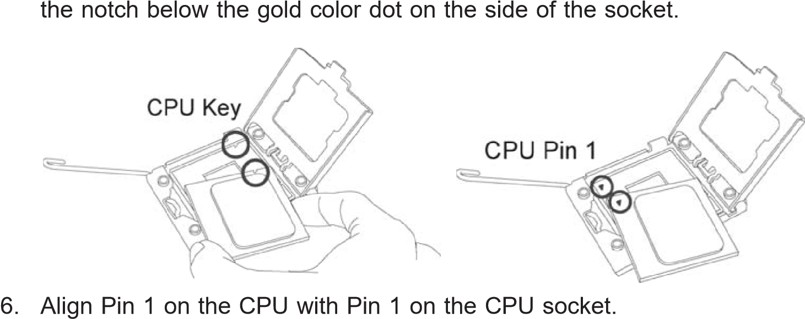

9. **Закройте нагрузочную пластину** и зафиксируйте рычаг.  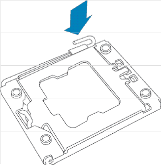

⚠ **Важно!**  
- **Сохраните защитную крышку** — она обязательна для транспортировки платы.  

---

## Установка пассивного кулера

**Установка пассивного кулера**  

1. **Нанесите термопасту** на основание кулера (тонким равномерным слоем).  
2. **Совместите крепежные отверстия** кулера с отверстиями на монтажной рамке.  
3. **Вставьте крепежные штифты** в отверстия на плате и поверните их **по часовой стрелке** для фиксации.  

---

### **Снятие кулера**  
⚠ **Не рекомендуется** без необходимости!  

1. **Отключите питание** системы.  
2. **Поверните штифты против часовой стрелки** и вытащите их.  
3. **Аккуратно покачайте кулер** из стороны в сторону, чтобы ослабить (без чрезмерного усилия!).  
4. **Снимите кулер** с процессора.  

5. **Перед повторной установкой:**  
   - Очистите поверхности процессора и кулера от старой термопасты.  
   - Нанесите **новую термопасту**.  

---

### **Ключевые рекомендации**  
- Для процессоров с TDP до **95 Вт** убедитесь, что кулер и корпус обеспечивают достаточное охлаждение.  
- Используйте **термопасту с высокой теплопроводностью** (например, Arctic MX-4).  
- При замене кулера **не касайтесь контактов процессора**!  

Для проверки совместимости процессоров см. раздел **«Поддержка CPU»** в руководстве или на [supermicro.com](http://www.supermicro.com).


### **2-4 Установка и извлечение модулей памяти**

#### **Перед началом работы:**
- Проверьте список рекомендованных модулей памяти на [сайте Supermicro](https://www.supermicro.com).
- **Внимание!** Будьте осторожны при установке/извлечении модулей, чтобы избежать повреждений.

---

### **Установка модулей DIMM**

1. **Определите порядок установки**  
   - Начинайте установку с **слота P1-DIMM1A**.  
   - Для лучшей производительности используйте модули **одного типа, объема и скорости** в одном банке.

2. **Подготовьте слот**  
   
   - Разведите **фиксаторы** по краям слота наружу (в открытое положение).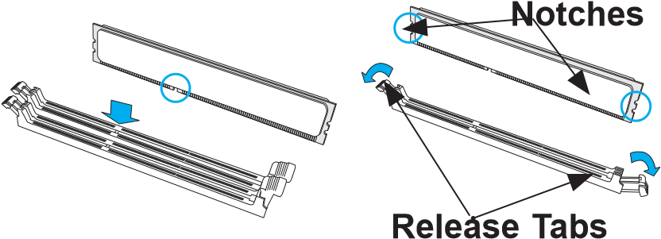
   
     --------------------------------------------------------------------------------------------------------------------------------
   
     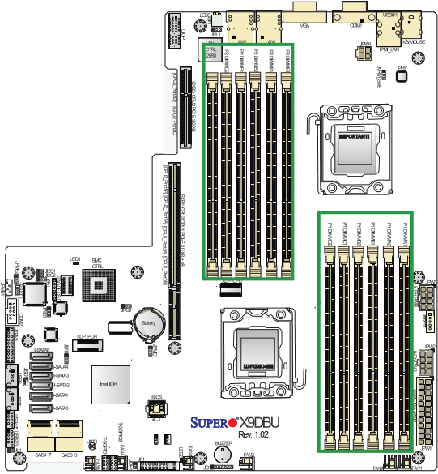
   
3. **Совместите ключи**  
   
   - Найдите **ключ-вырез** на модуле и совместите его с перегородкой в слоте.  
   - Убедитесь, что **вырезы по краям модуля** совпадают с направляющими слота.
   
4. **Установите модуль**  
   
   - Двумя руками равномерно надавите на **оба края модуля** до щелчка.  
   
   - **Фиксаторы должны автоматически закрыться**, надежно закрепив модуль.
   
     ---
   
     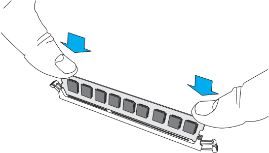

---

### Извлечение модулей DIMM

1. **Откройте фиксаторы**  
   - Аккуратно разведите фиксаторы по краям слота наружу.

2. **Извлеките модуль**  
   - Плавно потяните модуль вверх, держа его за края.  
   - **Не прикладывайте силу под углом** — это может повредить контакты.

---

### **Рекомендации**
- **Не смешивайте** модули RDIMM, LRDIMM и UDIMM в одном банке.  
- Для активации **режима ECC** используйте только сертифицированную память с поддержкой ECC.  
- При установке **большого количества модулей** сначала заполняйте слоты **белого цвета** (оптимальная схема указана в руководстве к плате).

> **Важно!** После установки проверьте, что все модули распознаются в BIOS. Если система не запускается, убедитесь, что память полностью зафиксирована в слотах.


### **2-4 Установка и извлечение модулей памяти**

#### **Извлечение модулей DIMM**
1. **Откройте фиксаторы**  
   - Нажмите на пластмассовые фиксаторы по обоим концам модуля DIMM, чтобы освободить его.

2. **Извлеките модуль**  
   - После ослабления модуля аккуратно извлеките его из слота памяти, держа за края.

---

### **Поддержка памяти на материнской плате X9DBU-3F/X9DBU-iF**
- **Типы памяти:**  
  - RDIMM (Registered ECC)  
  - LRDIMM (Load-Reduced ECC)  
  - UDIMM (Unbuffered ECC/Non-ECC)  
- **Максимальный объем:** 384 ГБ  
- **Частоты:** 800/1066/1333/1600 МГц  
- **Количество слотов:** 12 (по 6 на каждый процессор)  

> **Важно:** Актуальный список совместимых модулей смотрите на [supermicro.com](http://www.supermicro.com/products/motherboard).

---

### **Конфигурация установки процессоров и модулей памяти**

#### **Распределение слотов памяти по процессорам**
| **Процессор** | **Соответствующие слоты DIMM**                               |
| ------------- | ------------------------------------------------------------ |
| **CPU1**      | P1-DIMMA1, P1-DIMMA2, P1-DIMMB1, P1-DIMMB2, P1-DIMMC1, P1-DIMMC2 |
| **CPU2**      | P2-DIMMD1, P2-DIMMD2, P2-DIMME1, P2-DIMME2, P2-DIMMF1, P2-DIMMF2 |

#### **Оптимальные конфигурации для разного количества модулей**
| **Кол-во CPU + DIMM** | **Рекомендуемые слоты**                                      |
| --------------------- | ------------------------------------------------------------ |
| **1 CPU + 2 DIMM**    | P1-DIMMA1, P1-DIMMB1                                         |
| **1 CPU + 4 DIMM**    | P1-DIMMA1, P1-DIMMB1, P1-DIMMA2, P1-DIMMB2                   |
| **1 CPU + 6 DIMM**    | Все слоты CPU1                                               |
| **2 CPU + 4 DIMM**    | P1-DIMMA1, P1-DIMMB1, P2-DIMMD1, P2-DIMME1                   |
| **2 CPU + 6 DIMM**    | P1-DIMMA1, P1-DIMMB1, P1-DIMMC1, P2-DIMMD1, P2-DIMME1, P2-DIMMF1 |
| **2 CPU + 12 DIMM**   | Все слоты CPU1 + CPU2                                        |

---

### **Особенности работы с разными типами памяти**

#### **UDIMM (ECC/Non-ECC)**
- **Поддерживаемые объемы:** 1GB, 2GB, 4GB, 8GB  
- **Частоты:** 1066/1333 МГц (зависит от напряжения 1.35V/1.5V)  
- **Ограничения:**  
  - Не смешивать ECC и Non-ECC!  
  - При установке 2 модулей на канал (2DPC) максимальная частота — 1066 МГц.  

#### **RDIMM (ECC)**
- **Поддерживаемые объемы:** 1GB–32GB  
- **Частоты:** до 1600 МГц (1DPC)  
- **Особенности:**  
  - Совместимы с QRx4/QRx8 (16GB/32GB) при 800 МГц.  

#### **LRDIMM (ECC)**
- **Поддерживаемые объемы:** 16GB, 32GB  
- **Частоты:** 1066/1333 МГц (1.5V)  

---

### **Критические ограничения**
1. **Не смешивайте разные типы памяти** (RDIMM, UDIMM, LRDIMM) в одной системе.  
2. **Все модули в системе должны иметь одинаковую частоту** — работа будет на частоте самого медленного модуля.  
3. **Не устанавливайте одновременно ECC и Non-ECC** модули.  

> Для проверки совместимости конкретных модулей используйте [Memory List](http://www.supermicro.com/support/resources/mem.cfm).  

---

### **Советы по установке**
- Начинайте заполнение слотов **с P1-DIMMA1/P1-DIMMB1** для оптимальной производительности.  
- Для двухпроцессорной конфигурации распределяйте модули **симметрично** между CPU1 и CPU2.  
- После установки проверьте распознавание памяти в **BIOS** (раздел `Memory Configuration`).


### 2-5 Установка материнской платы

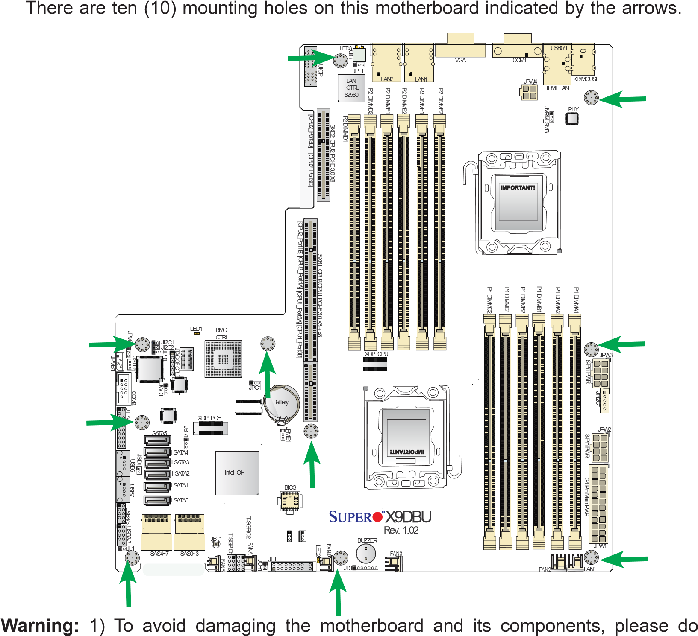

#### **Необходимые инструменты:**
- Крестообразная отвертка
- Винты с плоской головкой (10 шт.)
- Стойки (10 шт., при необходимости)

#### **Критические правила:**
1. **Не превышайте усилие затяжки** (>8 lb/дюйм на винт).
2. Избегайте контакта компонентов платы со стойками корпуса.

#### Пошаговая установка:
1. **Установите заглушку I/O** в корпус.

   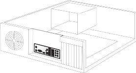

2. Совместите монтажные отверстия платы с отверстиями в шасси.

3. **Закрепите металлические стойки** (обеспечивают заземление).

4. Аккуратно разместите плату, избегая касания компонентов.

5. Зафиксируйте винтами #6 все отверстия (см. схему расположения).

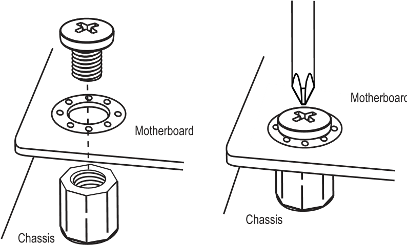

> **Внимание!** Изображения в руководстве могут отличаться от вашей комплектации.

---

### 2-6 Разъемы панели управления и порты I/O

**Разъемы задней панели материнской платы X9DBU-3F/X9DBU-iF**

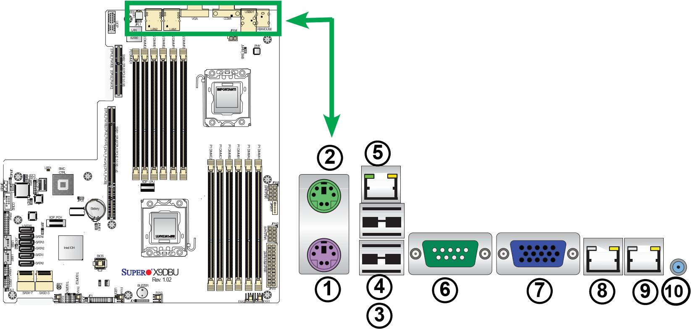

1. **PS/2 Keyboard (Фиолетовый)**  
   - Разъем для клавиатуры (фиолетовый цвет)  
   - Поддержка устаревших устройств  

2. **PS/2 Mouse (Зеленый)**  
   - Разъем для мыши (зеленый цвет)  
   - Совместим с большинством проводных PS/2 мышей  

3. **USB 2.0 Port 0 (Черный)**  
   - USB-порт версии 2.0  
   - Максимальная скорость 480 Мбит/с  

4. **USB 2.0 Port 1 (Черный)**  
   - Дополнительный USB 2.0 порт  

5. **IPMI LAN (Выделенный порт)**  
   - Порт для удаленного управления через IPMI  
   - Не зависит от основной операционной системы  
   - Поддержка IPMI 2.0  

6. **COM Port 1 (Бирюзовый)**  
   - Последовательный порт RS-232  
   - 9-контактный разъем (DB-9)  
   - Используется для консольного доступа  

7. **VGA Port (Синий)**  
   - Аналоговый видео выход  
   - Поддержка разрешений до 1920x1200  
   - Встроенный контроллер Matrox G200eW  

8. **Gigabit LAN 1**  
   - Сетевой порт 1 Гбит/с  
   - Контроллер Intel I350  

9. **Gigabit LAN 2**  
   - Дополнительный сетевой порт 1 Гбит/с  

10. **UID Switch (Кнопка идентификации)**  
    - Физическая кнопка для активации светодиода UID  
    - Помогает идентифицировать сервер в стойке  

#### **Дополнительные особенности:**
- Все USB-порты поддерживают горячее подключение
- Сетевые порты поддерживают Wake-on-LAN
- IPMI порт имеет отдельный MAC-адрес
- VGA порт поддерживает стандартные разрешения без необходимости драйверов

Для оптимальной работы рекомендуется:
1. Использовать IPMI порт для удаленного управления
2. Подключать монитор к VGA при первоначальной настройке
3. Занумеровать сетевые кабели для удобства идентификации

---

### **Важные замечания:**
1. Для **IPMI** используйте выделенный LAN-порт (не требует ОС).
2. При подключении фронтальных USB соблюдайте полярность.
3. **UID-индикатор** помогает locate сервер в стойке (управляется через BMC).

Для полной схемы распиновки см. раздел **"Connector Definitions"** в руководстве.

### **Распиновка разъемов PS/2 и USB**

#### **1. PS/2 Клавиатура и Мышь**
| **Контакт** | **Клавиатура**             | **Мышь**                      |
| ----------- | -------------------------- | ----------------------------- |
| 1           | Данные (KB Data)           | Данные (Mouse Data)           |
| 2           | Нет подключения (NC)       | Нет подключения (NC)          |
| 3           | Земля (Ground)             | Земля (Ground)                |
| 4           | Питание +5V                | Питание +5V                   |
| 5           | Тактовый сигнал (KB Clock) | Тактовый сигнал (Mouse Clock) |
| 6           | Нет подключения (NC)       | Нет подключения (NC)          |

> **Примечание:**  
>
> - Линия питания (+5V) защищена **PTC-предохранителем** (ограничение тока 1.5А).  
> - Фиолетовый порт — клавиатура, зеленый — мышь.

---

#### **2. USB-порты на задней панели (USB 0/1)**
| **Контакт** | **Назначение**  |
| ----------- | --------------- |
| 1           | +5V             |
| 2           | Данные (PO-)    |
| 3           | Данные (PO+)    |
| 4           | Земля (Ground)  |
| 5           | Не используется |

---

#### **3. Внутренние USB-разъемы (USB 2/3, 4/5, 6/7)**
| **Контакт** | **USB 2/4/6**  | **USB 3/5**    |
| ----------- | -------------- | -------------- |
| 1           | +5V            | +5V            |
| 2           | Данные (PO-)   | Данные (PO-)   |
| 3           | Данные (PO+)   | Данные (PO+)   |
| 4           | Земля (Ground) | Земля (Ground) |
| 5           | Ключ (NC)      | Ключ (NC)      |

> **Важно:**  
> - **USB 6/7** — это разъемы Type A на самой плате (для подключения фронтальных портов через кабель).  
> - При подключении соблюдайте полярность: **PO+** (белый провод), **PO-** (зеленый провод).  

---

### **Рекомендации по подключению**
1. **PS/2:**  
   - Подключайте устройства **при выключенном питании**.  
   - Не перепутайте порты — клавиатура (фиолетовый) и мышь (зеленый).  

2. **USB:**  
   - Для фронтальных портов используйте экранированные кабели.  
   - Избегайте перегибов проводов.  

3. **Безопасность:**  
   - Не замыкайте контакты +5V и Ground — это может повредить контроллер.  

Для дополнительных схем см. раздел **"Connector Definitions"** в руководстве к материнской плате.

## Последовательные порты

Два COM-порта (COM1 и COM2) расположены на материнской плате. COM1 расположен на задней панели ввода/вывода. COM2, расположенный рядом с разъёмом TPM/порта 80, обеспечивает доступ с передней панели. 

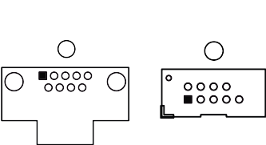

См. таблицу 

### **Распиновка последовательных портов (COM1/COM2)**

| **Контакт** | **Обозначение** | **Описание**        | **Направление** |
| ----------- | --------------- | ------------------- | --------------- |
| 1           | DCD             | Data Carrier Detect | Вход            |
| 2           | RXD             | Received Data       | Вход            |
| 3           | TXD             | Transmitted Data    | Выход           |
| 4           | DTR             | Data Terminal Ready | Выход           |
| 5           | GND             | Signal Ground       | -               |
| 6           | DSR             | Data Set Ready      | Вход            |
| 7           | RTS             | Request To Send     | Выход           |
| 8           | CTS             | Clear To Send       | Вход            |
| 9           | RI              | Ring Indicator      | Вход            |
| 10          | N/A             | Не используется     | -               |

#### **Ключевые сигналы:**
1. **TXD/RXD** - Основные линии передачи данных
2. **RTS/CTS** - Управление потоком (Hardware Flow Control)
3. **DTR/DSR** - Управление готовностью устройств
4. **GND** - Общая земля для всех сигналов

#### **Типовые подключения:**
- **Консольное соединение (без управления потоком):**
  ``` 
  TXD(3) - RXD(2)
  RXD(2) - TXD(3)  
  GND(5) - GND(5)
  ```
- **Полное соединение с управлением потоком:**
  ```
  Добавить:
  RTS(7) - CTS(8)
  CTS(8) - RTS(7)
  DTR(4) - DSR(6)
  ```

> **Примечание:** COM1 (задняя панель) и COM2 (внутренний разъем) имеют идентичную распиновку. Для работы портов требуется драйвер Super I/O (Nuvoton W83527).


## Видеоподключение

Один видеопорт (VGA1) расположен рядом с COM-портом 1 на объединительной плате ввода/вывода. Расположение см. на схеме платы ниже.

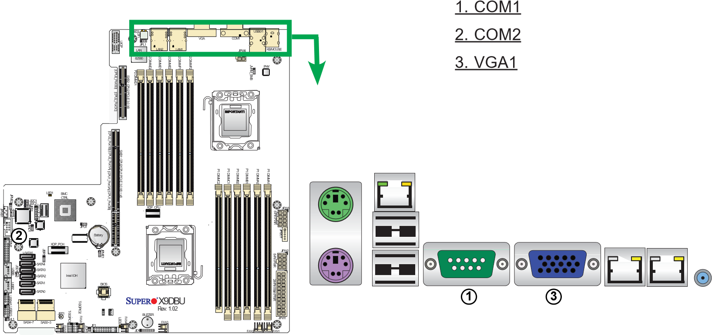

## Порты Ethernet

Два порта Gigabit Ethernet (LAN1/2) расположены на объединительной плате ввода/вывода материнской платы для обеспечения Ethernet-подключений. Кроме того, выделенный порт локальной сети IPMI расположен над портом USB.

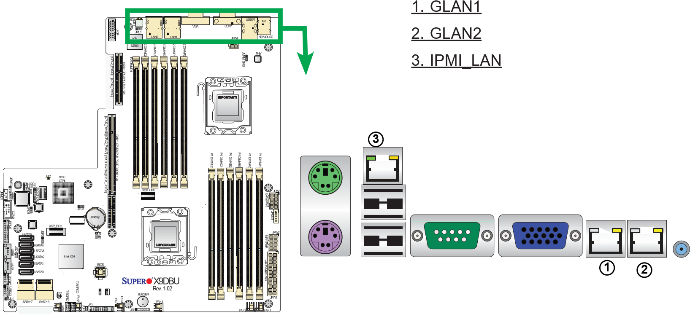

### **Распиновка LAN-портов (Gigabit Ethernet) X9DBU-3F/X9DBU-iF**

#### **Основные сигнальные линии (1-10 контакты)**
| Pin  | Обозначение | Тип     | Описание                             |
| ---- | ----------- | ------- | ------------------------------------ |
| 1    | P2V5SB      | Питание | Дежурное +2.5V                       |
| 2    | TD0+        | Данные  | Трансмиссия данных 0 (положительный) |
| 3    | TD0-        | Данные  | Трансмиссия данных 0 (отрицательный) |
| 4    | TD1+        | Данные  | Трансмиссия данных 1 (положительный) |
| 5    | TD1-        | Данные  | Трансмиссия данных 1 (отрицательный) |
| 6    | TD2+        | Данные  | Трансмиссия данных 2 (положительный) |
| 7    | TD2-        | Данные  | Трансмиссия данных 2 (отрицательный) |
| 8    | TD3+        | Данные  | Трансмиссия данных 3 (положительный) |
| 9    | TD3-        | Данные  | Трансмиссия данных 3 (отрицательный) |
| 10   | SGND        | Земля   | Сигнальная земля                     |

#### **Управление и индикация (11-18 контакты)**
| Pin  | Обозначение   | Тип     | Описание                       |
| ---- | ------------- | ------- | ------------------------------ |
| 11   | Act LED       | Выход   | Индикатор активности (зеленый) |
| 12   | P3V3SB        | Питание | Дежурное +3.3V                 |
| 13   | Link 100 LED  | Выход   | Индикатор 100 Мбит (желтый)    |
| 14   | Link 1000 LED | Выход   | Индикатор 1 Гбит (желтый)      |
| 15   | Ground        | Земля   | Общая земля                    |
| 16   | Ground        | Земля   | Дублирующая земля              |
| 17   | Ground        | Земля   | Дополнительная земля           |
| 18   | Ground        | Земля   | Резервная земля                |

#### **Особенности подключения:**
1. **Трансформаторная развязка**:
   - Встроена в разъем RJ-45
   - Соответствует стандарту IEEE 802.3ab

2. **Индикация состояния**:
   - **Link/Activity**: Двухцветный светодиод (совмещенный)
   - **100 Мбит**: горит желтый (Pin 13)
   - **1 Гбит**: мигает желтый (Pin 14)

3. **Питание**:
   - Дежурные линии (P2V5SB/P3V3SB) активны даже при выключенном сервере
   - Максимальный ток: 500mA

#### **Рекомендации:**
1. При использовании **кастомных кабелей** соблюдайте витую пару:
   - Пары 2-3 и 6-7 должны быть скручены
2. Для **длинных линий** (>50м) используйте CAT6
3. **Диагностика проблем**:
   ```bash
   # Проверка связи через ethtool
   ethtool eth0
   ```

> **Важно!** Контакты 15-18 (Ground) должны быть соединены с экраном кабеля для защиты от помех.

### **Функционал UID (Unit Identifier) на материнской плате X9DBU-3F/X9DBU-iF**

#### **1. Назначение UID**
- **Визуальная идентификация** сервера в стойке (особенно полезно в дата-центрах)
- **Упрощение обслуживания** - помогает быстро найти нужный сервер среди множества

#### **2. Элементы управления**
- **UID Switch (кнопка)**:
  - Расположена на задней панели ввода-вывода
  - Физическая кнопка для ручного управления индикацией

#### **3. Индикация**
- **Два светодиода** (синий/голубой):
  1. **Задний UID LED** (на задней панели)
  2. **Передний UID LED** (подключается к разъему на плате)

#### **4. Принцип работы**
1. **Однократное нажатие** кнопки UID:
   - Активирует **оба светодиода** (20-19 контакты на разъеме FP)
   - Сервер помечается для обслуживания

2. **Повторное нажатие**:
   - Отключает светодиодную индикацию
   - Система возвращается в нормальный режим

#### **5. Разъем для фронтального индикатора (20-19 контакты)**
| Контакт | Назначение | Цвет кабеля |
| ------- | ---------- | ----------- |
| 19      | Анод (+)   | Синий       |
| 20      | Катод (-)  | Белый       |

#### **6. Важные особенности**
- Индикация работает **независимо от состояния системы** (питание может быть выключено)
- Поддерживает **удаленное управление** через IPMI
- Совместима с **корпусными индикаторами** стандартных серверных шасси

#### **7. Рекомендации по использованию**
1. При обслуживании сервера **включите UID** для быстрой идентификации
2. Для подключения фронтального светодиода используйте **двухконтактный кабель 1.8mm pitch**
3. Не превышайте **ток 20mA** через светодиод

> **Примечание:** UID также активирует подсветку кнопки питания в некоторых корпусах Supermicro.


### **UID Switch: Распиновка и подключение**

#### **Назначение контактов**

| Pin # | Назначение | Описание                       | Цвет провода (типовой) |
| ----- | ---------- | ------------------------------ | ---------------------- |
| 1     | Ground     | Общий провод                   | Черный                 |
| 2     | Ground     | Дублирующий общий провод       | Черный                 |
| 3     | Button In  | Сигнальный вход кнопки (+3.3V) | Синий/Красный          |
| 4     | Ground     | Дополнительный общий провод    | Черный                 |

#### **Особенности подключения**
1. **Трехпроводная схема** (несмотря на 4 контакта):
   - Контакты 1, 2 и 4 соединены вместе (общий Ground)
   - Контакт 3 - сигнальный

2. **Логика работы**:
   - В нормальном состоянии: контакт 3 подтянут к +3.3V через резистор
   - При нажатии: замыкается на Ground (активный низкий уровень)

3. **Рекомендации**:
   - Используйте кабель с шагом 2.54mm (стандартный DuPont)
   - Максимальный ток через контакт 3: 5mA
   - Длина кабеля не должна превышать 50см

#### **Типовая схема подключения**
```
[Кнопка UID] 
   │
   ├───[Pin 3] Button In (сигнал)
   │
   └───[Pins 1,2,4] Ground
```

#### **Диагностика неисправностей**
1. **Кнопка не работает**:
   - Проверить целостность кабеля
   - Измерить +3.3V на Pin 3 (относительно Ground)

2. **Ложные срабатывания**:
   - Проверить на короткое замыкание
   - Убедиться в отсутствии перекрестных помех

> **Важно!** UID switch работает независимо от состояния питания системы (через BMC). Для полной функциональности требуется подключение разъема JPW1 (основное питание).


### **UID LED (LE2) Status Indicators**

#### **Индикация состояния сервера через UID светодиод**

| **Цвет/Состояние** | **Операционная система** | **Статус системы**     |
| ------------------ | ------------------------ | ---------------------- |
| **Синий: горит**   | Windows OS               | Сервер идентифицирован |
| **Синий: мигает**  | Linux OS                 | Сервер идентифицирован |

#### **Особенности работы:**
1. **Windows ОС**:
   - Постоянная синяя подсветка
   - Активируется:
     * При физическом нажатии UID-кнопки
     * Через IPMI-команды
     * Через утилиту Supermicro (Supermicro System Manager)

2. **Linux ОС**:
   - Мигающий синий индикатор (1 Гц)
   - Особенности реализации:
     * Частота мигания может меняться через BMC
     * Поддержка в стандартных драйверах ipmitool

3. **Общая логика**:
   - Индикация сохраняется после перезагрузки
   - Работает даже при выключенном основном питании (за счет BMC)
   - Совместима с:
     * Redfish API
     * IPMI 2.0 стандартными командами

#### **Управление через IPMI:**
```bash
# Включить индикацию
ipmitool raw 0x3c 0x0a 0x01

# Выключить индикацию 
ipmitool raw 0x3c 0x0a 0x00

# Проверить статус
ipmitool raw 0x3c 0x0b
```

#### **Типовые сценарии использования:**
1. **Идентификация в стойке**:
   - Техник находит нужный сервер по синему светодиоду
   - После обслуживания отключает индикацию

2. **Автоматизированный мониторинг**:
   - Система управления включает индикацию при обнаружении ошибок
   - Мигающий режим указывает на ожидание обслуживания

3. **Интеграция с DCIM**:
   - Соответствие стандарту IEC 62343-5-1
   - Поддержка протоколов SNMP trap для событий UID

> **Примечание:** В некоторых версиях BIOS можно настроить чувствительность кнопки и поведение светодиода через раздел "BMC Configuration".


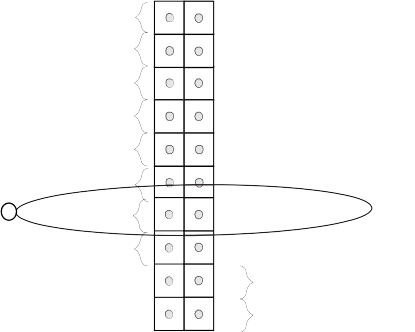


### **Функционал системы UID (Unit Identifier)**

#### **Управление двойной LED-индикацией**
1. **Синхронная активация**:
   - Однократное нажатие **физической кнопки UID** включает:
     - **Задний UID-светодиод** (на задней панели)
     - **Передний UID-индикатор** (подключен через контакты 19-20)
   - Повторное нажатие отключает оба индикатора

2. **Характеристики индикаторов**:
   | Расположение    | Цвет  | Ток  | Управление                       |
   | --------------- | ----- | ---- | -------------------------------- |
   | Задняя панель   | Синий | 15мА | Прямое управление BMC            |
   | Передняя панель | Синий | 10мА | Через разъем FP (контакты 19-20) |

#### **Дистанционное управление через IPMI**
1. **Командная строка**:
   ```bash
   # Активировать UID
   ipmitool raw 0x3C 0x0A 0x01 0x00
   
   # Деактивировать UID
   ipmitool raw 0x3C 0x0A 0x00 0x00
   
   # Проверить статус
   ipmitool raw 0x3C 0x0B
   ```

2. **Веб-интерфейс**:
   - Вход в BMC → Server Health → UID Control

#### **Электрические параметры**
1. **Подключение переднего индикатора**:
   ```
   Контакт 19: +3.3V (анод)
   Контакт 20: Земля (катод)
   ```
   - Максимальный ток: 20мА
   - Поддержка PWM-диммирования (через прошивку BMC)

2. **Цепь кнопки**:
   ```
   [Кнопка UID]
     ├── Подтяжка к +3.3V (внутри BMC)
     └── Замыкание на землю при нажатии
   ```

#### **Диагностика неисправностей**
1. **Индикаторы не горят**:
   - Проверить наличие +3.3V дежурного питания
   - Убедиться в версии прошивки BMC ≥ 1.30
   - Прозвонить цепь контактов 19-20

2. **Кнопка не работает**:
   - Измерить напряжение на контактах (должно быть 3.3V в разомкнутом состоянии)
   - Проверить механическую целостность кнопки

#### **Рекомендации по эксплуатации**
1. **Для дата-центров**:
   - Ресурс кнопки: 200,000 нажатий
   - Видимость индикатора: до 30 метров в рядах стоек

2. **Интеграция**:
   - Генерация SNMP-трапов при активации
   - Поддержка Redfish API для автоматизации

> **Примечание:** Состояние UID сохраняется после перезагрузки и не сбрасывается при рестарте BMC. Подробности в "Руководстве по прошивке BMC" на [Supermicro Documentation](https://www.supermicro.com/support/manuals/).


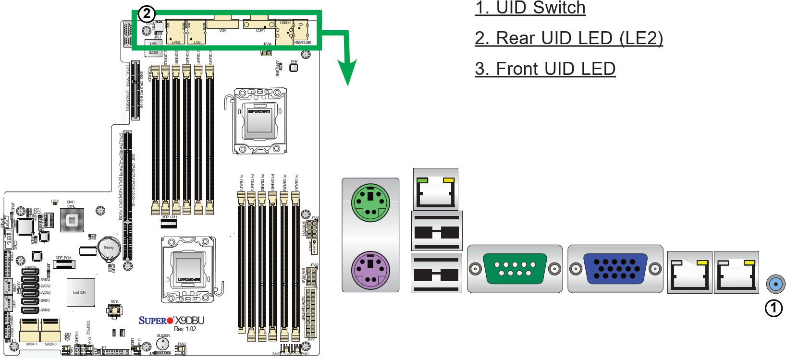


## Передняя панель управления

Разъём **JF1** содержит контакты для подключения различных кнопок и индикаторов, которые обычно расположены на панели управления в передней части корпуса. Эти разъёмы разработаны специально для использования с серверными корпусами Supermicro. Описание различных кнопок и светодиодных индикаторов панели управления см. на рисунке ниже.

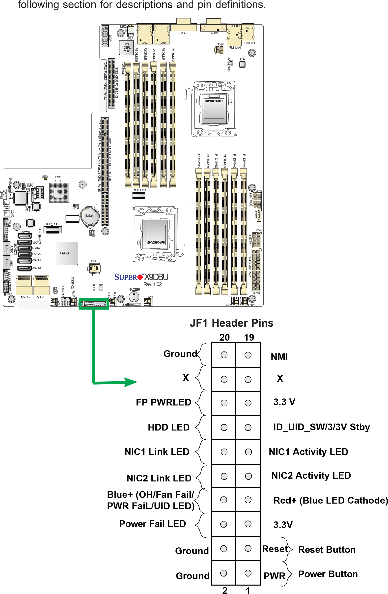


### **Разъем передней панели (JF1) - Кнопка NMI**

#### **Распиновка и подключение**
| Контакт | Назначение | Тип сигнала     | Цвет провода (типовой) |
| ------- | ---------- | --------------- | ---------------------- |
| **19**  | NMI_SW#    | Активный низкий | Красный/Желтый         |
| **20**  | Ground     | Земля           | Черный                 |

#### **Функциональные особенности**
1. **Назначение кнопки**:
   - Генерирует **немаскируемое прерывание** (Non-Maskable Interrupt)
   - Принудительно переводит систему в режим отладки
   - Используется для:
     - Аварийного дампа памяти (crash dump)
     - Диагностики зависших систем
     - Активации отладочных режимов

2. **Электрические параметры**:
   - Напряжение логики: 3.3V
   - Ток срабатывания: <5mA
   - Защита от дребезга: встроенная в BMC

#### **Рекомендации по подключению**
1. **Схема подключения**:
   ```
   [Кнопка NMI]
     ├── Контакт 19 (NMI_SW#)
     └── Контакт 20 (GND)
   ```

2. **Требования к кнопке**:
   - Тактовая кнопка без фиксации
   - Нормально-разомкнутый контакт
   - Ресурс: ≥100,000 нажатий

#### **Меры предосторожности**
1. **Защита от случайного нажатия**:
   - Рекомендуется использовать углубленную кнопку
   - Возможна блокировка через BIOS:
     ```bash
     # В настройках BMC:
     ipmitool raw 0x3C 0x0C 0x01 0x00
     ```

2. **Диагностика**:
   - Проверка работоспособности:
     ```bash
     # Через IPMI:
     ipmitool chassis status | grep NMI
     ```

> **Важно!** Для систем с критической нагрузкой рекомендуется отключать физический доступ к NMI-кнопке. Альтернатива - активация NMI только через IPMI.

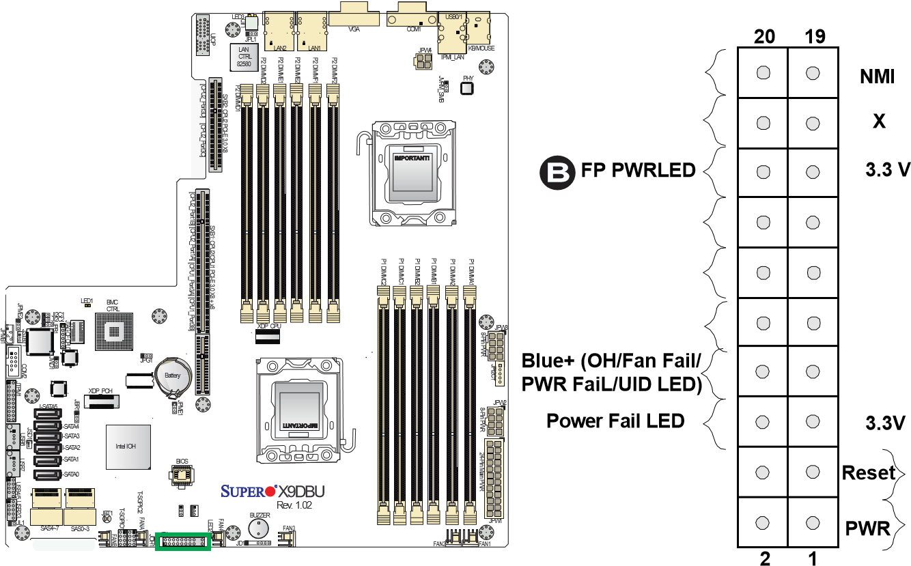

### **Разъем передней панели (JF1) - Подключение индикаторов и кнопок**

#### **1. Индикатор питания (Power LED)**
| Контакт | Назначение | Характеристики            |
| ------- | ---------- | ------------------------- |
| **15**  | +3.3V      | Дежурное питание          |
| **16**  | PWR LED    | Анод светодиода (зеленый) |

**Особенности:**
- Работает при наличии дежурного питания
- Требуемый ток: 5-10mA
- Рекомендуемый резистор: 220 Ом (встроен в материнскую плату)

#### **2. Индикатор активности HDD**
| Контакт | Назначение         |
| ------- | ------------------ |
| **13**  | HDD LED+ (красный) |
| **14**  | Ground             |

**Логика работы:**
- Мигает при обращении к любым накопителям
- Совместим с SATA/SAS/NVMe

#### **3. Сетевые индикаторы**
| Контакт | Назначение             |
| ------- | ---------------------- |
| **11**  | NIC1 Link LED (желтый) |
| **12**  | NIC1 Activity LED      |
| **9**   | NIC2 Link LED          |
| **10**  | NIC2 Activity LED      |

**Цветовая маркировка:**
- Link: постоянный свет (100/1000 Mbps)
- Activity: мигающий (передача данных)

#### **4. Кнопки управления**
| Контакт | Назначение   | Особенности       |
| ------- | ------------ | ----------------- |
| **1-2** | Power Button | Мягкое выключение |
| **3-4** | Reset Button | Аппаратный сброс  |
| **7-8** | UID Switch   | Синий индикатор   |

#### **Электрические параметры**
1. **Кнопки:**
   - Напряжение: 3.3V
   - Ток нажатия: <5mA
   - Защита от дребезга: 50ms (аппаратная)

2. **Светодиоды:**
   - Максимальный ток: 15mA
   - Обратное напряжение: 5V max

#### **Схема подключения**
```
[Передняя панель]
├── Power LED: 15(+) - 16(-)
├── HDD LED: 13(+) - 14(-)
├── Power SW: 1-2
└── Reset SW: 3-4
```

#### **Рекомендации**
1. Для кастомных корпусов:
   - Используйте экранированные кабели
   - Максимальная длина: 50см

2. Диагностика:
   ```bash
   # Проверка кнопки питания
   ipmitool chassis power status
   ```

> **Важно:** При подключении соблюдайте полярность светодиодов. Неправильное подключение может повредить цепи управления.


### **Подключение индикаторов передней панели (JF1)**

#### **1. Индикатор активности HDD (A)**
| Контакт | Назначение | Цвет провода | Характеристики  |
| ------- | ---------- | ------------ | --------------- |
| **13**  | HDD LED+   | Красный      | Анод светодиода |
| **14**  | Ground     | Черный       | Катод (земля)   |

**Особенности работы:**
- Мигает при обращении к **любым** накопителям (SATA/SAS/NVMe)
- Ток: 5-10 мА (встроенное ограничение на плате)
- Совместимость: 2-контактные LED всех стандартных корпусов

#### **2. Индикаторы сетевых портов**

##### **NIC1 (Порт 1)**
| Контакт | Индикатор (B/C)  | Цвет LED | Режимы работы                |
| ------- | ---------------- | -------- | ---------------------------- |
| **11**  | Link LED (B)     | Желтый   | Постоянный свет: подключение |
| **12**  | Activity LED (C) | Зеленый  | Мигание: передача данных     |

##### **NIC2 (Порт 2)**
| Контакт | Индикатор (D/E)  | Цвет LED | Режимы работы   |
| ------- | ---------------- | -------- | --------------- |
| **9**   | Link LED (D)     | Желтый   | Постоянный свет |
| **10**  | Activity LED (E) | Зеленый  | Мигание         |

#### **Ключевые особенности:**
1. **Совместимость разъемов**:
   - Все LED используют **стандартный шаг 2.54 мм**
   - Поддержка как 2-контактных, так и 3-контактных LED (с общим катодом)

2. **Электрические параметры**:
   - Напряжение: 3.3V
   - Максимальный ток: 15 мА на канал
   - Встроенная защита от переполюсовки

3. **Рекомендации по подключению**:
   ```plaintext
   [HDD LED]
   13 (+) ----[LED]---- 14 (-)
   
   [NIC1]
   11 (Link) ----[Желтый LED]---- Ground
   12 (Activity) ----[Зеленый LED]---- Ground
   ```

#### **Типовые проблемы и решения**
1. **Индикаторы не работают**:
   - Проверить полярность подключения
   - Убедиться в наличии дежурного питания (+3.3VSB)
   - Проверить настройки в BIOS:
     ```bash
     # Для IPMI-управляемых индикаторов
     ipmitool raw 0x3C 0x09 0x01
     ```

2. **Слабая яркость**:
   - Заменить на светодиоды с током 5-8 мА
   - Проверить сопротивление токоограничивающих резисторов

> **Важно!** Для корректной работы всех индикаторов необходимо подключение **основного 24-контактного разъема питания**. Индикаторы активности накопителей требуют включенного состояния системы (не работают в дежурном режиме).


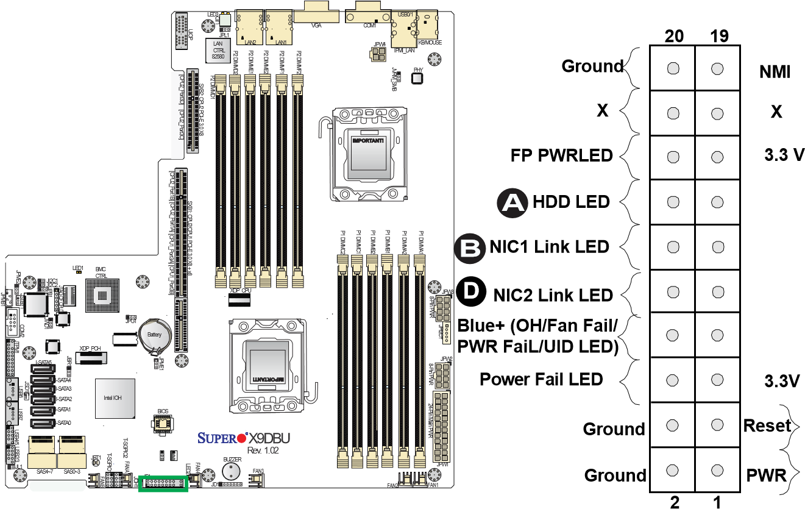


### **Подключение аварийных индикаторов (JF1)**

#### **1. Индикатор перегрева/отказа вентиляторов (A)**
| Контакт | Назначение         | Цвет LED | Состояния индикации                                          |
| ------- | ------------------ | -------- | ------------------------------------------------------------ |
| **7**   | +3.3V (Vcc)        | -        | Питание индикатора                                           |
| **8**   | OH/Fan Fail Signal | Красный  | **Выкл**: Норма<br>**Горит**: Перегрев<br>**Мигает**: Отказ вентилятора |

**Логика работы:**
- Активируется при:
  - Температуре CPU > 90°C (настраивается в BIOS)
  - Остановке любого системного вентилятора
  - Обрыве цепи RPM-мониторинга

#### **2. Индикатор сбоя питания (B)**
| Контакт | Назначение      | Цвет LED | Условия активации                              |
| ------- | --------------- | -------- | ---------------------------------------------- |
| **5**   | +3.3V Standby   | -        | Дежурное питание                               |
| **6**   | PWR Fail Signal | Красный  | **Горит**: Потеря основного питания (PWR_OK ↓) |

**Критические параметры:**
- Реагирует на:
  - Пропадание 12V/5V/3.3V
  - Срабатывание защиты БП
  - Отключение кабеля питания

#### **Схема подключения**
```plaintext
[Аварийные LED]
├── OH/Fan: 7(+) --[Красный LED]-- 8(-)
└── PWR Fail: 5(+) --[Красный LED]-- 6(-)
```

#### **Технические особенности**
1. **Требования к LED:**
   - Напряжение: 2.1-3.3V
   - Ток: 5-10 мА
   - Резистор: встроен 220 Ом

2. **Диагностика:**
   ```bash
   # Проверка статуса через IPMI:
   ipmitool sensor list | grep -E "Temp|Fan"
   ipmitool power status
   ```

3. **Настройки BIOS:**
   - Пороги температуры: `Advanced → Hardware Monitor`
   - Чувствительность: `Fan Fail Sensitivity`

#### **Рекомендации по эксплуатации**
1. Для серверных корпусов:
   - Используйте **двухцветные LED** (красный/желтый)
   - Максимальная длина кабеля: 1 метр

2. При ложных срабатываниях:
   - Проверить контакт термодатчиков
   - Калибровка вентиляторов:
     ```bash
     ipmitool raw 0x30 0x70 0x66 0x01 0x00 0x64
     ```

> **Важно!** Индикатор PWR Fail требует подключенного **24-контактного разъема ATX**. Для OH/Fan Fail необходимо активное состояние BMC (даже при выключенном сервере).


### **Подключение кнопок и индикаторов передней панели (JF1)**

#### **1. Кнопка Reset (A)**
| Контакт | Назначение   | Характеристики          |
| ------- | ------------ | ----------------------- |
| **3**   | Reset Signal | Активный низкий уровень |
| **4**   | Ground       | Общий провод            |

**Функционал:**
- Аппаратный сброс системы
- Минимальное время нажатия: 500ms
- Защита от случайного срабатывания

#### **2. Кнопка Power (B)**
| Контакт | Назначение | Режимы работы           |
| ------- | ---------- | ----------------------- |
| **1**   | PWRBTN#    | Активный низкий уровень |
| **2**   | Ground     | Общий провод            |

**Особенности:**
- Кратковременное нажатие:
  - Включение/выключение (зависит от состояния)
- Долгое нажатие (4+ секунды):
  - Принудительное выключение
  - Выход из suspend mode

#### **3. Индикатор питания (FP PWRLED)**
| Контакт | Назначение    | Цветовая маркировка |
| ------- | ------------- | ------------------- |
| **15**  | +3.3V Standby | Зеленый провод      |
| **16**  | PWR LED       | Белый провод        |

**Логика индикации:**
- Постоянный свет: система включена
- Мигание: спящий режим
- Выкл: питание отключено

#### **Полная схема подключения JF1**
```plaintext
[Передняя панель]
├── Кнопки:
│   ├── Power: 1(PWRBTN#) --[Кнопка]-- 2(GND)
│   └── Reset: 3(RESET#) --[Кнопка]-- 4(GND)
│
├── Индикаторы:
│   ├── Power LED: 15(+3.3V) --[LED]-- 16(PWR_LED)
│   ├── HDD LED: 13(+) --[LED]-- 14(GND)
│   ├── NIC1: 11(LINK) --[LED]-- GND
│   │        12(ACT) --[LED]-- GND
│   └── NIC2: 9(LINK) --[LED]-- GND
│          10(ACT) --[LED]-- GND
│
└── Аварийные LED:
    ├── OH/Fan: 7(+3.3V) --[LED]-- 8(OH_SIG)
    └── PWR Fail: 5(+3.3V) --[LED]-- 6(PWRFAIL#)
```

#### **Технические характеристики**
1. **Кнопки:**
   - Рабочее напряжение: 3.3V
   - Ток срабатывания: 2-5mA
   - Ресурс: 1 млн. нажатий

2. **Защитные механизмы:**
   - Аппаратный антидребезг (50ms)
   - Защита от ESD до 8kV
   - Изоляция между контактами: 500V AC

#### **Рекомендации по установке**
1. Для кастомных корпусов:
   - Используйте кабели 22-26 AWG
   - Максимальная длина: 60cm
   - Экранирование обязательно для промышленных решений

2. Диагностика:
   ```bash
   # Проверка кнопок через IPMI:
   ipmitool chassis identify
   ipmitool power status
   ```

> **Важно!** При подключении соблюдайте полярность светодиодов. Для кнопок полярность не имеет значения. Все сигнальные линии защищены самовосстанавливающимися предохранителями.


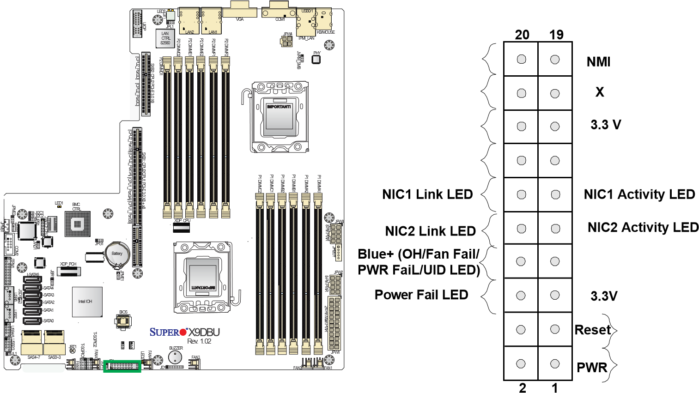


Светодиод жесткого диска ID_UID_SW/3/3V Stby
Красный+ (катод синего светодиода)
Кнопка сброса заземления A
Кнопка питания заземления B

2-7 

Подключение кабелей

Разъемы питания

На материнской плате расположены два 4-контактных разъема основного питания (JPW1), два 8-контактных разъема питания процессора (JPW2/JPW3) и 4-контактный разъем вспомогательного питания. Эти разъемы питания соответствуют спецификации SSI EPS 12 В. Эти разъемы питания также должны быть подключены к вашему блоку питания. См. таблицу справа для получения информации о назначении контактов.

Предупреждение: Во избежание повреждения материнской платы и компонентов используйте блок питания с поддержкой 24-контактного, двух 8-контактных и одного 4-контактного разъема питания. Обязательно подключите 24-контактный и два 8-контактных разъёма питания к блоку питания для обеспечения надлежащего питания вашей системы. 4-контактный разъём питания не является обязательным, однако Supermicro рекомендует также подключить его для оптимальной подачи питания.

​                                                                                                                                             **A. JPW1: 24-pin ATX**

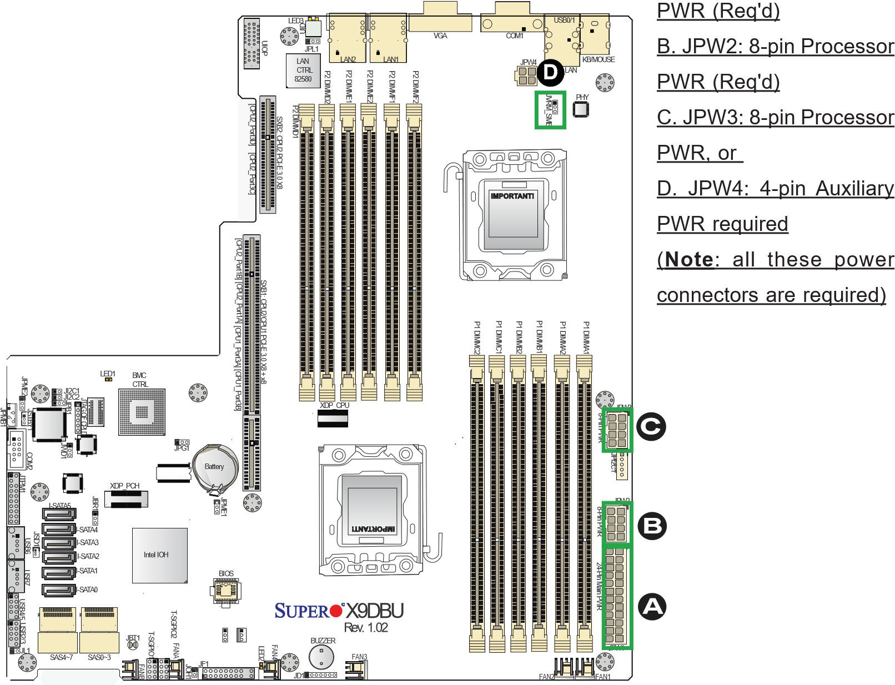


### **12V 8-контактный разъем питания процессора (JPW2/JPW3)**

#### **Распиновка и назначение контактов**
| Контакты | Назначение | Цвет провода (стандарт ATX) |
| -------- | ---------- | --------------------------- |
| **1-4**  | Ground     | Чёрный                      |
| **5-8**  | +12V       | Жёлтый                      |

#### **Ключевые характеристики**
1. **Требования к питанию:**
   - Минимальное сечение проводов: 18 AWG
   - Рекомендуемый ток: ≤9A на контакт
   - Общая мощность: до 384W (2×8-pin)

2. **Особенности подключения:**
   - **Обязательно** для систем с:
     - Процессорами TDP > 95W
     - Двухпроцессорной конфигурацией
   - Совместимость:
     - Стандарт EPS 12V 2.92
     - Обратная совместимость с 4-pin (использование только половины разъема)

#### **Схема подключения**
```plaintext
[Блок питания] 
  ├── Жёлтый (+12V) → Контакты 5-8
  └── Чёрный (GND) → Контакты 1-4
```

#### **Рекомендации по эксплуатации**
1. **Для высоконагруженных систем:**
   - Используйте раздельные кабели для JPW2 и JPW3
   - Избегайте использования переходников Molex-to-EPS

2. **Диагностика проблем:**
   ```bash
   # Проверка напряжений через IPMI:
   ipmitool sensor list | grep -i "12V"
   ```
   - Допустимый диапазон: 11.4V - 12.6V

3. **Меры безопасности:**
   - Всегда отключайте питание перед подключением/отключением
   - Проверяйте плотность посадки разъема (характерный щелчок)

> **Важно!** Непереключение 8-pin разъемов может привести к:
> - Нестабильности системы под нагрузкой
> - Преждевременному отключению
> - Перегреву разъемов питания

Для систем с разгоном рекомендуется мониторинг напряжений через:
```bash
watch -n 1 "ipmitool sensor list | grep -E '12V|VRM'"
```


### **Разъемы вентиляторов и дополнительные функции**

#### **1. Разъемы вентиляторов (4-pin)**
| Разъем  | Назначение               | Особенности            |
| ------- | ------------------------ | ---------------------- |
| FAN1-4  | Системные вентиляторы    | PWM-управление (4-pin) |
| FAN A/B | Процессорные вентиляторы | Поддержка до 2A (24W)  |

**Ключевые характеристики:**
- **Совместимость**: Работают с 3-pin вентиляторами (без регулировки скорости)
- **Управление**: Через IPMI/BIOS с шагом 0.1% (для 4-pin PWM)
- **Распиновка**:
  ```
  1: Ground (чёрный)
  2: +12V (жёлтый)
  3: Tachometer (зелёный)
  4: PWM Control (синий)
  ```

**Рекомендации:**
```bash
# Настройка через IPMI:
ipmitool raw 0x30 0x70 0x66 0x01 0x00 <скорость_0-100>
```

#### **2. Датчик вскрытия корпуса (JL1)**
| Контакт | Назначение |
| ------- | ---------- |
| 1       | Сигнал     |
| 2       | Ground     |

**Логика работы:**
- Замыкание на землю при открытии корпуса
- Генерирует событие в:
  - BIOS Event Log
  - IPMI System Event Log
  - ОС через ACPI

**Настройка в BIOS:**
```
Advanced → HW Monitor → Chassis Intrusion [Enabled/Reset]
```

#### **3. Динамик (Buzzer)**
| Контакт | Назначение | Типовые сигналы           |
| ------- | ---------- | ------------------------- |
| +       | 5V         | 1 короткий: POST успешен  |
| -       | Ground     | Длинные гудки: Ошибки RAM |

**Подключение:**
- Совместим со стандартными PC-спикерами
- Напряжение: 5V DC
- Ток: ≤50mA

#### **Схема подключения**
```plaintext
[Система охлаждения]
├── CPU_FAN1: PWM-вентилятор процессора
├── SYS_FAN2: Корпусной вентилятор
└── FAN_A/B: Дополнительные кулеры

[Безопасность]
├── JL1: Датчик вскрытия → Химпровод корпуса
└── Buzzer: Контаты 1-4 разъема PANEL
```

> **Важно!** Для оптимального охлаждения:  
> 1. Подключайте процессорные вентиляторы к FAN A/B  
> 2. Настройте кривые в BIOS:  
>    ```  
>    Advanced → Hardware Monitor → Fan Profile [Optimal]  
>    ```


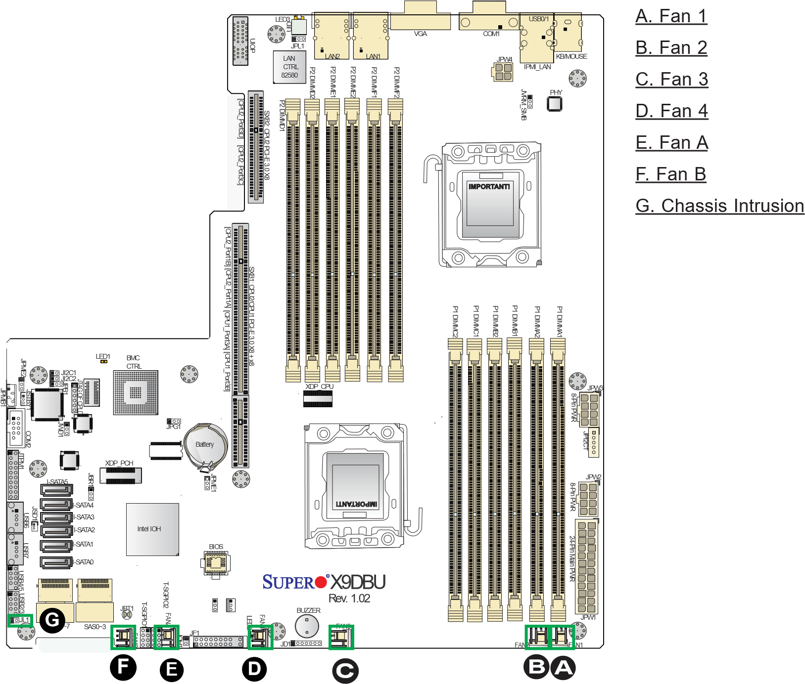


### **Детализация разъемов системных индикаторов и компонентов**

#### **1. Системный динамик (SP1)**
| Контакт | Назначение | Характеристики сигналов                 |
| ------- | ---------- | --------------------------------------- |
| **1**   | Анод (+)   | Питание +5V (±10%)                      |
| **2**   | Катод (-)  | Управляющий сигнал (открытый коллектор) |

**Коды сигналов:**
- **1 короткий** – Успешный POST
- **1 длинный + 2 коротких** – Ошибка видеокарты
- **Непрерывный** – Перегрев CPU
- **Серия коротких** (5+) – Ошибка памяти

> **Важно:** Максимальная нагрузка – 50 мА. Не подключайте низкоомные динамики!

#### **2. Индикатор перегрева/вентиляторов (JOH1)**
| Контакт | Назначение   | Логика работы                                                |
| ------- | ------------ | ------------------------------------------------------------ |
| **1**   | +3.3V        | Питание светодиода                                           |
| **2**   | OH/FAN_FAIL# | **Горит:** Перегрев (>90°C) <br> **Мигает:** Отказ вентилятора |

**Настройка в BIOS:**
```bash
Advanced → HW Monitor →  
- OH Threshold: [85-95°C]  
- Fan Fail RPM: [300-500]  
```

#### **3. Разъем TPM/Port 80 (JTPM1)**
| Контакт | Назначение    | Стандарт                |
| ------- | ------------- | ----------------------- |
| 1-20    | LPC-интерфейс | TPM 2.0 (ISO/IEC 11889) |
| 9,11,13 | Port 80       | POST-коды диагностики   |

**Функционал:**
- **TPM:** Шифрование BitLocker/HSM
- **Port 80:** Вывод POST-кодов на внешние индикаторы

#### **Схемы подключения**
```plaintext
[Безопасность]
├── SP1: 
│   ├── 1(+) → Красный провод
│   └── 2(-) → Чёрный провод
└── JOH1:
    ├── 1 → +3.3V (жёлтый)
    └── 2 → Сигнальный (зелёный)

[TPM]
└── JTPM1:
    ├── 1: LPC_AD0
    └── 20: VCC_3.3V
```

#### **Рекомендации по эксплуатации**
1. Для **аудио-диагностики**:
   - Используйте динамики 8-16 Ом
   - Тестовый сигнал: `ipmitool raw 0x6 0x4`

2. При **перегреве**:
   ```bash
   # Принудительное охлаждение:
   ipmitool raw 0x30 0x70 0x66 0x01 0x00 0x64
   ```

3. Для **TPM**:
   - Активация в BIOS: `Security → TPM State [Enabled]`
   - Требуется драйвер в ОС

> **Внимание!** Контакты JOH1 чувствительны к статике. Перед подключением LED сбросьте заряд, коснувшись корпуса.

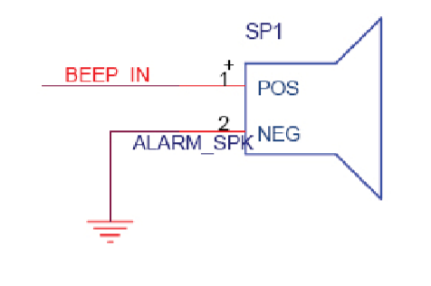

## Индикатор перегрева/сбоя вентилятора

**Разъем JOH1** предназначен для подключения светодиодного индикатора, который  сигнализирует о перегреве корпуса и сбое работы вентиляторов. При  возникновении неисправности вентилятора светодиод начинает мигать.Модуль доверенной платформы (TPM) и порт 80

**Разъем JTPM1** обеспечивает поддержку:Модуля TPM (Trusted Platform Module)Порта 80Мониторинга состояния вентилятора и перегреваСостояние индикатора и соответствующие сообщенияСостояние индикатораСообщениеПостоянный светПерегревМигающий светСбой вентилятораНазначение контактов разъема TPM/Port 80

**Группа 1:**

Контакт 1 — LCLK (тактовый сигнал)

Контакт 2 — GND (земля)

Контакт 3 — LFRAME# (сигнал фрейма)

Контакт 4 — <( KEY )> (ключ)

Контакт 5 — LRESET# (сигнал сброса)

Контакт 6 — +5V (питание)

Контакт 7 — LAD 3 (линия данных 3)

Контакт 8 — LAD 2 (линия данных 2)

**Группа 2:**

Контакт 9 — +3.3V (питание)

Контакт 10 — LAD1 (линия данных 1)

Контакт 11 — LAD0 (линия данных 0)

Контакт 12 — GND (земля)

Контакт 13 — SMB_CLK4 (тактовый сигнал SMBus)

Контакт 14 — SMB_DAT4 (данные SMBus)

Контакт 15 — +3V_DUAL (двойное питание 3V)

Контакт 16 — SERIRQ (сигнал прерывания)

**Группа 3:**

Контакт 17 — GND (земля)

Контакт 18 — CLKRUN# (сигнал работы тактового генератора)

Контакт 19 — LPCPD# (сигнал управления питанием)

Контакт 20 — LDRQ# (сигнал запроса)Данная система индикации и мониторинга позволяет своевременно обнаруживать  критические состояния системы и предотвращать возможные повреждения  компонентов.

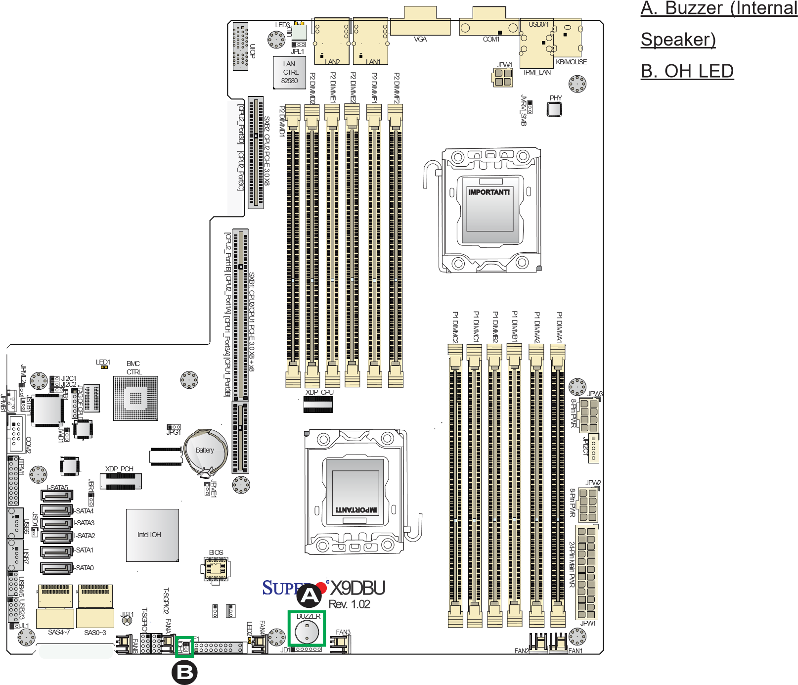


Используйте этот разъём для повышения производительности системы и безопасности данных. Описание контактов см. в таблице.

### **Распиновка разъема IPMB (JIPMB)**

#### **Назначение контактов**
| Контакт | Назначение       | Тип сигнала | Технические характеристики              |
| ------- | ---------------- | ----------- | --------------------------------------- |
| **1**   | IPMB_DAT (Data)  | Биполярный  | Линия данных I2C (3.3V, 4.7kΩ подтяжка) |
| **2**   | Ground           | -           | Общий провод                            |
| **3**   | IPMB_CLK (Clock) | Тактовый    | Частота до 400 кГц                      |
| **4**   | NC (No Connect)  | -           | Не используется                         |

#### **Электрические параметры**
1. **Протокол:** I2C (IPMI-спецификация)
2. **Напряжение логики:** 3.3V ±5%
3. **Ток линии:** ≤10mA
4. **Защита:** ESD-диоды (8kV HBM)

#### **Схема подключения**
```plaintext
[Контроллер IPMI]
├── 1 (DAT) → SDA (синий провод)
├── 2 (GND) → Земля (черный)
└── 3 (CLK) → SCL (зеленый)
```

#### **Рекомендации по эксплуатации**
1. **Кабельная инфраструктура:**
   - Используйте витую пару (CAT5e)
   - Макс. длина: 1.5м (для 400 кГц)
   - Экранирование обязательно

2. **Диагностика проблем:**
   ```bash
   # Проверка связи через ipmitool:
   ipmitool -I bmc channel info 1
   ```

3. **Интеграционные сценарии:**
   - Подключение дополнительных BMC-контроллеров
   - Внешние датчики температуры/влажности
   - Кастомные модули мониторинга

> **Критически важно:**  
> - Избегайте переполюсовки контактов 1 и 3  
> - Не подключайте питание к контакту 4  
> - При использовании переходников I2C→IPMB проверьте уровень логики  

Для расширенной конфигурации см. "IPMI Developer's Guide" на [Supermicro Documentation](https://www.supermicro.com/support/manuals/).


## IPMB

Разъём шины системного управления для IPMI 2.0 расположен на JIPMB. Подключите сюда соответствующий кабель, чтобы использовать подключение I2C IPMB в вашей системе.


### **Разъем IPMB (JIPMB) для IPMI 2.0**

#### **Назначение и подключение**
**IPMB (Intelligent Platform Management Bus)** - специализированный интерфейс для:
- Мониторинга аппаратных компонентов
- Удаленного управления через IPMI
- Интеграции с системами DCIM

#### **Ключевые характеристики**
| Параметр   | Значение                             |
| ---------- | ------------------------------------ |
| Стандарт   | IPMI 2.0 / I2C                       |
| Скорость   | 100 кГц (стандарт) / 400 кГц (Turbo) |
| Напряжение | 3.3V                                 |
| Макс. ток  | 50 мА                                |

#### **Рекомендации по использованию**
1. **Для подключения:**
   - Используйте экранированный 4-контактный кабель
   - Максимальная длина: 1 метр

2. **Диагностика:**
   ```bash
   # Проверка связи через IPMI:
   ipmitool bmc info
   ```

3. **Интеграция:**
   - Совместим с:
     - Supermicro IPMIView
     - Nagios/Icinga плагинами
     - Prometheus IPMI Exporter

> **Важно:** Не подключайте периферийные устройства напрямую - только совместимые контроллеры управления!


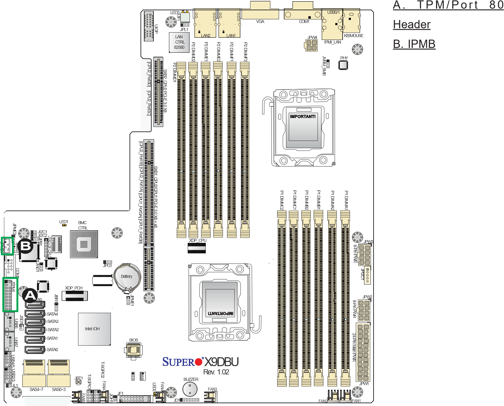


### **Разъемы управления питанием и мониторинга**

#### **1. Разъем Power SMB (I2C) - JPI2C1**
| Контакт | Назначение    | Стандарт  | Применение                   |
| ------- | ------------- | --------- | ---------------------------- |
| **1**   | +3.3V Standby | SMBus 2.0 | Питание датчиков             |
| **2**   | SMB_CLK       | I2C       | Тактовая линия (100-400 кГц) |
| **3**   | SMB_DATA      | I2C       | Линия данных                 |
| **4**   | Ground        | -         | Общий провод                 |

**Функционал:**
- Мониторинг БП (напряжения, токи, КПД)
- Контроль скоростей вентиляторов
- Сбор данных с термодатчиков

**Пример использования:**
```bash
# Чтение показаний через ipmitool:
ipmitool sdr list | grep -i "PSU"
```

#### **2. Разъем Standby Power - JSTBY1**
| Контакт | Назначение | Характеристики   |
| ------- | ---------- | ---------------- |
| **1**   | +5VSB      | Дежурное питание |
| **2**   | Ground     |                  |

**Особенности:**
- Обеспечивает питание BMC при выключенном сервере
- Макс. нагрузка: 2A
- Защита от КЗ: самовосстанавливающийся предохранитель

#### **3. Разъемы T-SGPIO 1/2**
| Контакт | Назначение | Протокол |
| ------- | ---------- | -------- |
| **1**   | CLK        | SGPIO v2 |
| **2**   | DATA       |          |
| **3**   | LOAD       |          |
| **4**   | Ground     |          |

**Применение:**
- Управление backplane-индикаторами
- Диагностика дисковых массивов
- Совместимость с SAS/SATA Expander

#### **Схемы подключения**
```plaintext
[Мониторинг]
├── JPI2C1 → Датчики БП
│   ├── 1: +3.3V (красный)
│   └── 3: SDA (желтый)

[Резервное питание]
└── JSTBY1 → BMC
    ├── 1: +5VSB (оранжевый)
    └── 2: GND (черный)

[SGPIO]
├── T-SGPIO1 → Backplane 1
└── T-SGPIO2 → Backplane 2
```

#### **Рекомендации**
1. **Для точного мониторинга:**
   - Используйте экранированные кабели ≤50см
   - Избегайте параллельной прокладки с силовыми линиями

2. **Диагностика:**
   ```bash
   # Проверка дежурного питания:
   ipmitool dcmi power reading
   ```

3. **Безопасность:**
   - Не подключайте нагрузки >2A к JSTBY1
   - Заземляйте экраны SMBus-кабелей

> **Важно!** Для систем с горячим резервированием БП требуется подключение **всех** SMB-разъемов к обоим блокам питания.


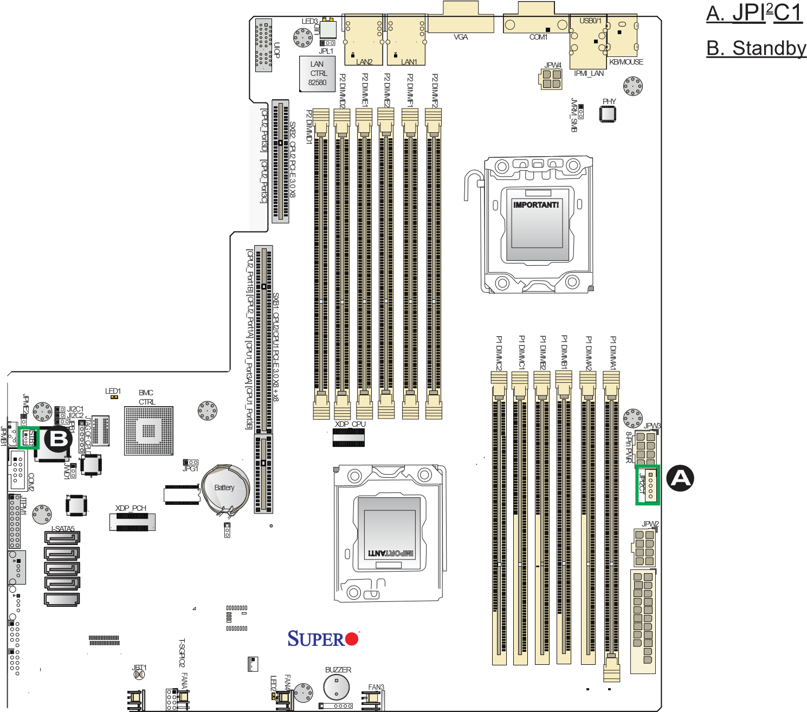


### Разъём питания DOM

Разъём питания для устройств SATA DOM

(Disk On Module) расположен на JSD1. Подключите сюда соответствующий кабель для питания устройств DOM.

### Индикатор питания/Динамик

На разъёме JD1 контакты 1–3 используются для светодиодной индикации питания, а контакты 4–7 — для динамика. Описание контактов см. в таблицах справа. Обратите внимание:

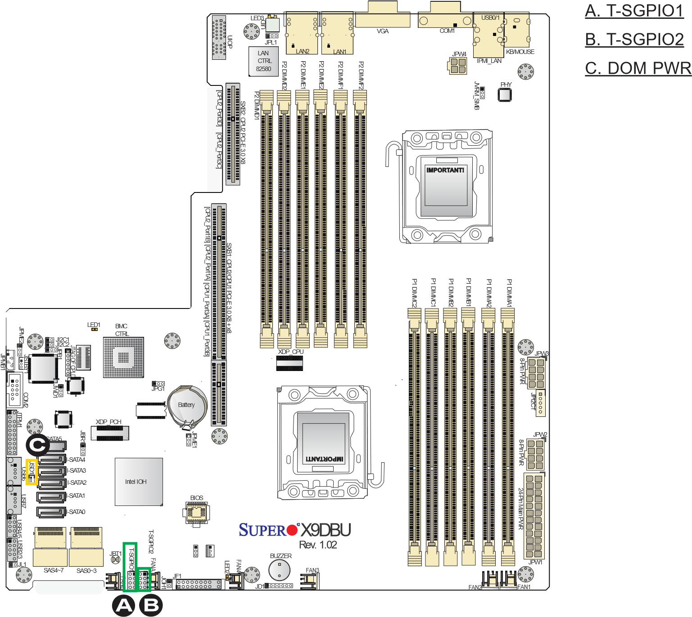

### **Разъемы питания и индикации**

#### **1. Разъем питания SATA DOM (JSD1)**
| Контакт | Назначение | Цвет провода | Макс. ток |
| ------- | ---------- | ------------ | --------- |
| **1**   | +5V        | Красный      | 1.5A      |
| **2**   | Ground     | Черный       | -         |
| **3**   | Ground     | Черный       | -         |

**Особенности подключения:**
- Для 2.5" DOM-устройств
- Требует кабеля с разъемом MOLEX 8981-04P
- Защита от переполюсовки

#### **2. Разъем индикатора питания (PWR LED)**
| Контакт | Назначение      | Цвет провода |
| ------- | --------------- | ------------ |
| **1**   | Анод (+)        | Зеленый      |
| **2**   | Катод (-)       | Белый        |
| **3**   | Не используется | -            |

**Характеристики:**
- Напряжение: 3.3V
- Ток: 5-10mA
- Резистор: 220 Ом (встроен)

#### **3. Разъем спикера**
| Конфигурация | Назначение        | Особенности          |
| ------------ | ----------------- | -------------------- |
| **Pins 4-5** | Внешний спикер    | Поддержка PC-спикера |
| **Pins 6-7** | Внутренний спикер | Требуется перемычка  |

**Коды ошибок:**
- 1 короткий: Успешный POST
- Непрерывный: Перегрев CPU
- 1 длинный + 2 коротких: Ошибка видеокарты

### **Схемы подключения**
```plaintext
[DOM Устройство]
├── 1 (+5V) → Красный провод
└── 2-3 (GND) → Черные провода

[Индикатор питания]
├── 1 (+) → Зеленый провод
└── 2 (-) → Белый провод

[Спикер]
├── Внешний: 4(+) 5(-)
└── Внутренний: Установите перемычку 6-7
```

### **Рекомендации**
1. **Для DOM-устройств:**
   - Макс. мощность: 7.5W (1.5A × 5V)
   - Используйте экранированные кабели

2. **При проблемах со спикером:**
   ```bash
   # Тест через IPMI:
   ipmitool raw 0x6 0x4
   ```

3. **Диагностика индикатора:**
   - Проверьте полярность мультиметром
   - При отсутствии свечения: замерьте +3.3V на Pin 1

> **Важно!** Не подключайте DOM-устройства без заземления (контакт 2/3). Для промышленных решений используйте развязывающие трансформаторы.


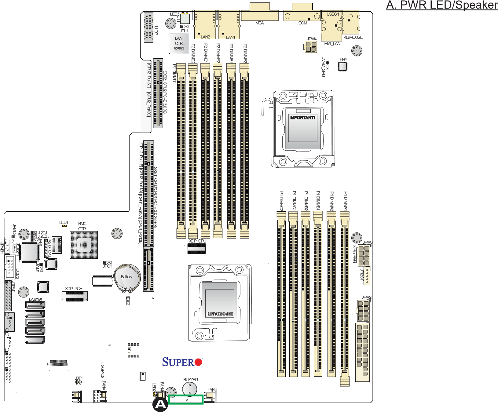

### 2-8 Настройка перемычек и дополнительные разъемы

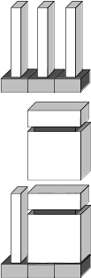


### **Настройка перемычек сетевых портов (LAN1/2 и LAN3/4)**

#### **Расположение и назначение перемычек**
| Перемычка | Управляемые порты | Расположение на плате               |
| --------- | ----------------- | ----------------------------------- |
| **JPL1**  | LAN1 и LAN2       | Возле разъема RJ45 LAN1             |
| **JPL2**  | LAN3 и LAN4*      | Возле чиста Intel I350 (*если есть) |

#### **Режимы работы**
| Положение перемычки | Состояние портов              | Визуализация |
| ------------------- | ----------------------------- | ------------ |
| **1-2 (замкнуто)**  | Порты ВКЛЮЧЕНЫ (по умолчанию) | `[■]■[ ]`    |
| **2-3 (замкнуто)**  | Порты ОТКЛЮЧЕНЫ               | `[ ]■[■]`    |

#### **Пошаговая инструкция**
1. **Для отключения портов:**
   - Выключите сервер и отсоедините кабель питания
   - Переставьте перемычку с положения 1-2 на 2-3
   - Пример для LAN1/2:
     ```
     До:    JPL1: [■]■[ ]  
     После: JPL1: [ ]■[■]
     ```

2. **Примечания:**
   - В отключенном состоянии порты:
     - Не определяются в ОС
     - Не потребляют питание
     - Сохраняют настройки MAC-адресов
   - Для серверов с 4 портами требуется переключать **оба** джампера (JPL1 и JPL2)

#### **Схема подключения**
```plaintext
[Перемычка LAN]
├── Контакт 1: Vcc (3.3V)
├── Контакт 2: Сигнал управления
└── Контакт 3: Ground
```

#### **Рекомендации**
1. **Для безопасности:**
   ```bash
   # Перед отключением проверьте активные соединения:
   ipmitool lan print 1
   ```

2. **При проблемах:**
   - Если порты не включаются, проверьте:
     - Положение перемычки
     - Наличие +3.3V на контакте 1
     - Замыкание на землю (контакт 3)

> **Важно!** Для 10G портов (если есть) используйте отдельные перемычки. Отключение портов через BIOS переопределяет настройки перемычек.


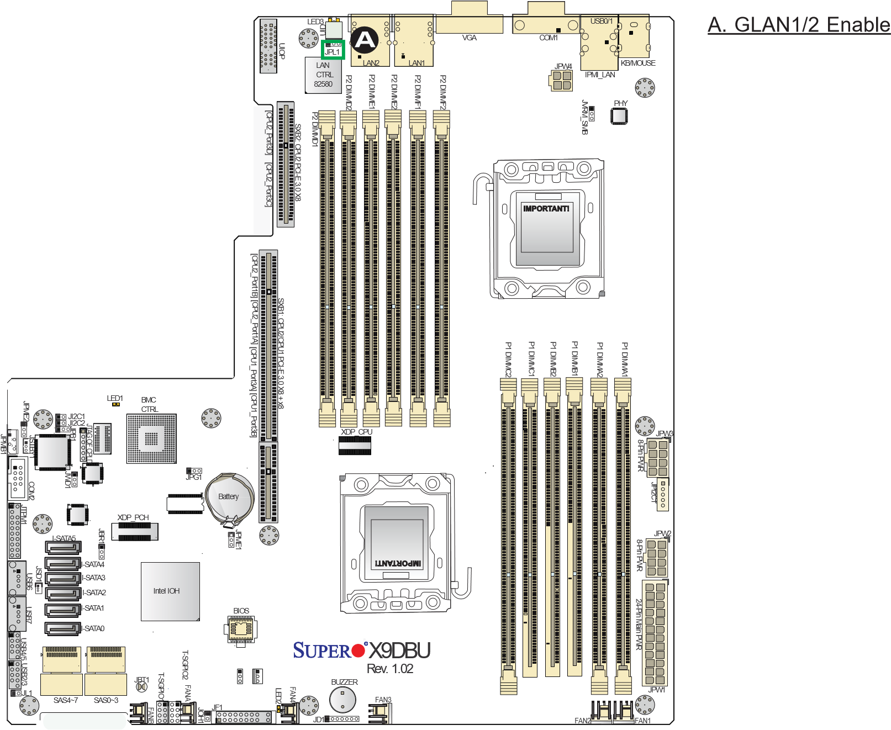

#### 1. Разъемы SGPIO (T-SGPIO1/2)

**Назначение:** Управление индикацией backplane для SATA/SAS  
**Распиновка:**

```
1: CLK      2: DATA
3: LOAD     4: GND
```
**Применение:**  
- Подключение к backplane с поддержкой Serial_Link  
- Совместимость с горячей заменой дисков  

---

#### **2. Разъем питания SATA DOM (JSD1)**
| Контакт | Назначение |
| ------- | ---------- |
| 1       | +5V        |
| 2       | Ground     |

**Особенности:**  
- Ток до 1.5A (до 2 устройств DOM)  
- Требуется кабель с разъемом MOLEX 8981-04P  

---

#### **3. Разъем питания/спикера (JD1)**
| Контакты | Назначение          |
| -------- | ------------------- |
| 1-3      | Power LED (зеленый) |
| 4-5      | Внешний спикер      |
| 6-7      | Внутренний спикер*  |

**\*Важно:**  
- Для активации встроенного спикера замкните 6-7 перемычкой  
- Полярность для LED: 1(+) 3(-)  

---

#### **4. Критические перемычки**

##### **JPL1 - Управление сетевыми портами**
| Состояние | LAN1/LAN2 |
| --------- | --------- |
| **1-2**   | Включены  |
| **2-3**   | Выключены |

**По умолчанию:** 1-2 (Enabled)  

##### **JBT1 - Сброс CMOS**
**Метод сброса:**  
1. Отключить питание и извлечь батарейку CMOS  
2. Замкнуть контактные площадки металлическим предметом на 10 сек  
3. Вернуть батарейку и включить питание  

**Последствия:**  
- Сброс BIOS к заводским настройкам  
- Удаление всех паролей  
- Сброс настроек RAID  

---

#### **Схемы подключения**
```plaintext
[Backplane]
├── T-SGPIO1 → CLK/DATA/LOAD
└── T-SGPIO2 → Резервный

[DOM Устройства]
└── JSD1 → +5V/GND

[Индикация]
├── JD1:
│   ├── 1-3: Power LED
│   └── 6-7: Jumper для спикера
```

---

#### **Рекомендации**
1. **Для SATA DOM:**  
   - Максимальная мощность: 7.5W на устройство  
   - Используйте кабели с ферритовыми кольцами  

2. **При сбросе CMOS:**  
   ```bash
   # После сброса восстановите настройки:
   ipmitool raw 0x30 0x70 0x0c 0x01
   ```

3. **Диагностика спикера:**  
   - Коды ошибок: 1 длинный + 2 коротких = Ошибка видеокарты  

> **Внимание!** Не замыкайте JBT1 при включенном питании — это может повредить южный мост. Для серверов с двойным BIOS используйте перемычку JBMC1 для переключения между чипами.


### **Управление перемычками CMOS и Watch Dog**

#### **1. Сброс CMOS (JBT1)**
**Расположение:** Контактные площадки возле батарейки CMOS  
**Процедура сброса:**

1. Полностью выключите сервер и отсоедините кабель питания
2. Извлеките батарейку CMOS (CR2032)
3. Замкните металлическим предметом (отвертка) оба контакта на 10 секунд:
   ``` 
   [PAD1] ===(замыкание)===[PAD2]
   ```
4. Верните батарейку и включите питание

**Последствия сброса:**
- Сброс BIOS к заводским настройкам
- Удаление всех паролей (включая BMC)
- Сброс настроек RAID и Boot Order

---

#### **2. Конфигурация Watch Dog (JWD1)**
**Расположение:** Рядом с разъемом TPM  
**Режимы работы:**

| Положение | Функция                      | Применение                 |
| --------- | ---------------------------- | -------------------------- |
| **1-2**   | Hard Reset (по умолчанию)    | Перезагрузка при зависании |
| **2-3**   | NMI (Non-Maskable Interrupt) | Прерывание для диагностики |
| **Open**  | Отключено                    | -                          |

**Настройка через BIOS:**
```
Advanced → Watch Dog Configuration → 
- Timeout: [1-255 мин]
- Action: [Reset/NMI]
```

**Пример использования:**
```bash
# Активация через IPMI (60 сек таймаут):
ipmitool raw 0x06 0x24 0x00 0x00 0x00 0x3C
```

---

#### **Сравнение функций**
| Особенность        | JBT1 (CMOS Clear) | JWD1 (Watch Dog)       |
| ------------------ | ----------------- | ---------------------- |
| Физический доступ  | Требуется         | Не обязателен          |
| Влияние на систему | Полный сброс      | Контролируемый рестарт |
| Интеграция         | Только аппаратная | BIOS/IPMI/ОС           |

---

#### **Критические замечания**
1. Для **CMOS Clear**:
   - Не замыкайте контакты при включенном питании!
   - После сброса потребуется:
     ```bash
     # Восстановить настройки BMC:
     ipmitool lan set 1 ipsrc static
     ```

2. Для **Watch Dog**:
   - При NMI-режиме требуется драйвер в ОС
   - Логи событий сохраняются в:
     ```
     /var/log/ipmi.log (Linux)
     Event Viewer → System (Windows)
     ```

> **Важно!** Для промышленных решений с Watch Dog:
> - Используйте внешний мониторинг через `ipmitool sel list`
> - Настройте дублирование сигнала на релейный выход


### **Настройка перемычек управления подсистемами**

#### **1. Перемычка VGA (JPG1)**
| Положение | Состояние                  | Особенности                                         |
| --------- | -------------------------- | --------------------------------------------------- |
| **1-2**   | VGA Включен (по умолчанию) | Активирует встроенный видеоконтроллер Matrox G200eW |
| **2-3**   | VGA Отключен               | Освобождает ресурсы для PCIe-видеокарт              |

**Когда отключать:**
- При использовании дискретной графики
- Для серверов без монитора
- Для снижения энергопотребления

---

#### **2. Перемычка BMC (JPB1)**
| Положение | Состояние                  | Функционал                |
| --------- | -------------------------- | ------------------------- |
| **1-2**   | BMC Включен (по умолчанию) | Полная поддержка IPMI/KVM |
| **2-3**   | BMC Отключен               | Экономия энергии (~3W)    |

**Критические нюансы:**
- При отключении теряется:
  - Удаленное управление
  - Мониторинг датчиков
  - Доступ к SOL (Serial Over LAN)

---

#### **3. Перемычка ME Recovery (JPME1)**
| Положение | Режим                     | Применение             |
| --------- | ------------------------- | ---------------------- |
| **1-2**   | Нормальный (по умолчанию) | Стандартная работа     |
| **2-3**   | Recovery Mode             | Обновление прошивки ME |

**Процедура восстановления:**
1. Установите перемычку 2-3
2. Загрузите образ через `ipmitool`:
   ```bash
   ipmitool raw 0x32 0xba 0x18 0x01
   ```
3. После прошивки верните в положение 1-2

---

#### **Сравнительная таблица**

| Перемычка | По умолчанию | Риски отключения             | Время восстановления          |
| --------- | ------------ | ---------------------------- | ----------------------------- |
| **JPG1**  | 1-2          | Потеря видеовыхода           | Мгновенно                     |
| **JPB1**  | 1-2          | Потерь удаленного доступа    | Требуется холодный перезапуск |
| **JPME1** | 1-2          | Критично только при прошивке | До 15 минут                   |

---

#### **Рекомендации**
1. **Для VGA:**
   - При использовании GPU NVIDIA Tesla устанавливайте 2-3
   - Проверьте вывод через IPMI KVM:
     ```bash
     ipmitool sol activate
     ```

2. **Для BMC:**
   - Перед отключением сохраните настройки:
     ```bash
     ipmitool lan print > bmc_backup.txt
     ```

3. **Для ME Recovery:**
   - Используйте только с официальными образами от Supermicro
   - При ошибках:
     ```bash
     ipmitool mc reset cold
     ```

> **Важно!** Все изменения перемычек требуют **полного отключения питания**. Для критичных систем рекомендуется дублирование управления через Redfish API.

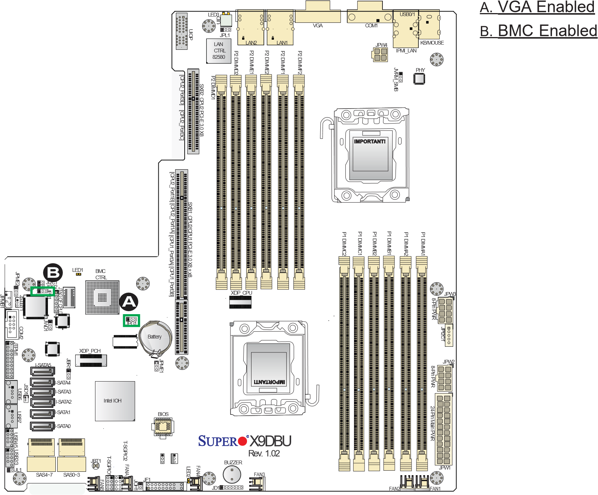


### **Настройка специализированных перемычек**

#### **1. Перемычка Manufacturer Mode (JPME2)**
| Положение | Режим                   | Назначение                                                   |
| --------- | ----------------------- | ------------------------------------------------------------ |
| **Open**  | Нормальный режим        | Стандартная работа (по умолчанию)                            |
| **2-3**   | Производительский режим | Отключает защиту SPI для: <br>- Прошивки извне <br>- Модификации скрытых настроек <br>- Восстановления поврежденной прошивки |

**Критически важно:**

- Используйте ТОЛЬКО с доверенными образами прошивки
- После прошивки немедленно верните в положение Open
- Требует физического доступа к серверу

**Процедура обновления:**
```bash
# Через host-сервер (требует специального ПО производителя)
flashrom -p internal:laptop=force_I_want_a_brick -w bios.rom
```

---

#### **2. Перемычки I2C для PCIe (JI2C1/JI2C2)**
| Перемычка | Положение | Назначение                                 | Совместимость                       |
| --------- | --------- | ------------------------------------------ | ----------------------------------- |
| **JI2C1** | Open      | Отключение I2C для PCIe x16 (по умолчанию) | Все видеокарты                      |
|           | Closed    | Активация мониторинга через SMBus          | Только серверные GPU (NVIDIA Tesla) |
| **JI2C2** | Open      | Отключение I2C для PCIe x8                 | RAID-контроллеры                    |
|           | Closed    | Включение управления питанием              | HBA-карты                           |

**Когда активировать:**
- Для карт с датчиками температуры/напряжения
- При использовании NVMe с Power Budgeting
- Для совместимости с IPMI-мониторингом

**Предупреждение:**  
Активация с потребительскими видеокартами может вызвать конфликты!

---

#### **Сравнение режимов**

| Характеристика      | Manufacturer Mode (JPME2)  | I2C to PCIe (JI2C1/2)   |
| ------------------- | -------------------------- | ----------------------- |
| **Безопасность**    | Критично снижена           | Нейтрально              |
| **Сценарии**        | Recovery/Development       | Мониторинг оборудования |
| **Время активации** | 10-15 мин (прошивка)       | Мгновенно               |
| **Риски**           | Bricking материнской платы | Конфликты устройств     |

---

#### **Рекомендации по эксплуатации**
1. **Для JPME2:**
   - Записывайте исходное положение перемычки перед изменением
   - Используйте источник бесперебойного питания во время прошивки

2. **Для JI2C1/2:**
   - Проверяйте совместимость в [Supermicro HCL](https://www.supermicro.com/support/resources/)
   - Диагностика подключения:
     ```bash
     # Проверка устройств на шине I2C
     i2cdetect -l
     ```

3. **Общее:**
   - Всегда используйте антистатический браслет
   - Для промышленных решений применяйте перемычки с защитными колпачками

> **Важно!** Manufacturer Mode дает доступ к критическим разделам прошивки. Любые изменения в этом режиме аннулируют гарантию. Для повседневной эксплуатации все перемычки должны быть в положении **по умолчанию**.


### 2-9 Встроенные светодиодные индикаторы

2-9  Onboard LED Indicators

### Светодиоды GLAN

Порты LAN 1/2 расположены на объединительной плате ввода-вывода. Каждый порт Ethernet LAN имеет два светодиода. Желтый светодиод справа указывает на активность. Светодиод Link слева может гореть зеленым, янтарным или быть выключенным, указывая скорость. Подробнее см. в таблицах:

### **Индикация сетевых портов (GLAN)**

#### **1. Индикатор активности (левый светодиод)**
| Цвет       | Состояние | Значение               |
| ---------- | --------- | ---------------------- |
| **Желтый** | Мигание   | Передача/прием данных  |
| **Выкл**   | -         | Нет сетевой активности |

#### **2. Индикатор скорости соединения (правый светодиод)**
| Цвет         | Скорость              | Особые условия                                   |
| ------------ | --------------------- | ------------------------------------------------ |
| **Выкл**     | Нет связи или 10 Мбит | -                                                |
| **Зеленый**  | 100 Мбит              | -                                                |
| **Янтарный** | 1 Гбит                | -                                                |
| **Зеленый**  | 1 Гбит                | Только когда ВСЕ порты LAN1-4 работают на 1 Гбит |

#### **Технические детали**
1. **Логика работы:**
   
   - Индикаторы управляются контроллером **Intel I350**
   - Частота мигания: 10 Гц (при активном трафике)
   - Яркость: 50-100 кд/м² (зависит от модели)
   
2. **Подключение:**
   ```plaintext
   [Разъем на плате]
   ├── Активность: Контакт 11 (JF1)
   └── Скорость: Контакт 13/14 (JF1)
   ```

#### **Рекомендации**
1. **Диагностика проблем:**
   ```bash
   # Проверка статуса портов в Linux:
   ethtool eth0 | grep -E "Speed|Link"
   ```
2. **При отсутствии индикации:**
   - Проверьте кабель (CAT5e/6)
   - Убедитесь, что порт включен в BIOS:
     ```
     Advanced → Network Stack Configuration → LAN1/2 Enable
     ```

3. **Для серверных решений:**
   - При использовании LACP оба индикатора будут мигать синхронно
   - В режиме энергосбережения (Energy Efficient Ethernet) яркость снижается на 30%

> **Важно!** Янтарный цвет при 1 Гбит указывает на работу через copper-кабель, зеленый — при использовании SFP.

​                                     Link LED                                                                                    Activity LED

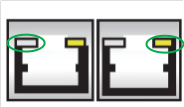


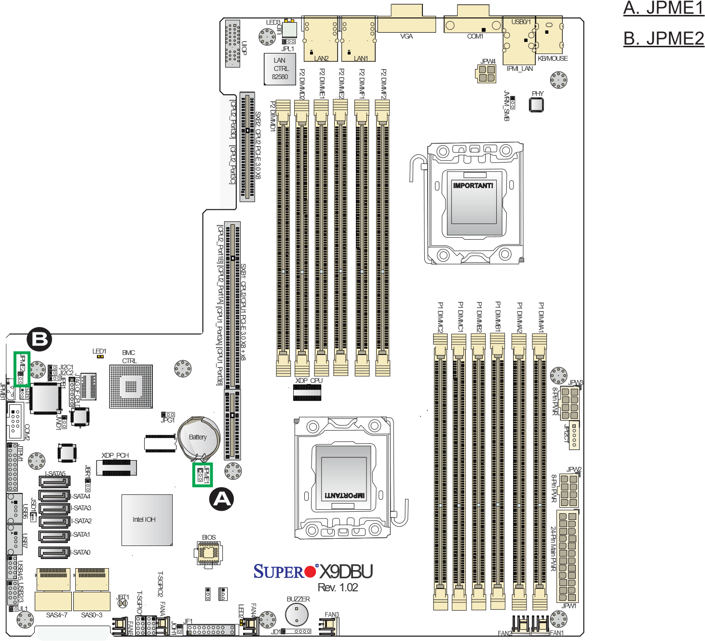


**IPMI Dedicated LAN LEDs**

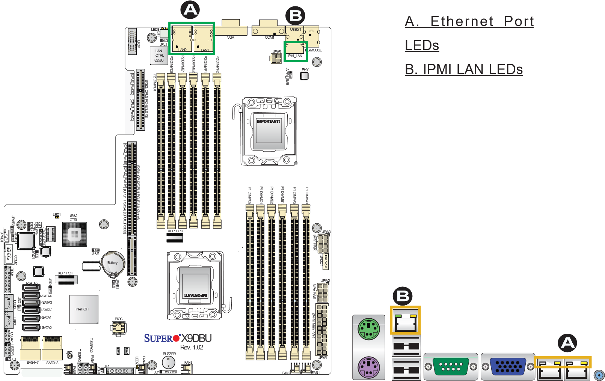

Помимо портов Gigabit Ethernet, над портами USB 0/1 на материнской плате также расположен выделенный порт IPMI LAN. Янтарный светодиод справа показывает активность, а зелёный светодиод слева — скорость соединения. Подробнее см. в таблицах.  

**IPMI LAN**

​                                                                Link LED                                 Activity LED

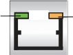


### **Индикация IPMI LAN порта**

#### **1. Индикатор соединения (левый светодиод)**
| Состояние           | Значение                     | Технические параметры |
| ------------------- | ---------------------------- | --------------------- |
| **Зеленый (горит)** | Активное соединение 100 Мбит | Напряжение: 3.3V ±5%  |
| **Выключен**        | Нет соединения               | Ток: 5 мА             |

#### **2. Индикатор активности (правый светодиод)**
| Состояние             | Значение        | Частота мигания      |
| --------------------- | --------------- | -------------------- |
| **Янтарный (мигает)** | Передача данных | 10 Гц (при нагрузке) |
| **Выключен**          | Нет активности  | -                    |

#### **Ключевые особенности**
1. **Управление:**
   - Контроллер: **Nuvoton WPCM450R BMC**
   - Питание: от дежурного +3.3VSB (работает даже при выключенном сервере)

2. **Распиновка (на плате):**
   ```
   Левый LED:  Контакт 1 (+), Контакт 2 (-)  
   Правый LED: Контакт 3 (+), Контакт 4 (-)
   ```

3. **Диагностика:**
   ```bash
   # Проверка статуса через IPMI:
   ipmitool lan print 1 | grep -E "Link|Active"
   ```

#### **Рекомендации**
1. При **отсутствии индикации**:
   - Проверьте кабель (требуется минимум CAT5)
   - Убедитесь, что IPMI включен в BIOS:
     ```
     Advanced → BMC Configuration → IPMI LAN Enable
     ```

2. Для **удаленного мониторинга**:
   ```bash
   # Лог активности через syslog:
   logger -p user.notice "IPMI Link: $(ipmitool lan print 1 | grep Link)"
   ```

> **Важно!** Этот порт НЕ зависит от основной сетевой подсистемы. Для работы требуется:
> - Отдельный IP-адрес
> - Разрешенный доступ в настройках BMC (меню `Security → IPMI Filtering`)


### Светодиод питания на плате

**Onboard Power LED** 

Светодиод питания на плате расположен на материнской плате (LED2). Когда этот светодиод горит, система включена. Перед извлечением или установкой компонентов обязательно выключите систему и отсоедините шнур питания. Дополнительную информацию см. в таблицах справа.

### **Индикатор питания на материнской плате (LED1)**

#### **Настройки индикации**
| Цвет/Состояние                  | Режим работы системы             | Описание                                                     |
| ------------------------------- | -------------------------------- | ------------------------------------------------------------ |
| **Выключен**                    | Система отключена                | Кабель питания не подключен или отсутствует дежурное напряжение |
| **Зеленый (постоянно)**         | Система включена                 | Основное питание подано, система работает в нормальном режиме |
| **Зеленый (частое мигание)**    | Режим ACPI S1 (Power On Suspend) | Процессор остановлен, оперативная память и устройства остаются под напряжением |
| **Зеленый (медленное мигание)** | Режим ACPI S3 (Suspend to RAM)   | Состояние сохранено в RAM, большинство компонентов отключено |

#### **Технические детали**
1. **Управление:**
   - Контролируется чипсетом Intel C602/C606
   - Источник питания: +5VSB (дежурное напряжение)

2. **Частота мигания:**
   - Быстрое: 2 Гц (S1)
   - Медленное: 0.5 Гц (S3)

3. **Подключение:**
   ```
   LE1:
     Анод (+) → 5VSB (красный провод)
     Катод (-) → Сигнал управления (зеленый провод)
   ```

#### **Рекомендации**
1. **При диагностике:**
   - Если индикатор не горит при подключенном питании:
     ```bash
     # Проверьте дежурное напряжение:
     ipmitool sensor list | grep "5VSB"
     ```
   - Постоянное горение в S3 режиме указывает на ошибку ACPI

2. **Для корректной работы:**
   - В BIOS должны быть включены:
     ```
     Advanced → ACPI Settings → Suspend Mode [Auto]
     ```

3. **Особенности состояний:**
   - **S1:** Быстрый выход (1-2 сек), повышенное энергопотребление
   - **S3:** Медленный выход (5-10 сек), экономия энергии

> **Важно!** При обслуживании системы всегда дожидайтесь полного выключения индикатора перед отсоединением кабеля питания. Мигающие режимы указывают на активное состояние низкого энергопотребления.

### Светодиод UID на задней панели

**Rear UID LED** 

Светодиод UID на задней панели расположен на материнской плате (LED3). Этот светодиод используется вместе с переключателем UID на задней панели для легкой идентификации системы, требующей обслуживания. Дополнительную информацию см. в разделе «Переключатель UID» на стр. 3–15.

### **Статус индикатора UID (Unit Identification)**

#### **Режимы работы и их значение**

| Цвет/Состояние              | Операционная система | Статус системы         |
| --------------------------- | -------------------- | ---------------------- |
| **Синий (постоянно горит)** | Windows OS           | Сервер идентифицирован |
| **Синий (мигает)**          | Linux OS             | Сервер идентифицирован |

#### **Технические характеристики**

1. **Управление индикацией:**
   - **Windows:** Постоянное свечение через драйвер BMC
   - **Linux:** Мигание 1 Гц через системный демон (`ipmid`)

2. **Активация:**
   - Физическая кнопка UID на задней панели
   - Команда IPMI:
     ```bash
     # Активировать (вкл/выкл)
     ipmitool raw 0x3C 0x0A 0x01 0x00
     ```

3. **Электрические параметры:**
   - Напряжение: 3.3V ±5%
   - Ток потребления: 15 мА
   - Резистор: встроенный 220 Ом

#### **Типовые сценарии использования**

1. **В дата-центре:**
   - Поиск конкретного сервера в стойке
   - Обслуживание без отключения:
     ```bash
     # Включить на 5 минут:
     ipmitool chassis identify 300
     ```

2. **При неисправностях:**
   - Если индикатор не работает:
     ```bash
     # Проверьте статус через IPMI:
     ipmitool raw 0x3C 0x0B
     ```

#### **Интеграция с ПО**
- **Windows:**  
  Через Supermicro System Manager (автоматическая активация при алертах)

- **Linux:**  
  Настройка через `systemd`:
  
  ```ini
  # /etc/systemd/system/uid-notify.service
  [Service]
  ExecStart=/usr/bin/ipmitool chassis identify force
  ```

> **Важно!** Индикатор UID работает независимо от состояния ОС (через BMC). Для видимости в больших стойках рекомендуем использовать дополнительные внешние индикаторы.

### Светодиод BMC Heartbeat

**BMC Heartbeat LED**

Светодиод BMC Heartbeat расположен на материнской плате (LED1). Мигание LED1 означает, что BMC работает нормально. Дополнительную информацию см. в таблице справа. 2-10 Разъемы Serial ATA

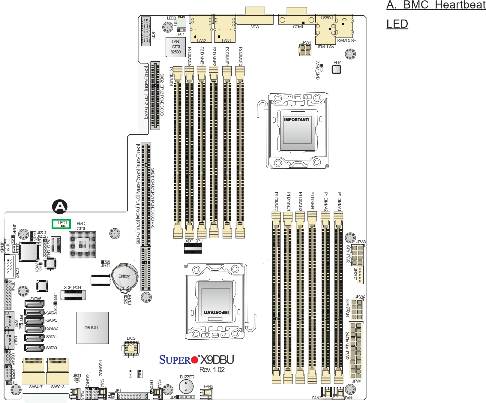

### **Индикатор активности BMC (LED1)**

#### **Режимы работы**

| Состояние индикатора   | Статус BMC             | Дополнительная информация             |
| ---------------------- | ---------------------- | ------------------------------------- |
| **Зеленый: мигает**    | BMC работает нормально | Частота мигания: 1 Гц (±0.2 Гц)       |
| **Не горит**           | BMC неактивен/отключен | Требуется проверка питания и прошивки |
| **Зеленый: постоянно** | Ошибка BMC             | Необходима перезагрузка BMC           |

#### **Технические детали**

1. **Параметры мигания:**
   - Нормальный режим: 1 импульс в секунду
   - Контролируется микроконтроллером Nuvoton WPCM450R
   - Питание: 3.3V Standby (работает даже при выключенном сервере)

2. **Диагностика:**
   ```bash
   # Проверка статуса BMC через IPMI:
   ipmitool mc info | grep "Firmware Revision"
   ```

3. **Подключение:**
   - Анод (+) : контакт 1 (зеленый провод)
   - Катод (-): контакт 2 (черный провод)

#### **Рекомендации**

1. **При отсутствии мигания:**
   - Проверьте подключение кабеля питания BMC
   - Обновите прошивку:
     ```bash
     ipmitool fw update bmc_firmware.bin
     ```

2. **Если горит постоянно:**
   - Выполните холодный сброс BMC:
     ```bash
     ipmitool mc reset cold
     ```

3. **Для мониторинга:**
   ```bash
   # Настройка оповещений при сбоях:
   ipmitool sel elist | grep "BMC Firmware Error"
   ```

> **Важно!** Индикатор Heartbeat является критическим для мониторинга работоспособности BMC. При изменении режима мигания (учащение/прекращение) немедленно проверьте систему.

### Порты Serial ATA


На материнской плате расположено шесть портов Serial ATA (I-SATA0~ISATA 5), включая четыре порта SATA2 и два порта SATA3. Эти порты обеспечивают последовательную передачу сигналов, которая быстрее, чем у Parallel ATA. Описание контактов см. в таблице справа.

Порты SAS

Восемь портов Serial Attached SCSI (SSATA/SAS 0~3, SAS 4~7) расположены на материнской плате X9DBU-3F/X9DBU-iF и обеспечивают последовательную передачу данных. Эти порты поддерживаются микросхемой Intel C606. Описание контактов см. в таблице справа.


### Индикаторы состояния системы

#### **1. Встроенный индикатор питания (LED2)**
| Состояние    | Статус системы                      | Меры безопасности                             |
| ------------ | ----------------------------------- | --------------------------------------------- |
| **Горит**    | Система включена                    | Всегда отключайте питание перед обслуживанием |
| **Выключен** | Система выключена/в режиме ожидания | -                                             |

#### **2. Задний UID-индикатор (LED3)**
| Состояние         | Функционал                            | Связанный компонент    |
| ----------------- | ------------------------------------- | ---------------------- |
| **Синий (горит)** | Идентификация системы активна         | Кнопка UID (стр. 3-15) |
| **Мигает**        | Активная сессия удаленного управления | IPMI/KVM               |
| **Выключен**      | Нормальная работа                     | -                      |

#### **3. Индикатор активности BMC (LED1)**
| Состояние          | Статус BMC        | Диагностика                    |
| ------------------ | ----------------- | ------------------------------ |
| **Мигает (1 Гц)**  | Нормальная работа | Стандартный режим              |
| **Горит/Не горит** | Ошибка BMC        | Проверьте версию прошивки IPMI |

### **Подключение накопителей**

#### **Порты Serial ATA**
| Порты     | Стандарт | Макс. скорость | Поддерживаемые режимы       |
| --------- | -------- | -------------- | --------------------------- |
| I-SATA0/1 | SATA III | 6 Гбит/с       | AHCI/RAID 0,1,5,10          |
| I-SATA2-5 | SATA II  | 3 Гбит/с       | Совместимость с IDE-режимом |

**Ключевые особенности:**
- Горячая замена (требуется настройка в BIOS)
- Поддержка портовых множителей (SATA III)
- Технология Intel Rapid Storage

#### **SAS-порты (только X9DBU-3F/-iF)**
| Группа портов | Контроллер | Особенности                                  |
| ------------- | ---------- | -------------------------------------------- |
| SSATA/SAS0-3  | Intel C606 | SAS 2.0 (6 Гбит/с), совместимость с SATA III |
| SAS4-7        | Intel C606 | Выделенные SAS 2.0, поддержка STP            |

**Дополнительные возможности:**
- RAID 0/1/10 через Intel Matrix Storage
- Кэширование SSD
- T10 PI (защита данных) для корпоративных дисков

### **Рекомендации по подключению**

1. **Управление питанием:**
   - Всегда проверяйте LED2 перед обслуживанием
   - Индикатор UID (LED3) помогает locate сервер в стойке

2. **Оптимизация хранилища:**
   ```bash
   # Проверка скорости подключения в Linux:
   for i in {0..5}; do cat /sys/class/ata_link/link$i/sata_spd; done
   ```
   - SAS-порты приоритетны для корпоративных SSD/HDD
   - SATA III оптимальны для загрузочных устройств

3. **Мониторинг BMC:**
   ```bash
   # Проверка состояния:
   ipmitool mc info | grep -i "firmware revision"
   ```

> **Важно!** Чипсет C606 поддерживает гибридные конфигурации (SSD+HDD), но не рекомендуется объединять потребительские SATA-диски с корпоративными SAS-накопителями в одном RAID-массиве из-за разницы в производительности. Для максимальной производительности SAS используйте сертифицированные Supermicro диски.


### 2-10 Подключение Serial ATA и SAS

#### **1. Порты Serial ATA (SATA)**
**Конфигурация портов:**
| Порты     | Версия SATA | Макс. скорость | Режимы работы       |
| --------- | ----------- | -------------- | ------------------- |
| I-SATA0/1 | SATA III    | 6 Гбит/с       | AHCI, RAID 0/1/5/10 |
| I-SATA2-5 | SATA II     | 3 Гбит/с       | Legacy IDE, AHCI    |

**Ключевые особенности:**
- Поддержка горячей замены (требуется настройка в BIOS)
- Совместимость с SSD и HDD
- Intel Rapid Storage Technology для RAID-массивов

**Распиновка SATA-портов:**
```
1: Ground    2: TX+      3: TX-
4: Ground    5: RX-      6: RX+
7: Ground
```

#### **2. Порты SAS (только X9DBU-3F/X9DBU-iF)**
**Конфигурация портов:**
| Группа портов | Тип     | Скорость | Особенности              |
| ------------- | ------- | -------- | ------------------------ |
| SSATA/SAS0-3  | SAS 2.0 | 6 Гбит/с | Совместимость с SATA III |
| SAS4-7        | SAS 2.0 | 6 Гбит/с | Полноценные SAS-порты    |

**Функционал:**
- Поддержка RAID 0/1/10 через Intel C606
- T10 PI (защита данных) для корпоративных дисков
- STP (Serial Tunneling Protocol) для SATA-устройств

#### **Рекомендации по подключению**
1. **Для SATA:**
   ```bash
   # Проверка скорости в Linux:
   for i in {0..5}; do cat /sys/class/ata_link/link$i/sata_spd; done
   ```
   - SATA III (6 Гбит/с) идеальны для SSD
   - SATA II (3 Гбит/с) подходят для HDD и оптических приводов

2. **Для SAS:**
   - Используйте сертифицированные Supermicro диски
   - Приоритет для критичных нагрузок:
     ```bash
     # Мониторинг через ipmitool:
     ipmitool sensor list | grep -i "sas_temp"
     ```

3. **Настройка RAID:**
   - Требуется активация в BIOS:
     ```
     Advanced → SATA Configuration → RAID Mode
     ```
   - Документация по HostRAID: [Intel SATA HostRAID Guide](https://www.supermicro.com/support/manuals/)

#### **Сравнение интерфейсов**
| Характеристика | SATA III          | SAS 2.0  |
| -------------- | ----------------- | -------- |
| Макс. скорость | 6 Гбит/с          | 6 Гбит/с |
| Поддержка SSD  | Да                | Да       |
| Горячая замена | Да (с настройкой) | Да       |
| Длина кабеля   | до 1 м            | до 10 м  |

> **Важно!** Для SAS-подключений используйте кабели с экранированием. Смешивание SATA и SAS в одном RAID-массиве не рекомендуется.


### **Распиновка SATA/SAS-портов**

#### **Назначение контактов**
| Контакт | Обозначение | Тип сигнала              | Описание                       |
| ------- | ----------- | ------------------------ | ------------------------------ |
| **1**   | Ground      | Земля                    | Общий проводник                |
| **2**   | TX_P        | Передача (положительный) | Дифференциальная пара передачи |
| **3**   | TX_N        | Передача (отрицательный) |                                |
| **4**   | Ground      | Земля                    | Экранирование                  |
| **5**   | RX_N        | Прием (отрицательный)    | Дифференциальная пара приема   |
| **6**   | RX_P        | Прием (положительный)    |                                |
| **7**   | Ground      | Земля                    | Дополнительное экранирование   |

#### **Технические характеристики**
1. **Скорость передачи:**
   - **SATA III:** 6 Гбит/с (600 МБ/с)
   - **SAS 2.0:** 6 Гбит/с (совместим с SATA III)

2. **Дифференциальные пары:**
   - Импеданс: 100 Ом (±10%)
   - Напряжение: 400-600 мВ (пиковое)

3. **Электрические требования:**
   - Допустимое отклонение напряжения: ±5%
   - Максимальный ток: 1.5A на порт

#### **Схема подключения**
```plaintext
[Устройство (HDD/SSD)]
├── 2 (TX_P) → Красный провод
├── 3 (TX_N) → Белый провод
├── 5 (RX_N) → Синий провод
└── 6 (RX_P) → Желтый провод

[Заземление]
├── 1,4,7 → Черные провода
```

#### **Рекомендации по эксплуатации**
1. **Для стабильной работы:**
   - Используйте кабели длиной ≤1 м (SATA) / ≤10 м (SAS)
   - Избегайте перегибов кабелей (минимальный радиус 30 мм)

2. **Диагностика проблем:**
   ```bash
   # Проверка линка в Linux:
   dmesg | grep -i "sata link"
   ```
   - Ошибка "PHY RDY change" указывает на проблемы с кабелем

3. **При подключении SAS:**
   - Убедитесь в поддержке SSP (Serial SCSI Protocol)
   - Для SATA-устройств активируйте STP в BIOS:
     ```
     Advanced → SAS Configuration → STP Support
     ```

> **Важно!** Не подключайте питание к сигнальным контактам. Для горячей замены SAS-устройств используйте специальные backplane-разъемы с поддержкой SES-2.


Порты Serial ATA

На материнской плате расположено шесть портов Serial ATA (I-SATA0~ISATA 5), включая четыре порта SATA2 и два порта SATA3. Эти порты обеспечивают последовательную передачу сигналов, которая быстрее, чем у Parallel ATA. Описание контактов см. в таблице справа.

Порты SAS

Восемь последовательных портов SCSI (SSATA/SAS 0~3, SAS 4~7) расположены на материнской плате X9DBU-3F/X9DBU-iF и обеспечивают последовательное подключение. Эти порты поддерживаются микросхемой Intel C606. Описание контактов см. в таблице справа.

Примечание: Для получения дополнительной информации о настройке SATA HostRAID см. руководство пользователя Intel SATA HostRAID, размещенное на нашем веб-сайте.

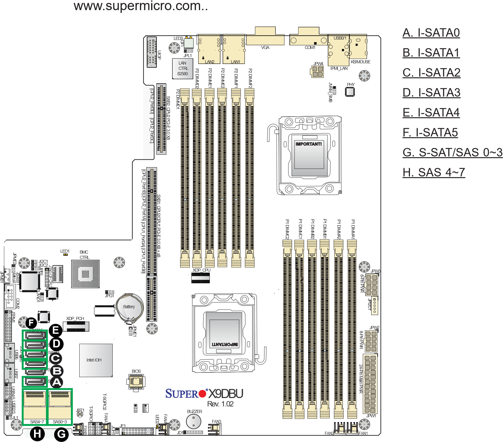


# Глава 3: Диагностика и устранение неисправностей

Chapter 3: Troubleshooting

## Процедуры диагностики

Используйте следующие процедуры для устранения неисправностей. Если после выполнения всех шагов проблема не решена, обратитесь к разделам "Процедуры технической поддержки" и/или "Возврат оборудования на обслуживание".

**Внимание:** Всегда отключайте кабель питания перед установкой, заменой или изменением любых аппаратных компонентов.

### Перед включением питания
1. Убедитесь в отсутствии короткого замыкания между материнской платой и корпусом.
2. Отсоедините все ленточные кабели от материнской платы, включая кабели клавиатуры и мыши.
3. Извлеките все дополнительные карты.
4. Установите сначала процессор CPU1 (убедитесь в правильной установке) и подключите разъемы передней панели.

### Нет питания
1. Проверьте отсутствие короткого замыкания между платой и корпусом.
2. Убедитесь в правильном подключении разъемов ATX питания.
3. Проверьте положение переключателя 115V/230V на блоке питания (если есть).
4. Проверьте систему, включая и выключая питание.

5. Возможно разряжена батарейка материнской платы. Проверьте напряжение (~3V). При необходимости замените.

### Нет видеосигнала
1. При включенном питании, но отсутствии изображения, извлеките все дополнительные карты и кабели.
2. Используйте спикер для определения звуковых кодов ошибок (см. Приложение A).

### Сбой загрузки системы
Если система не проходит POST или не реагирует после включения:
1. Проверьте звуковые сигналы:
   - Нет сигнала: попробуйте запустить без модулей памяти, затем только с CPU1
   - Есть сигналы: сбросьте CMOS (раздел 2-8)
2. Извлеките все компоненты, особенно модули памяти, и проверьте звуковые сигналы.
3. Запустите систему с одним модулем памяти для диагностики.

### Потеря настроек BIOS
1. Используйте качественный блок питания.
2. Проверьте/замените батарейку CMOS.
3. Если проблема не решена, обратитесь к поставщику.

### Ошибки памяти
При звуковых сигналах о проблемах с памятью:
1. Убедитесь в совместимости и правильной установке модулей.
2. Используйте модули одинакового типа и скорости.
3. Проверьте тип памяти (RDIMM/LRDIMM/UDIMM).
4. Проверьте модули и слоты, переставляя модули.
5. Убедитесь в полной установке модулей (раздел 2-4).
6. Следуйте таблицам размещения модулей (раздел 2-4).

### Нестабильная работа системы

#### A. Во время или после установки ОС
1. Совместимость CPU/BIOS: проверьте поддержку процессора и обновите BIOS.
2. Память: протестируйте модули (memtest86).
3. HDD: проверьте работоспособность дисков.
4. Охлаждение: проверьте вентиляторы и температуру в BIOS.
5. Питание: убедитесь в достаточной мощности БП.
6. Драйверы: используйте правильные версии.

#### B. До или во время установки ОС
1. Источник установки: проверьте загрузочные устройства.
2. Кабели: проверьте все соединения.
3. Минимальная конфигурация: запустите систему с минимальным набором компонентов.
4. Поиск неисправных компонентов: тестируйте компоненты по отдельности.
5. Заменяйте компоненты по одному для точной диагностики.
6. Проверяйте компоненты в другой системе.


### 3-2 Процедуры технической поддержки

3-2     Technical Support Procedures

Прежде чем обращаться в службу технической поддержки, выполните следующие действия. Также, пожалуйста, обратите внимание, что Supermicro, будучи производителем материнских плат, также продает материнские платы по своим каналам, поэтому лучше всего сначала обратиться к своему дистрибьютору или реселлеру за услугами по устранению неполадок. Они должны быть осведомлены о любых возможных проблемах с
конкретной конфигурацией системы, которая была вам продана.

1. Перед обращением в службу технической поддержки ознакомьтесь с разделами «Процедуры устранения неполадок» и «Часто задаваемые вопросы» (FAQ) в этой главе или ознакомьтесь с часто задаваемыми вопросами на нашем веб-сайте
(http://www.supermicro.com/).

2. Обновления iOS можно загрузить с нашего веб-сайта (http://www.supermicro.
com).

3. Если вам по-прежнему не удаётся решить проблему, предоставьте следующую информацию при обращении в Supermicro за технической поддержкой: com).

   • Модель материнской платы и номер версии печатной платы
   • Дата/версия BIOS (отображается на начальном экране при первой загрузке системы).
   • Конфигурация системы

4. Пример формы обращения в службу технической поддержки можно найти на нашем веб-сайте (http://www.supermicro.com).
• Дистрибьюторам: для получения немедленной помощи, пожалуйста, подготовьте номер своего счёта при звонке в наш отдел технической поддержки. С нами можно связаться по электронной почте support@supermicro.com.ation


**Перед обращением в техническую поддержку выполните следующие шаги.**  
*Примечание:* Как производитель материнских плат, Supermicro распространяет продукцию через партнеров. Рекомендуем сначала обратиться к вашему поставщику или дистрибьютору — они могут располагать информацией о возможных проблемах в вашей конфигурации.  

#### 1. Самостоятельная диагностика  
- Изучите разделы **«Процедуры диагностики»** и **«Частые вопросы» (FAQ)** в этой главе.  
- Проверьте [базу знаний на сайте Supermicro](http://www.supermicro.com/).  

#### 2. Обновление ПО  
- Загрузите последние версии **BIOS/IPMI** с [официального сайта](http://www.supermicro.com/).  

#### 3. Подготовка информации для поддержки  
Если проблема не решена, при обращении укажите:  
- **Модель материнской платы** и ревизию PCB (указаны на самой плате).  
- **Версию BIOS** (отображается при загрузке).  
- **Конфигурацию системы** (CPU, память, диски, периферия).  

#### 4. Форма обращения  
- Шаблон запроса в техподдержку доступен на [supermicro.com](http://www.supermicro.com).  
- **Для дистрибьюторов:**  
  - Готовьте номер вашего аккаунта для ускорения обработки запроса.  
  - Контакты:  
    - Email: **support@supermicro.com**  
    - Телефон: уточните на сайте для вашего региона.  

---

**Рекомендации:**  
- Для критичных инцидентов приложите:  
  - Логи IPMI (`ipmitool sel elist`).  
  - Фото ошибок на экране (если есть видеовыход).  
- При проблемах с железом:  
  ```bash
  # Соберите данные о системе (Linux):
  dmidecode -t baseboard > mobo_info.txt
  ipmitool mc info > bmc_info.txt
  ```


#### 3-3  Battery Removal and Installation

3-3 Извлечение и установка батарейки

**Извлечение батарейки:**
1. Выключите систему и отсоедините кабель питания.
2. Найдите батарейку на материнской плате.
3. Аккуратно отожмите фиксатор батарейки с помощью ручки или тонкой отвертки.
4. Извлеките батарейку из разъема.

**Важно!** Утилизируйте батарейки правильно:
- Не повреждайте батарейку - это может привести к утечке опасных веществ
- Не выбрасывайте в обычный мусор
- Соблюдайте местные правила утилизации опасных отходов

**Установка новой батарейки:**
1. Убедитесь, что полярность правильная (+ сверху).
2. Вставьте новую батарейку CR2032 до щелчка фиксатора.


#### 3-4 Часто задаваемые вопросы

3-4  Frequently Asked Questions

**Какие типы памяти поддерживаются?**
- RDIMM/LRDIMM ECC
- UDIMM ECC/Non-ECC DDR3
Не смешивайте модули разного объема и скорости.

**Как обновить BIOS?**
1. Скачайте последнюю версию с [supermicro.com](http://www.supermicro.com)
2. Для обновления:
   - ZIP-версия: распакуйте на загрузочную USB-флешку и запустите AMI.bat
   - EXE-версия: запустите файл напрямую
3. Не прерывайте процесс обновления!

*Примечание:* Встроенный чип BIOS нельзя извлечь. При необходимости ремонта обратитесь в сервисный центр Supermicro.

#### 3-5 Возврат оборудования на обслуживание

3-5 Returning Merchandise for Service

**Требования:**
- Наличие чека/копии счета с датой покупки
- Предварительное получение RMA-номера

**Процедура возврата:**
1. Обратитесь к продавцу для получения RMA-номера
2. Укажите номер RMA на упаковке
3. Отправьте посылку с предоплатой доставки

**Важно!** Гарантия не распространяется на:
- Повреждения при транспортировке
- Неправильное использование оборудования
- Последствия несанкционированного ремонта

Для ускорения обработки запроса вы можете оформить RMA онлайн на сайте Supermicro.


# Глава 4: Настройка AMI BIOS

 Chapter 4: AMI BIOS

## 4-1 Введение

 4-1 Introduction

В этой главе описывается утилита настройки AMI BIOS для материнских плат X9DBU-3F/X9DBU-iF, а также приводятся инструкции по работе с интерфейсом BIOS.

### Основные сведения
- BIOS хранится во флеш-памяти EEPROM и может быть обновлен
- Для входа в настройки BIOS нажмите **<Del>** во время загрузки системы
- В некоторых моделях могут использоваться другие клавиши (<F3>, <F4> и т.д.)

### Структура интерфейса
Интерфейс BIOS состоит из двух основных областей:
1. **Левая часть** - список доступных для настройки параметров
   - Серые пункты - недоступны для изменения
   - Синие пункты - доступны для настройки
2. **Правая часть** - справочная информация и подсказки по управлению

### Управление в BIOS
Используются следующие "горячие клавиши":
- **<F3>** - загрузка оптимальных настроек по умолчанию
- **<F4>** - сохранение изменений и выход
- **<Enter>** - выбор/вход в подменю
- **<ESC>** - выход/отмена
- Клавиши-стрелки - навигация

**Важно!** 
- Обновляйте BIOS только при наличии проблем, связанных с BIOS
- Не прерывайте процесс обновления BIOS - это может привести к необратимым повреждениям системы
- Для восстановления BIOS используйте руководство по восстановлению UEFI BIOS на сайте Supermicro

## 4-2 Главное меню настроек

 4-2 Main Setup

Главный экран BIOS отображает основную информацию о системе и является отправной точкой для всех настроек.

### Основные разделы:
1. **System Information** - информация о системе:
   - Версия BIOS
   - Процессор
   - Объем памяти
   - Системная дата/время

2. **Advanced** - расширенные настройки:
   - Конфигурация процессора
   - Настройки чипсета
   - Управление питанием
   - Параметры PCI

3. **Boot** - настройки загрузки:
   - Приоритет загрузочных устройств
   - Параметры быстрой загрузки
   - Безопасная загрузка

4. **Security** - параметры безопасности:
   - Установка паролей
   - Настройки TPM
   - Безопасность ввода/вывода

5. **Save & Exit** - сохранение настроек:
   - Сохранение изменений
   - Выход без сохранения
   - Загрузка настроек по умолчанию

**Примечание:** Параметры, выделенные **жирным шрифтом**, являются значениями по умолчанию.


Вот перевод текста с сохранением оригинальных названий пунктов BIOS и технических терминов:

---

**System Date**  
Этот пункт отображает системную дату в формате День ММ/ДД/ГГ (например, Ср 10/12/2012).  

**System Time**  
Этот пункт отображает системное время в формате ЧЧ:ММ:СС (например, 15:32:52).  

**Supermicro X9DBU**  
**Version**  
Этот пункт отображает версию BIOS ROM, используемого в системе.  

**Build Date**  
Этот пункт отображает дату сборки BIOS ROM.  

**Memory Information**  
**Total Memory**  
Отображает общий объем памяти, доступный в системе.  

### 4-3 Advanced Setup Configurations  
Используйте клавиши со стрелками для выбора **Advanced Setup** и нажмите **Enter**, чтобы открыть следующие пункты меню.  

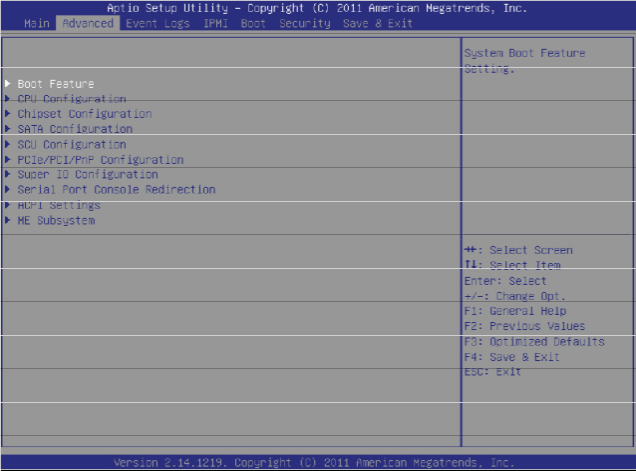

#### **Boot Features**  
**Quiet Boot**  
Эта функция позволяет выбрать отображение экрана загрузки: сообщения POST или логотип производителя. Выберите **Disabled**, чтобы отображать сообщения POST, или **Enabled**, чтобы показывать логотип.  

**AddOn ROM Display Mode**  
Определяет режим отображения Option ROM. **Force BIOS** использует настройки BIOS, а **Keep Current** сохраняет текущие настройки.  

**Bootup Num-Lock**  
Определяет состояние клавиши Numlock при включении. Варианты: **Off** и **On**.  

**Wait For 'F1' If Error**  
Если выбрано **Enabled**, система будет ждать нажатия F1 при возникновении ошибки.  

#### **Interrupt 19 Capture**  
Если включено (**Enabled**), BIOS позволяет адаптерам с ROM загружаться с подключенных дисков. Если отключено (**Disabled**), такие диски не будут загрузочными.  

#### **Re-try Boot**  
Если включено, BIOS повторяет попытку загрузки после неудачной первой попытки.  

#### **Power Configuration**  
**Watch Dog Function**  
При включении система автоматически перезагрузится после 5 минут бездействия при критической ошибке.  

**Power Button Function**  
**Instant Off** — выключение при нажатии кнопки питания. **4 Seconds Override** — выключение при удержании кнопки 4 секунды.  

**Restore on AC Power Loss**  
Определяет поведение системы после восстановления питания:  
- **Stay Off** — оставаться выключенной.  
- **Power On** — включиться.  
- **Last State** — вернуться к предыдущему состоянию.  

#### **CPU Configuration**  
Отображает информацию о процессоре и позволяет настроить его параметры.  

**Socket 1/2 CPU Information**  
Показывает данные о процессоре:  
- Тип, сигнатуру, микроядро, степпинг.  
- Макс./мин. частоту, количество ядер.  
- Поддержку технологий: **Intel HT**, **VT-x**, **SMX**.  
- Объем кэша L1/L2/L3.  

**Hyper-threading**  
Включение/отключение технологии Hyper-threading.  

**Active Processor Cores**  
Определяет количество активных ядер (All, 1, 2).  

**Execute-Disable Bit**  
Защита от вредоносного кода. Рекомендуется **Enabled**.  

**Intel® Virtualization Technology**  
Включение аппаратной виртуализации.  

#### **CPU Power Management**  
**Power Technology**  
Режимы энергосбережения: **Disabled**, **Energy Efficient**, **Custom**.  

**EIST (Enhanced Intel SpeedStep)**  
Автоматическая регулировка частоты и напряжения.  

**C-States (C1E, C3, C6, C7)**  
Управление энергосберегающими состояниями процессора.  

#### **Chipset Configuration**  
**Intel VT-d**  
Включение виртуализации для устройств ввода-вывода.  

**Memory Mode**  
Режимы работы памяти:  
- **Independent** — вся память доступна ОС.  
- **Mirroring** — зеркалирование для избыточности.  
- **Lockstep** — параллельная работа двух каналов.  

**DDR Speed**  
Принудительное изменение частоты памяти (например, **Force DDR3-1600**).  

#### **South Bridge Configuration**  
**Legacy USB Support**  
Поддержка USB-устройств в Legacy-режиме.  

**EHCI Hand-Off**  
Необходимо для ОС без поддержки EHCI.  

---

Перевод сохраняет оригинальные названия пунктов BIOS (например, **Execute-Disable Bit**, **Hyper-threading**) и технические термины, близко следуя структуре исходного текста.

**Информация о системе**  

### **Системная дата**  
Отображает текущую дату системы в формате [День недели] [ММ/ДД/ГГГГ] (например, Ср 10/12/2012). Поддерживается батарейкой CMOS при выключенном питании.  

### **Системное время**  
Отображает текущее время системы в 24-часовом формате [ЧЧ:ММ:СС] (например, 15:32:52). Также поддерживается батарейкой CMOS.  

### **Версия BIOS Supermicro X9DBU**  
Отображает точную версию прошивки BIOS, установленной на материнской плате (например, "X9DBU 3.4a"). Важно для проверки совместимости.  

### **Дата сборки**  
Показывает дату компиляции текущей версии BIOS в формате ММ/ДД/ГГГГ.  

### **Информация о памяти**  
#### **Общий объем памяти**  
Отображает суммарный объем ОЗУ, обнаруженный BIOS при POST (например, "32768 МБ" для 32 ГБ).  

---

## **Расширенные настройки**  

### **Функции загрузки**  

#### **Тихая загрузка (Quiet Boot)**  
Управление отображением экрана POST:  
- **Вкл.**: Показывает логотип производителя вместо сообщений POST  
- **Выкл.**: Отображает подробные коды POST и подсчет памяти  

#### **Режим отображения AddOn ROM**  
Определяет, как опциональные ROM (например, RAID-контроллеры) отображают свою инициализацию:  
- **Force BIOS**: Использует настройки системного BIOS  
- **Keep Current**: Сохраняет родной режим отображения адаптера  

#### **Num-Lock при загрузке**  
Устанавливает состояние клавиши NumLock при включении:  
- **Вкл.**: Активирует цифровую клавиатуру  
- **Выкл.**: Деактивирует цифровую клавиатуру  

#### **Ожидание 'F1' при ошибке**  
Управление обработкой ошибок во время POST:  
- **Вкл.**: Система останавливается при ошибках, требуя нажатия F1  
- **Выкл.**: Пытается продолжить загрузку несмотря на ошибки  

#### **Захват прерывания 19 (Interrupt 19 Capture)**  
Управление распознаванием загрузочных устройств:  
- **Вкл.**: Позволяет дополнительным контроллерам загружаться с подключенных дисков  
- **Выкл.**: Ограничивает загрузку только контроллерами материнской платы  

#### **Повторная попытка загрузки (Re-try Boot)**  
- **Вкл.**: Автоматически повторяет попытку загрузки после сбоя  
- **Выкл.**: Останавливается после первой неудачной попытки  

---

## **Настройки питания**  

### **Функция Watch Dog**  
Функция восстановления системы:  
- **Вкл.**: Принудительная перезагрузка после 5 минут зависания  
- **Выкл.**: Без автоматического восстановления  

### **Действие кнопки питания**  
Управление поведением кнопки питания:  
- **Мгновенное выключение**: Немедленное отключение при нажатии  
- **Переопределение за 4 секунды**: Требует удержания кнопки 4 секунды для выключения  

### **Восстановление после пропадания питания**  
Определяет поведение при восстановлении питания:  
- **Включить**: Автоматически включается после сбоя  
- **Оставаться выключенным**: Требует ручного включения  
- **Последнее состояние**: Возвращается к состоянию до сбоя  

---

## **Настройки процессора**  

### **Технология Hyper-Threading**  
Активация логических процессоров:  
- **Вкл.**: Создает два потока на физическое ядро  
- **Выкл.**: Ограничивает одним потоком на ядро  

### **Активные ядра процессора**  
Управление количеством ядер:  
- **Все**: Использует все доступные ядра  
- **1/2**: Ограничивает указанным количеством ядер  

### **Бит запрета исполнения (Execute-Disable Bit)**  
Защита памяти:  
- **Вкл.**: Запрещает исполнение кода в областях данных  
- **Выкл.**: Отключает защиту памяти  

### **Технология Intel Virtualization (VT-x)**  
Поддержка аппаратной виртуализации:  
- **Вкл.**: Требуется для гипервизоров  
- **Выкл.**: Улучшает производительность без виртуализации  

### **Состояния питания процессора**  
#### **C-состояния**  
- **C0**: Активное рабочее состояние  
- **C1E**: Легкий сон с пониженным напряжением  
- **C3/C6/C7**: Прогрессивно более глубокие состояния сна  

#### **Лимит C-состояния пакета**  
- **C0**: Без энергосбережения  
- **C2**: Легкое энергосбережение  
- **C6**: Глубокое энергосбережение  
- **Без лимита**: Автоматическое управление  

---

## **Настройки памяти**  

### **Режим памяти**  
Метод работы ОЗУ:  
- **Независимый**: Стандартный режим без избыточности  
- **Зеркалирование**: Поддерживает дублирующую копию всех данных  
- **Синхронизированный**: Синхронизирует каналы памяти  

### **Скорость DDR**  
Управление тактовой частотой памяти:  
- **Авто**: Использует профили SPD  
- **Принудительно DDR3-1333**: Фиксирует указанную скорость  

### **Чередование каналов**  
Шаблоны доступа к памяти:  
- **1 способ**: Без чередования  
- **2 способа**: Чередование между двумя каналами  
- **4 способа**: Чередование по четырем направлениям  

### **Фоновая проверка (Patrol Scrub)**  
Обслуживание памяти:  
- **Вкл.**: Постоянно проверяет и восстанавливает память  
- **Выкл.**: Без фоновой проверки  

### **Коррекция по требованию (Demand Scrub)**  
Исправление ошибок на лету:  
- **Вкл.**: Исправляет ошибки при обнаружении  
- **Выкл.**: Без исправления во время работы  

---

## **Настройки чипсета**  

### **Intel VT-d**  
Поддержка виртуализации ввода-вывода:  
- **Вкл.**: Требуется для сквозной передачи PCIe  
- **Выкл.**: Базовая виртуализация  

### **Конфигурация USB**  
#### **Поддержка устаревших USB**  
- **Авто**: Автоматическое определение  
- **Вкл.**: Принудительный устаревший режим  
- **Выкл.**: Только UEFI  

#### **Передача управления EHCI**  
- **Вкл.**: Необходима для старых ОС  
- **Выкл.**: Стандарт для современных ОС  

#### **Эмуляция портов 60/64**  
- **Вкл.**: Поддержка устаревших контроллеров клавиатуры  
- **Выкл.**: Только нативный ввод UEFI  

---

## **Конфигурация PCIe**  

### **Разделение портов IIO PCIe**  
#### **Порт IOU1-PCIe**  
Распределение линий:  
- **x4x4**: Разделение на два соединения x4  
- **x8**: Одно соединение x8  

#### **Скорость связи порта**  
Управление поколением порта:  
- **Gen1**: 2.5 GT/с  
- **Gen2**: 5.0 GT/с  
- **Gen3**: 8.0 GT/с  

### **CTLE слота SXB**  
Коррекция сигнала:  
- **Авто**: Автоматическая эквализация  
- **Вручную**: Пользовательские коэффициенты  

---


### **Конфигурация SATA**

При выборе этого подменю AMI BIOS автоматически определяет наличие устройств IDE/SATA и отображает следующие параметры:

**SATA Port0~SATA Port5**  
BIOS отображает статус каждого SATA-порта, определенный во время POST.

**Режим SATA**  
Настройка режима работы SATA-контроллера:  
- **Disabled**: Отключение контроллера  
- **IDE Mode**: Эмуляция IDE (устаревший режим)  
- **AHCI Mode**: Современный режим с поддержкой NCQ  
- **RAID Mode**: Режим создания RAID-массивов  

---

#### **Режим IDE**  
Дополнительные параметры при выборе IDE Mode:

**Контроллер Serial-ATA 0/1**  
Управление SATA-контроллерами:  
- **Disabled**: Отключение контроллера  
- **Enhanced**: Нативный режим SATA (рекомендуется)  
- **Compatible**: Эмуляция IDE (для совместимости)  

*По умолчанию:*  
- Контроллер 0: Compatible  
- Контроллер 1: Enhanced  

---

#### **Режим AHCI**  
Дополнительные настройки:

**Агрессивное управление питанием (ALPM)**  
- **Enabled**: Энергосбережение при простое  
- **Disabled**: Полная производительность  

**Горячее подключение (Hot Plug) для Port 0~5**  
- **Enabled**: Поддержка "горячей" замены дисков  
- **Disabled**: Отключение функции  

**Последовательный запуск дисков (Staggered Spin Up)**  
- **Enabled**: Поочередный раскрут HDD для снижения пиковой нагрузки  
- **Disabled**: Одновременный запуск всех дисков  

---

#### **Режим RAID**  
Настройки для RAID-массивов:

**Горячее подключение для Port 0~5**  
Аналогично AHCI Mode.

---

### **Конфигурация SCU (Storage Control Unit)**

**Контроллер хранилища**  
- **Enabled**: Активация встроенного SCU-контроллера  
- **Disabled**: Отключение  

**SCU Option ROM**  
- **Enabled**: Поддержка загрузки с SCU-устройств  
- **Disabled**: Отключение  

**SCU Port 0~7**  
Автоматическое определение подключенных устройств.

*Примечание:*  
- Платы серии **iF** поддерживают только SATA-диски  
- Платы серии **3F** поддерживают SATA и SAS-диски  

---

### **Конфигурация PCIe/PCI/PnP**

**Приоритет PCI ROM**  
Выбор типа загрузочного ROM:  
- **EFI Compatible ROM**: Для UEFI-систем  
- **Legacy ROM**: Для устаревших ОС  

**Таймер задержки PCI**  
Установка задержки для PCI-устройств (в циклах): 32, 64, 96, 128, 160, 192, 224, 248  

**Декодирование выше 4G**  
- **Enabled**: Поддержка 64-битных PCI-устройств  
- **Disabled**: Ограничение 32-битным адресным пространством  

**Генерация PERR#/SERR#**  
- **Enabled**: Разрешение сигналов об ошибках PCI  
- **Disabled**: Отключение  

**Максимальный размер пакета (Payload)**  
- **Auto**: Автонастройка  
- **128/256 Bytes**: Ручная установка  

**Максимальный размер запроса (Read Request)**  
- **Auto**: Автонастройка  
- **128B-4096B**: Ручная установка  

**Поддержка ASPM**  
Управление энергопотреблением PCI-E:  
- **Disabled**: Отключение  
- **Force L0s**: Принудительный режим энергосбережения  
- **Auto**: Автоматическая оптимизация  

*Внимание! Включение ASPM может вызвать нестабильность некоторых устройств!*

**Выбор Option ROM для сетевой загрузки**  
- **iSCSI**: Загрузка по iSCSI  
- **PXE**: Сетевая загрузка PXE  

---

### **Настройки встроенного сетевого адаптера**

**Загрузка Option ROM для LAN1/LAN2**  
- **Enabled**: Активирует загрузочный ROM для сетевой загрузки (PXE/iSCSI)  
- **Disabled**: Отключает функцию  

*По умолчанию:*  
- LAN1: Enabled  
- LAN2: Disabled  

**Приоритет видеовыхода (VGA Priority)**  
Выбор основного графического адаптера:  
- **Onboard**: Интегрированная графика  
- **Offboard**: Дискретная видеокарта  

---

### **Конфигурация Super IO**

**Используемый чип Super IO**  
Отображает модель мультиконтроллера (например, Nuvoton NCT6779D).

---

### **Настройки последовательных портов**

#### **Serial Port 1/2 Configuration**

**Активация порта**  
- **Enabled**: Включает COM-порт  
- **Disabled**: Отключает  

**Настройки устройства**  
- **Auto**: Автоматическое определение адресов  
- **Ручная настройка**:  
  - Базовый адрес: 3F8h, 2F8h, 3E8h, 2E8h  
  - Прерывания: IRQ 3-12  
  - Пример: `IO=3F8h; IRQ=4` (стандарт для COM1)  

**Режим работы**  
- **Normal**: 115.2 Кбит/с  
- **High Speed**: До 1 Мбит/с  

#### **Атрибуты Serial Port 2**  
- **SOL (Serial Over LAN)**: Для удаленного управления  
- **COM**: Стандартный последовательный порт  

---

### **Перенаправление консоли (Console Redirection)**

#### **Общие настройки для COM1/COM2**

**Активация**  
- **Enabled**: Включает переадресацию вывода  
- **Disabled**: Отключает  

*По умолчанию:*  
- COM1: Disabled  
- COM2: Enabled  

#### **Параметры передачи**

**Тип терминала**  
- **VT100**: Базовый ASCII  
- **VT100+**: С поддержкой цветов  
- **ANSI**: Расширенная кодировка  
- **VT-UTF8**: Unicode-совместимость  

**Скорость (Bits Per Second)**  
9600, 19200, 38400, 57600, 115200  

**Биты данных**  
7 или 8 бит  

**Контроль четности**  
- **None**: Нет проверки  
- **Even**: Четный  
- **Odd**: Нечетный  
- **Mark/Space**: Фиксированные значения  

**Стоп-биты**  
1 или 2  

**Управление потоком**  
- **None**: Без контроля  
- **Hardware RTS/CTS**: Аппаратное  

**Дополнительные функции**  
- **VT-UTF8 Combo Keys**: Поддержка сочетаний клавиш  
- **Recorder Mode**: Запись лога терминала  
- **Resolution 100x31**: Расширенное разрешение  

#### **Для устаревших ОС**  
**Разрешение экрана**  
- 80x24 или 80x25 символов  

**Настройки Putty**  
Эмуляция терминалов: VT100, LINUX, XTERMR6 и др.  

---

### **Аварийное управление (EMS)**

**Перенаправление для Out-of-Band управления**  
- **Enabled**: Активирует доступ к консоли через COM-порт  
- **Disabled**: Отключает  

---

### **Настройки перенаправления консоли (EMS)**

**Управление аварийными сервисами (EMS)**  
Параметры для удаленного управления через последовательный порт при критических сбоях системы.

#### **Порт для Out-of-Band управления**  
Выбор COM-порта для аварийного доступа:  
- **COM1**  
- **COM2**  

#### **Тип терминала**  
Эмуляция терминального интерфейса:  
- **VT100** - Базовый ASCII (текстовый режим)  
- **VT100+** - Расширенный с поддержкой цветов и функциональных клавиш  
- **ANSI** - Расширенный набор символов ASCII  
- **VT-UTF8** - Поддержка Unicode (кодировка UTF-8)  

#### **Скорость передачи (бит/сек)**  
Настройка скорости последовательного порта:  
- **9600**  
- **19200**  
- **57600**  
- **115200**  

*Примечание: Скорость должна совпадать на обоих концах соединения.*

#### **Управление потоком**  
Контроль переполнения буфера:  
- **None** - Без контроля  
- **Hardware RTS/CTS** - Аппаратный контроль (рекомендуется)  
- **Software Xon/Xoff** - Программный контроль  

#### **Параметры передачи**  
Отображаются текущие настройки:  
- **Биты данных** (7/8 бит)  
- **Контроль четности** (None/Even/Odd)  
- **Стоп-биты** (1/2)  

---

### **Настройки ACPI**

#### **Режимы энергосбережения**  
**Состояние сна ACPI**  
- **S1 (CPU Stop Clock)** - Минимальное энергопотребление:  
  - Остановка процессора  
  - Обновление оперативной памяти  
  - Питание подается на CPU и RAM  
- **Suspend Disabled** - Отключение режима сна  

#### **Поддержка NUMA**  
Активация архитектуры неоднородного доступа к памяти:  
- **Enabled** - Оптимизация для многопроцессорных систем  
- **Disabled** - Стандартный режим  

#### **Таймер высокой точности (HPET)**  
- **Enabled** - Использование высокочастотного таймера:  
  - Частота прерываний выше, чем у RTC  
  - Обеспечивает плавное воспроизведение мультимедиа  
  - Заменяет устаревший 8254 PIT  
- **Disabled** - Стандартный таймер  

---

### **Настройки доверенных вычислений (Trusted Computing)**  
*(Доступно при обнаружении TPM-устройства BIOS)*  

#### **Конфигурация TPM**  

**Поддержка TPM**  
- **Enabled**: Активирует функциональность TPM (требует включения соответствующего джампера на материнской плате)  
- **Disabled**: Отключает TPM  

*Примечание: Для работы необходимо физическое включение TPM через перемычку.*  

**Состояние TPM**  
- **Enabled**: Активирует функции безопасности TPM (целостность данных, защита сети)  
- **Disabled**: Деактивирует TPM  

#### **Операции с TPM**  

**Запланированная операция (Pending Operation)**  
- **None**: Нет действий  
- **Enable Take Ownership**: Запланировать получение владения TPM  
- **Disable Take Ownership**: Запланировать отмену владения  
- **TPM Clear**: Запланировать сброс TPM до заводских настроек  

*Важно!* Для выполнения запланированной операции система автоматически перезагрузится.  

---

### **Текущий статус TPM**  

**Статус активации TPM**  
Отображает текущее состояние поддержки TPM:  
- Включен (Enabled)  
- Отключен (Disabled)  

**Активность TPM**  
Показывает, активен ли в данный момент модуль TPM:  
- Активен (Active)  
- Деактивирован (Deactivated)  

**Статус владения TPM**  
Отображает информацию о владении TPM:  
- Владение получено (Owned)  
- Владение отсутствует (Not Owned)  

---

### **Конфигурация Intel TXT (Trusted Execution Technology)**  

#### **Аппаратная поддержка Intel TXT (LT-SX)**  
Данный раздел отображает поддержку технологии Trusted Execution Technology (TXT) следующими компонентами:  
- **ЦП (CPU)**: Наличие функции TXT  
- **Чипсет**: Наличие функции TXT  

#### **Настройки Intel TXT (LT-SX)**  
- **Поддержка TXT (LT-SX)**:  
  - **Enabled** – Активирует Intel TXT (по умолчанию **Disabled**)  

#### **Зависимости Intel TXT (LT-SX)**  
Для корректной работы технологии Intel TXT должны быть включены следующие функции:  
- **VT-d (Intel Virtualization Technology for Directed I/O)** – Поддержка виртуализации ввода-вывода  
- **VT (Intel Virtualization Technology)** – Аппаратная виртуализация  
- **Поддержка TPM (Trusted Platform Module)** – Наличие и активация модуля TPM  
- **Состояние TPM** – TPM должен быть включен и активен  

*(Примечание: Если какая-либо из зависимостей не выполнена, TXT не будет работать.)*  

---

### **Подсистема Intel ME (Management Engine)**  
Данный раздел отображает информацию о версиях компонентов Intel ME:  
- **Версия BIOS-интерфейса ME**  
- **Версия ME (Management Engine)**  

*(Примечание: ME обеспечивает удаленное управление и безопасность системы.)*  

---


## 4-4 Журналы событий

4-4 Event Logs

Используйте эту функцию для настройки параметров журнала событий.

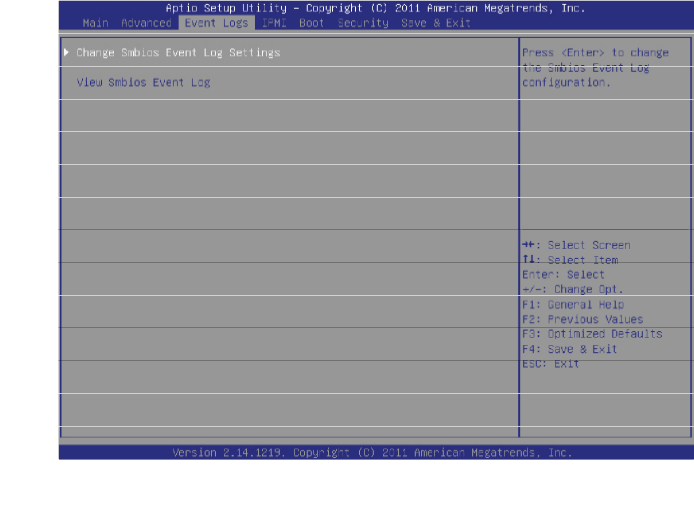

### **Настройки журнала событий SMBIOS**

#### **Включение/отключение функций**
**Журнал событий SMBIOS**  
- **Enabled**: Активирует запись событий SMBIOS при загрузке системы  
- **Disabled**: Отключает ведение журнала  

**Поддержка журналирования ошибок в реальном времени**  
- **Enabled**: Включает запись ошибок во время работы системы  
- **Disabled**: Отключает функцию  

**Порог исправимых ошибок памяти**  
Устанавливает максимальное количество исправимых ошибок памяти перед записью в журнал (по умолчанию: **10**)

**Поддержка журналирования ошибок PCI**  
- **Enabled**: Включает запись ошибок PCI-устройств  
- **Disabled**: Отключает мониторинг  

#### **Настройки очистки**
**Очистка журнала событий**  
- **No**: Не очищать  
- **Yes, next reset**: Очистить при следующей перезагрузке  
- **Yes, every reset**: Очищать при каждой перезагрузке  

**Действие при заполнении журнала**  
- **Do Nothing**: Не предпринимать действий  
- **Erase Immediately**: Немедленно очистить переполненный журнал  

#### **Стандартные параметры SMBIOS**
**Журналирование событий загрузки**  
- **Enabled**: Записывать события загрузки системы  
- **Disabled**: Отключает запись  

**MECI (Шаг счетчика повторяющихся событий)**  
Определяет, через сколько повторений идентичной ошибки создается новая запись (диапазон: **1-255**, по умолчанию: **1**)

**METW (Временное окно для счетчика событий)**  
Устанавливает интервал времени (в минутах) между записями одинаковых событий (диапазон: **0-99**, по умолчанию: **60**)

#### **Просмотр журнала SMBIOS**
Позволяет просматривать записи журнала с указанием:  
- **Даты/времени** события  
- **Кода ошибки**  
- **Уровня серьезности**  

---


## 4-5 IPMI

Используйте эту функцию для настройки параметров интеллектуального интерфейса управления платформой (IPMI).

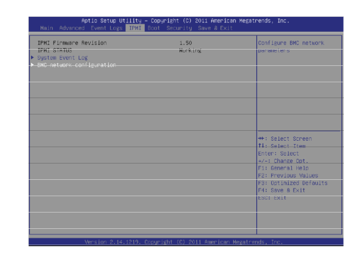

#### IPMI Firmware Revision

Версия прошивки IPMI

Этот пункт указывает версию прошивки IPMI, используемую в вашей системе.

**IPMI Status**

Состояние IPMI

Этот пункт показывает состояние прошивки IPMI, установленной в вашей системе.

### IPMI Status

**Enabling/Disabling Options**

Включение/отключение параметров

**SEL Components**

Выберите «Включено» для регистрации всех системных событий при загрузке. Доступные параметры: «Включено» и «Отключено».


**Erasing Settings**

Стирание настроек

**Erase SEL**

Выберите «Да, при следующем сбросе», чтобы очистить все журналы системных событий при следующей перезагрузке системы.
Выберите «Да, при каждом сбросе», чтобы очистить все журналы системных событий при каждой перезагрузке системы.
Выберите «Нет», чтобы сохранять все журналы системных событий после каждой перезагрузки системы. Доступные параметры:

Нет, «Да, при следующем сбросе» и «Да, при каждом сбросе».

**When SEL is Full**

При заполнении журнала SEL

Эта функция позволяет пользователю определить, что должна делать BIOS при заполнении журнала системных событий. Выберите «Стереть немедленно», чтобы стереть все события в журнале при заполнении журнала системных событий. Доступные параметры: «Ничего не делать» и «Стереть немедленно». Пользовательские параметры ведения журнала EFI

**Custom EFI Logging Options**

**Log EFI Status Codes**

Ведение журнала кодов состояния EFI

Выберите «Enabled», чтобы регистрировать коды состояния EFI (Extensible Firmware Interface), коды ошибок или коды выполнения. Доступны следующие варианты: «Enabled» и «Disabled».

Примечание: После внесения изменений в настройки обязательно перезагрузите систему,
чтобы изменения вступили в силу.

**BMC Network Configuration**

Конфигурация сети BMC

**LAN Channel 1**:  Эта функция позволяет пользователю настроить параметры порта LAN1.

**Update IPMI LAN Configuration**

Обновить конфигурацию локальной сети IPMI

Эта функция позволяет BIOS применять любые изменения IP/MAC-адреса при следующей
загрузке системы. Если для параметра установлено значение «Да», любые изменения, внесенные в указанные ниже параметры, вступят в силу после перезагрузки системы. Доступны варианты «Нет» и «Да».

**Configuration Address Source**

Источник адреса конфигурации

Эта функция позволяет пользователю выбрать источник IP-адреса для этого компьютера.
Если выбран вариант «Статический», вам потребуется знать IP-адрес этого компьютера и ввести его в систему вручную. Если выбран протокол DHCP, BIOS выполнит поиск
сервера DHCP (Dynamic Host Configuration Protocol) в сети, к которой подключен компьютер, и запросит следующий доступный IP-адрес для этого компьютера. Доступные варианты: DHCP и Static. Следующие пункты назначаются IP-адреса автоматически,
если выбран DHCP, или могут быть настроены вручную, если выбран статический режим.

**Station IP Address**

Этот пункт отображает IP-адрес станции для этого компьютера. Он должен быть представлен в десятичном и четырёхзначном формате, разделённом точками (например, 192.168.10.253).

**Subnet Mask**

Этот пункт отображает подсеть, к которой принадлежит этот компьютер. Значение каждого
трехзначного числа, разделённого точками, не должно превышать 255.

**Station MAC Address** 

Этот пункт отображает MAC-адрес станции для этого компьютера. MAC-адреса представляют собой шесть двузначных шестнадцатеричных чисел.

**Gateway IP Address**

Этот пункт отображает IP-адрес шлюза для этого компьютера. Это должно быть в
десятичном формате и в формате четверки чисел, разделенных точками (например, 192.168.10.253).


## 4-6  Boot

 4-6 Загрузка
Это подменю позволяет пользователю настроить следующие параметры загрузки системы:

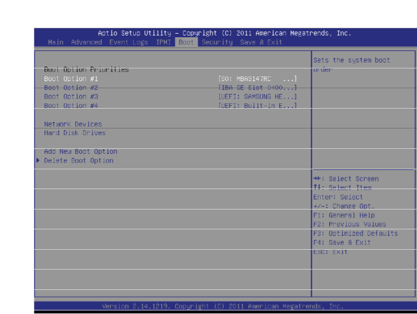


---

**Boot Option Priorities**  
*(Приоритет загрузочных устройств)*  

**Boot Option #1/Boot Option #2/Boot Option #3**  
*(Вариант загрузки №1/№2/№3)*  
Назначение приоритета загрузочных устройств.  

**Network Devices, Hard Disk Drives**  
*(Сетевые устройства, жесткие диски)*  
Определение порядка загрузки для:  
- Устаревших сетевых устройств  
- Накопителей HDD/SSD  

**Add New Boot Option**  
*(Добавить вариант загрузки)*  
Добавление нового EFI-загрузочного устройства в список.  

**Delete Boot Option**  
*(Удалить вариант загрузки)*  
Исключение устройства из списка загрузки:  
1. Выбор устройства для удаления  
2. Подтверждение операции  

---

### **4-7 Security**  
*(Безопасность)*  

Это меню позволяет настроить параметры безопасности системы.  

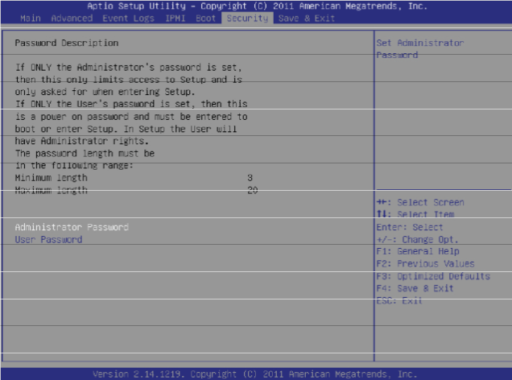

---

#### **Administrator Password**  
*(Пароль администратора)*  
Установка пароля для доступа к утилите настройки BIOS.  
- Длина пароля: **от 3 до 20 символов**  

#### **User Password**  
*(Пароль пользователя)*  
Установка пароля для:  
1. Входа в систему  
2. Доступа к настройкам BIOS  
- Длина пароля: **от 3 до 20 символов**  

---

### **4-8 Save & Exit**  
*(Сохранение и выход)*  

Это подменю позволяет настроить параметры сохранения и выхода из BIOS.  

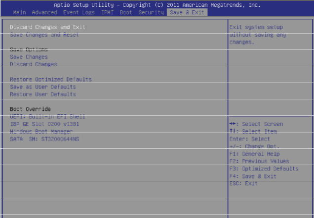

---

#### **Discard Changes and Exit**  
*(Отменить изменения и выйти)*  
- Выход из BIOS **без сохранения** изменений  
- После выбора появится диалоговое окно:  
  - **Yes** - подтвердить выход без сохранения  
  - **No** - вернуться в BIOS  

#### **Save Changes and Reset**  
*(Сохранить изменения и перезагрузить)*  
- Сохранение настроек и **перезагрузка** системы  
- Диалоговое окно:  
  - **Yes** - сохранить и выйти  
  - **No** - отменить действие  

---

### **Save Options**  
*(Параметры сохранения)*  

#### **Save Changes**  
*(Сохранить изменения)*  
- Сохранение текущих настроек **без выхода** из BIOS  
- Диалоговое окно:  
  - **Yes** - подтвердить сохранение  
  - **No** - отменить  

#### **Discard Changes**  
*(Отменить изменения)*  
- Сброс **всех** изменений к предыдущим значениям  
- Диалоговое окно:  
  - **Yes** - загрузить предыдущие настройки  
  - **No** - оставить текущие изменения  

#### **Restore Optimized Defaults**  
*(Загрузить оптимизированные настройки)*  
- Восстановление **оптимальных** параметров BIOS  
- Диалоговое окно:  
  - **Yes** - подтвердить сброс  
  - **No** - отменить  

#### **Save as User Defaults**  
*(Сохранить как пользовательские настройки)*  
- Сохранение текущей конфигурации как **персонального** шаблона  
- Диалоговое окно:  
  - **Yes** - сохранить  
  - **No** - оставить предыдущие пользовательские настройки  

#### **Restore User Defaults**  
*(Восстановить пользовательские настройки)*  
- Загрузка **ранее сохраненных** пользовательских параметров  
- Диалоговое окно:  
  - **Yes** - подтвердить восстановление  
  - **No** - отменить  

---

### **Boot Override**  
*(Принудительная загрузка)*  
- **Временная** загрузка с выбранного устройства (без изменения приоритетов)  
- Доступные устройства отображаются в списке  

---


### Приложение A  
#### Коды звуковых сигналов BIOS  

Во время выполнения POST (самотестирования при включении), которое проводится при каждой загрузке системы, могут возникать ошибки.  

- **Нефатальные ошибки** — в большинстве случаев позволяют системе продолжить загрузку. Сообщения об этих ошибках обычно отображаются на экране.  
- **Фатальные ошибки** — не позволяют системе завершить процесс загрузки. При возникновении фатальной ошибки следует обратиться к производителю системы для возможного ремонта.  

Фатальные ошибки обычно передаются через серию звуковых сигналов. Номера в списке соответствуют количеству сигналов для каждой конкретной ошибки.  

### A-1 Коды звуковых сигналов BIOS  

| Количество сигналов / Светодиод | Сообщение об ошибке          | Описание                                                     |
| ------------------------------- | ---------------------------- | ------------------------------------------------------------ |
| 1 сигнал                        | **Refresh**                  | Готово к загрузке                                            |
| 5 коротких + 1 длинный сигнал   | **Memory error**             | Память не обнаружена в системе                               |
| 5 сигналов                      | **No Con-In или No Con-Out** | **Con-In**: USB- или PS/2-клавиатура, PCI или Serial Console Redirection, IPMI KVM/SOL. **Con-Out**: Видеоконтроллер, PCI или Serial Console Redirection, IPMI SOL |

#### X9 IPMI Коды ошибок  
| Сигнал             | Ошибка                           |
| ------------------ | -------------------------------- |
| Непрерывный сигнал | **System OH** (Перегрев системы) |

---

### Приложение B  
#### Инструкции по установке программного обеспечения  

### B-1 Установка программного обеспечения и драйверов  

После установки операционной системы появится экран, подобный показанному ниже. Теперь вы можете приступить к установке дополнительных программ и драйверов, которые ещё не были установлены.  

#### **Как установить программы и драйверы:**  
1. **Нажмите на соответствующие иконки** справа от каждого пункта в списке.  
2. **Следуйте инструкциям на экране** для завершения установки.  
3. **После установки каждого компонента** перезагрузите систему, прежде чем переходить к следующему.  

#### **Примечания:**  
- Чтобы прочитать файлы **Readme** (дополнительную информацию) для каждого компонента, нажмите на иконку с изображением **листа бумаги**.  
- Для установки нажмите на иконку **компьютера** рядом с нужным пунктом.  
- Если требуется создать **дискету с драйверами накопителя**, загрузитесь с **Driver CD** и установите в BIOS:  
  - **SATA Configuration → Compatible Mode**  
  - **SATA Mode → IDE**  
  После создания дискеты верните настройки SATA к исходным значениям.  

---

### **Установка Windows**  
Инструкции по установке **Windows OS** доступны на нашем сайте:  
🔗 [http://www.supermicro.com/support/manuals/](http://www.supermicro.com/support/manuals/)  

---

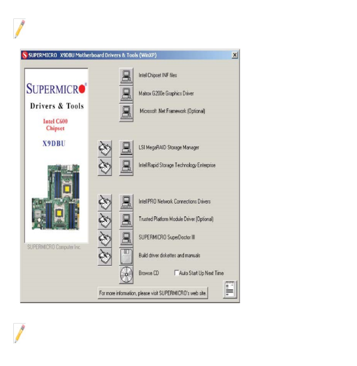

**Примечание:**  
1. Чтобы прочитать файлы **Readme** для каждого пункта, нажмите на иконку с изображением листа бумаги. Для установки нажмите на иконку компьютера справа от пункта. Устанавливайте компоненты по очереди (сверху вниз). После установки каждого компонента необходимо перезагрузить систему.  
2. При создании загрузочной дискеты с драйверами накопителя через **Driver CD** установите в BIOS режим **SATA Configuration → Compatible Mode** и настройте **SATA как IDE**. После создания дискеты верните настройки SATA к исходным значениям.  

### B-2 Настройка SuperDoctor III 

SuperDoctor® III — это инструмент для мониторинга системы (температура, напряжения, вентиляторы).  

**SuperDoctor® III** — это веб-инструмент для удалённого и локального управления системой. Локальная версия называется **SD III Client**. Программа позволяет отслеживать состояние системы, включая температуру CPU, напряжения и скорость вентиляторов. 

- **Логин по умолчанию:** `ADMIN` (логин и пароль).  
- В Windows настройки **SuperDoctor III** имеют приоритет над BIOS.  
- Скачать утилиту можно здесь:  
  🔗 [http://www.supermicro.com/products/accessories/software/SuperDoctorIII.cfm](http://www.supermicro.com/products/accessories/software/SuperDoctorIII.cfm)  

 **Важно:**   

- В Windows настройки **SuperDoctor III** имеют приоритет над настройками BIOS. После установки SD III использует температурные пороги, заданные в BIOS, но дальнейшие изменения должны вноситься только через SD III, так как его настройки переопределяют BIOS.  
- Утилиту и руководство можно скачать на сайте: [supermicro.com](http://www.supermicro.com/products/accessories/software/SuperDoctorIII.cfm).  
- Для Linux рекомендуется использовать **SuperDoctor II**.  

---

**SuperDoctor**® III Interface Display Screen-I (Health Information) 

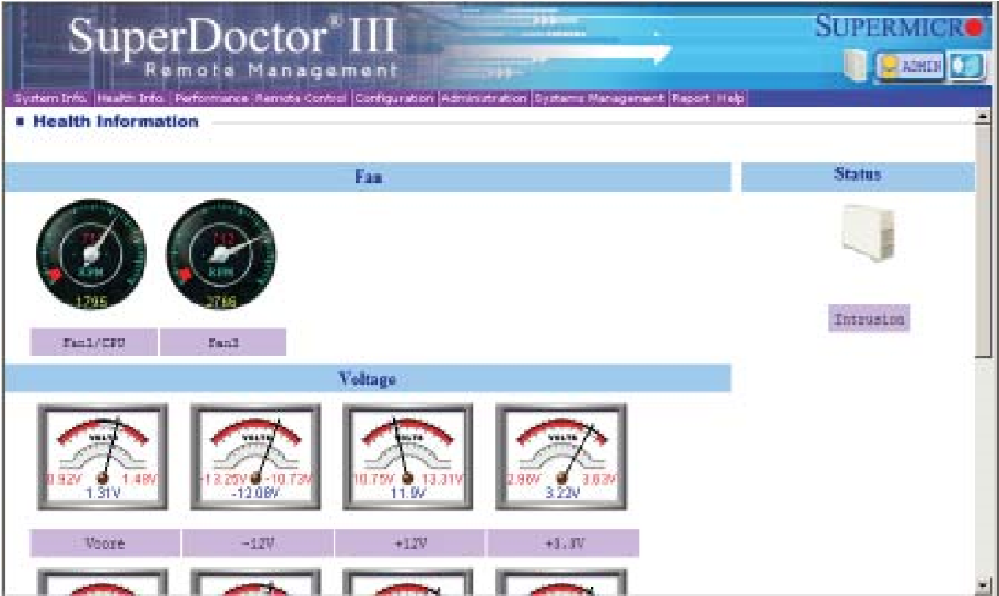

**Interface Display Screen-II  (Remote Control)** 

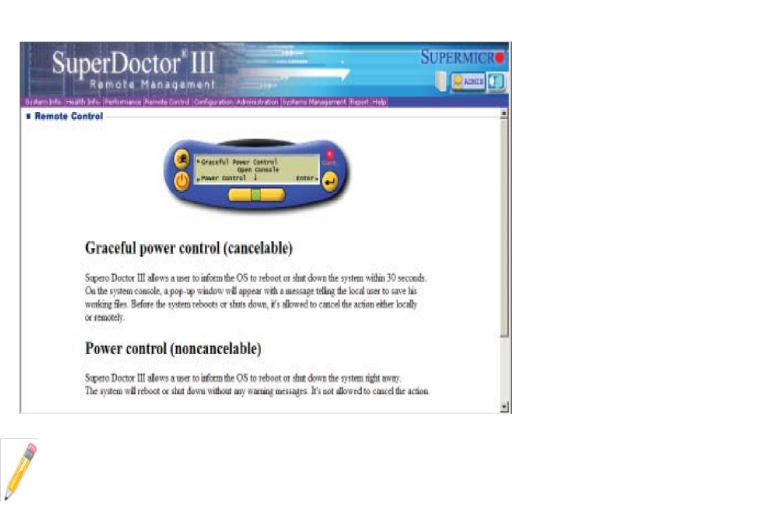

---

### Установка SuperDoctor II для Linux

#### **1. Скачивание SuperDoctor II**  
SuperDoctor II предназначен для мониторинга аппаратного состояния серверов Supermicro под Linux.  
🔹 **Официальная страница загрузки:**  
→ [https://www.supermicro.com/products/accessories/software/SuperDoctorII.cfm](https://www.supermicro.com/products/accessories/software/SuperDoctorII.cfm)  

#### **2. Выбор версии**  
На странице загрузки выберите:  
✔ Подходящую версию (32-bit или 64-bit)  
✔ Совместимую с вашей версией Linux (RHEL, CentOS, Ubuntu и др.)  

#### **3. Установка**  
##### **Для RPM-дистрибутивов (RHEL/CentOS):**  
```bash
wget [URL_скачивания_пакета.rpm]
sudo rpm -ivh SuperDoctorII-*.rpm
```

##### **Для DEB-дистрибутивов (Ubuntu/Debian):**  
```bash
wget [URL_скачивания_пакета.deb]
sudo dpkg -i SuperDoctorII-*.deb
```

#### **4. Запуск и настройка**  
После установки:  
```bash
sudo /opt/SuperDoctorII/sdii-gui  # Графический интерфейс  
sudo /opt/SuperDoctorII/sdii-cmd  # Консольная версия  
```

#### **5. Автозапуск (опционально)**  
Чтобы SuperDoctor II запускался автоматически:  
```bash
sudo systemctl enable sdii-service  # (если доступен)  
```

### **Важно!**  
⚠ **Проверьте совместимость** с вашей версией ОС перед установкой.  
⚠ Для работы требуются права **root** или **sudo**.  
⚠ Если возникают ошибки зависимостей, установите недостающие пакеты (например, `libssl`).  

Нужна помощь? Обратитесь в **Supermicro Support**:  
🔗 [https://www.supermicro.com/support/](https://www.supermicro.com/support/)

---

 (Дисклеймер, продолжение)  

Продукты Supermicro не предназначены для использования в:  
- системах жизнеобеспечения,  
- медицинском оборудовании,  
- ядерных объектах,  
- авиации и авиационных устройствах,  
- критических системах, где отказ может привести к травмам, гибели людей или значительному материальному ущербу.  

Supermicro не несёт ответственности за использование продукции в подобных условиях. Покупатель использует такие продукты на свой страх и риск и обязуется возмещать ущерб, связанный с их применением в опасных сферах.

```

X9DBU-3F / X9DBU-iF
USER’S MANUAL

 Revision 1.1

The information in this User’s Manual has been carefully reviewed and is believed to be accurate.
The vendor assumes no responsibility for any inaccuracies that may be contained in this document,
and makes no commitment to update or to keep current the information in this manual, or to notify
any person or organization of the updates. Please Note: For the most up-to-date version of this
manual, please see our Website at www.supermicro.com.
Super Micro Computer, Inc. ("Supermicro") reserves the right to make changes to the product
described in this manual at any time and without notice. This product, including software and docu-
mentation, is the property of Supermicro and/or its licensors, and is supplied only under a license.
Any use or reproduction of this product is not allowed, except as expressly permitted by the terms
of said license.

About This Motherboard

  The Super X9DBU-3F/X9DBU-iF motherboard supports dual Intel E5-2400 (Socket
  B2) processors and Intel QPI (QuickPath Interface) Technology (V.1.1), providing
  point-to-point connections with transfer speeds of up to 8.0 TG/s. With the C602/
  C606 chipset built in, the X9DBU-3F/X9DBU-iF motherboard supports Intel® Man-
  ageability Engine (ME), Rapid Storage Technology, Digital Media Interface (DMI),
  PCI-E Gen. 3.0, and DDR3 memory of up to 1600 MHz, greatly enhancing system
  performance. This motherboard is ideal for high-end server platforms. Please refer
  to our website at http://www.supermicro.com for processor and memory update
  and support.


Chapter 1 Overview
1-1   Overview ..................................................................1-1
1-2   Processor and Chipset Overview...........................1-11
1-3   Special Features ......................................................1-12
1-4   PC Health Monitoring .............................................1-12
1-5   ACPI Features...........................................................1-13
1-6   Power Supply ..........................................................1-13
1-7   Super I/O ................................................................. 1-14
1-8   Advanced Power Management ............................ 1-14
      Intel® Intelligent Power Node Manager (IPNM) ... 1-14
      Management Engine (ME) ....................................... 1-15
1-9   Introduction to the IPMI Controller ......................1-15
Chapter 2 Installation
2-1   Standardized Warning Statements ........................2-1
2-2   Static-Sensitive Devices ........................................... 2-4
2-3   Processor and Heatsink Installation....................... 2-5
      Installing an LGA 1356 Processor ............................. 2-5
      Installing a Passive CPU Heatsink ............................. 2-7
      Removing the Passive Heatsink ................................ 2-8
2-4   Installing and Removing the Memory Modules.... 2-9
      Installing & Removing DIMMs ................................... 2-9
      Removing Memory Modules ..................................... 2-9
2-5   Motherboard Installation ........................................ 2-13
      Tools Needed .............................................................. 2-13
      Location of Mounting Holes ...................................... 2-13
      Installing the Motherboard ........................................ 2-14
2-6   Control Panel Connectors and I/O Ports ................ 2-15
      Back Panel Connectors and I/O Ports ....................... 2-15
      Back Panel I/O Port Locations and Definitions ......... 2-15
          ATX PS/2 Keyboard and Mouse Ports..................... 2-16
          Universal Serial Bus (USB) ....................................... 2-16
          Serial Ports ................................................................ 2-17
          Video Connection ..................................................... 2-17
          Ethernet Ports ........................................................... 2-18
          Unit Identifier Switch ................................................. 2-19
     Front Control Panel ........................................................ 2-20
     Front Control Panel Pin Definitions............................... 2-21
        NMI Button ................................................................... 2-21
        Power LED .................................................................... 2-21
        HDD LED......................................................................... 2-22
        NIC1/NIC2 LED Indicators ........................................... 2-22
        Overheat (OH)/Fan Fail LED......................................... 2-23
        Power Fail LED .............................................................. 2-23
        Reset Button ................................................................. 2-24
        Power Button ................................................................ 2-24
2-7  Connecting Cables ........................................................ 2-25
        Power Connectors ....................................................... 2-25
        Fan Headers.................................................................. 2-26
        Chassis Intrusion ......................................................... 2-26
        Buzzer ........................................................................... 2-27
        Overheat/Fan Fail LED ................................................ 2-27
        TPM Header/Port 80 ................................................... 2-28
        IPMB .............................................................................  2-28
        Power SMB (I2C) Connector ....................................... 2-29
        Standby Header ........................................................... 2-29
        T-SGPIO 1/2 Headers ................................................... 2-30
        DOM Power Connector ............................................... 2-30
        Power LED/Speaker ..................................................... 2-31
2-8  Jumper Settings ............................................................ 2-32
     Explanation of Jumpers ................................................. 2-32
        GLAN/10G_LAN Enable/Disable ................................ 2-32
        CMOS Clear .................................................................. 2-33
        Watch Dog Enable/Disable ........................................ 2-33
        VGA Enable .................................................................. 2-34
        BMC Enable ................................................................. 2-34
        Management Engine (ME) Recovery ......................... 2-35
        Manufacturer Mode Select ........................................ 2-35
2-9  Onboard LED Indicators ............................................. 2-37
        GLAN LEDs ................................................................... 2-37
        IPMI Dedicated LAN LEDs .......................................... 2-37
        Onboard Power LED .................................................. 2-38
        Rear UID LED .............................................................. 2-38
        BMC Heartbeat LED ................................................... 2-39
2-10 Serial ATA Connections ............................................. 2-40
         Serial ATA Ports........................................................... 2-40
         SAS Ports ..................................................................... 2-40
Chapter 3 Troubleshooting
3-1  Troubleshooting Procedures ...................................... 3-1
3-2  Technical Support Procedures ................................... 3-5
3-3  Battery Removal and Installation ............................... 3-6
3-4  Frequently Asked Questions ....................................... 3-7
3-5  Returning Merchandise for Service............................. 3-8
Chapter 4 BIOS
4-1  Introduction.................................................................... 4-1
4-2  Main Setup ..................................................................... 4-2
4-3  Advanced Setup Configurations................................... 4-4
4-4  Event Logs ...................................................................... 4-25
4-5  IPMI ................................................................................. 4-27
4-6  Boot ................................................................................ 4-29
4-7  Security .......................................................................... 4-30
4-8  Save & Exit ..................................................................... 4-31

Appendix A BIOS Error Beep Codes
A-1  BIOS Error Beep Codes ............................................... A-1
Appendix B Software Installation Instructions
B-1  Installing Software Programs ..................................... B-1
B-2  Configuring SuperDoctor® III ..................................... B-2
```


---


Если у вас возникнут вопросы, обратитесь к документации или на сайт поддержки Supermicro.
